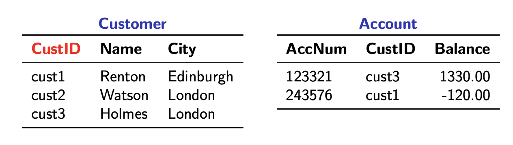

```toc
from-heading: 2
to-heading: 6
```

## Week 1: Introduction and Basic SQL

- Introduction
  - Data -> most important asset of any enterprise
  - To be turned into meaningful information, must find way to effectively, efficiently, and reliably:
    - collect and store
    - maintain and update
    - process and analyse it.
  - That way should enable *decision making*
    - TODO: What do they mean by decision making? Decision making based on the data? what decisions? for the enterprise?
  - What is a database?
    > A collection of data items related to a specific enterprise, which is structured and organised so as to be more easily accessed, managed, and updated.
  - **D**ata**b**ase **M**anagement **S**ystem (DBMS)
    - Software package for creating and managing databases
    - Mediates interaction between end-users and the database
      - End-users can be humans or applications
      - I assume this means that when I have changes I want to do to the database, I express that incentive and DBMS will ensure that that change actually happens?
    - Ensures that data is consistently organised and remains easily accessible
      - This makes sense since you could see a DBMS as a kind of interface between the user and the database system, and when manipulating the database system through the same interface, it's much easier to keep it consistent!
  - Advantages of a DBMS
    - Uniform data administration
    - Efficient access to resources
    - Data independence
      - TODO: structure Paolo's answer
      - you don't want the logical description of your data and the physical storage of your data entangled that one change requires a change of the other one (description of the data vs actual raw data that is stored, the application does not need to know how the data is organised)
    - Reduced application development time
    - Data integrity and security
    - Concurrent access
    - Recovery from crashes
  - Different kinds of data(bases)
    - A *data model* is a collection of concepts for describing data
    - A *schema* is a description of a particular collection of data, using a given data model
      - TODO: structure paolo's answer:
        - A data model is like some programming paradigm, like OOP, while the schema is the organisation of the programming to classes, the data would be the objects of those classes
      - TODO: Examples of either of these two terms?
    - Relational databases
      - Data organised in tables (relations) with typed attributes
      - Most common type of databases out there
    - Document stores
      - Text documents structured using tags (similar to HTML tags)
    - Graph databases
      - Data organised in graph structures with nodes and edges
      - Common for modelling social networks
    - Key-value stores
      - Data organised in associative arrays (i.e. dictionaries or maps)
  - The relational model
    - Simple idea: organise data in *tables*
      - Those tables are also called *relations*
    - Datamodel: a relational one, tables
    - Schema (concept of a relational database model):
      - Description of the data, how it is organised
      - We have a set of *table names*
        - Kind of like an index which points to all tables
      - List of distinct (typed) *column names* (= *attributes*) for each table
      - *Constraints* within a table or between tables
    - Instance
      - That's what the actual data is
        - It's stored in the rows of the tables
      - Must satisfy typing and constraints
  - Example of a relational database
    - TODO: typeset this in markdown

    

    - TODO: add screenshot with colours above, red is schema, blue is instance (dbs-instance-schema.png)
  - Query Languages
    - Used to ask questiosn (queries) to a database
    - Two different types of query languages
      - Procedural: specify a *sequence of steps* to obtain the expected result
      - Declarative: specify *what* you want, not *how* to get it
    - Typically, queries are asked in a declarative way
    - DBMSs figure out internally how to translate a query into procedures
      - Analogy: using a high-level programming language (declarative) and the compiler figures out internally how to translate it into an imperative script in machine language so that the computer can understand it (procedural)
  - SQL
    - **S**tructured **Q**uery **L**anguage
    - *Declarative* language for querying relational databases
    - Implemented in all major RDBMSs
      - I assume that's "Relational DBMSs"
- Basic SQL
  - Consists of two sublanguages
    - **DDL**: Data definition language
      - Operations on the schema (the set of table names and the list of column names)
    - **DML**: Data manipulation language
      - Operations on the instance (the rows, data itself)
  - *Base tables* are tables that you define in the schema of your database, they are not created after initialisation of the database? (TODO)
  - Non-base tables would be called views, they could be outputs of queries we have given a name & saved (TODO)
  - Creating tables
    ```sql
    -- Syntax
    CREATE TABLE <table_name> (
        <column 1> <type1>,
        <column 2> <type2>,
        ...
        <column N> <typeN>
    );
    -- Example
    CREATE TABLE Customer(
        custid  varchar(10),
        name    varchar(20),
        city    varchar(30),
        address varchar(30)
    );
    ```
  - Most common SQL data types
    - Strings
      - `varchar(n)`, at most `n` characters
    - Numbers
      - `smallint` (2 bytes, for postgresql)
      - `integer` or `int` (4 bytes)
      - `bigint` (8 bytes)
      - `numeric(p,s)`: arbitrary precision number, at most `p` total digits and `s`digits in the fractional part
        - numeric(4,3) would allow 3.141
    - Date and time
      - `date`, e.g. `2000-27-01`
        - TODO: are different formats allowed as well?
      - `time`, time of the day, e.g. `16:23`
      - `timestamp`
        - TODO: what's a timestamp? a combination of date and time?
  - Default values
    - Specifies the default value of a column
      - Does not mean that the column is initialised with that default value!
    ```sql
    -- Syntax
    CREATE TABLE <table_name> (
        <column 1> <type 1>,
        <column 2> <type 2> DEFAULT <value>,
        ...
        <column N> <type N>
    );
    -- Example
    CREATE TABLE Account (
        accnum varchar(12),
        branch varchar(30),
        custid varchar(10),
        balance numeric(14,2) DEFAULT 0
    );
    ```
  - Populating tables
    - The process of adding data to tables
    ```sql
    -- General syntax
    INSERT INTO <table_name> VALUES (...), ..., (...);
    -- Example 1
    INSERT INTO Account VALUES
        ('243576', 'Edinburgh', 'cust1', -120);
    -- Example 2
    INSERT INTO Customer VALUES
        ('cust1','Renton','Edinburgh','2 Wellington Pl'),
        ('cust2','Watson','London','221B Baker St'),
        ('cust3','Holmes','London','221B Baker St');
    ```
  - Populating tables with default values
    - There are two possibilities
    ```sql
    -- 1st possibility: explicitly use default
    INSERT INTO Account VALUES
        ('250018','London','cust',DEFAULT);
    -- 2nd possibility: explicitly list attributes (ommitted ones get the default)
    INSERT INTO Account (accnum,branch,custid) VALUES
        ('250018','London','cust3');
    ```
    - Attributes without specified `DEFAULT` in `CREATE TABLE` have default value `NULL`
    - Possible to reorder attribute tuple
  - Changing the definition of a table
    ```sql
    ALTER TABLE <name>
        RENAME TO <new_name>;
        RENAME <column> TO <new_column>;
        ADD <column> <type>;
        DROP <column>;
        ALTER <column>
            TYPE <type>;
            SET DEFAULT <value>;
            DROP DEFAULT;
    ```
    - TODO: Is this an example of DDL?
    - Is `ALTER TABLE` an example of DDL whereas everything we did before was DML?
  - Destroying tables
    ```sql
    TRUNCATE TABLE <name>;
    DROP TABLE <name>;
    ```
    - TODO: idk what these do exactly, drop maybe completely deletes a table, truncate just shortens it? but why does truncate not have a parameter of how much to shorten a table then
  - Many other changes are possible, this list is non-exhaustive
  - Basic queries in SQL
    ```sql
    -- Basic pattern
    SELECT <list_of_attributes>
    FROM <list_of_tables>
    WHERE <condition>;
    ```
    - Idea:
      1. Loop over all rows of the tables listed in `FROM`
      2. Take those that satisfy the `WHERE` condition
      3. Output the values of the attributes listed in `SELECT`
      
    

    ```sql
    -- This returns the entire table as we select all (*) attributes from Customer, and we did not specify filtering conditions:
    SELECT *
    FROM Customer ;

    -- This returns the Name and Address column:
    SELECT Name, Address
    FROM Customer ;

    -- This returns the name and address column of every instance that has 'Edinburgh' specified as city
    SELECT Name, Address
    FROM Customer
    WHERE City = 'Edinburgh' ;
    ```

    - TODO: add output tables
  - Queries that involve multiple tables in `FROM`
    - Can do this:
       ```sql
       SELECT B, C
       FROM Table1, Table2 ;
       ```
    - TODO: But what if there are attributes named B in both tables?
    - TODO: pay attention during lecture. What if table1 had 3 rows and table2 had 2 rows, what rows are concatenated? -> probably keeps adding the two rows until they don't fit, then just from top to bottom whatever fits, i.e. here just the first row
  - Joining tables
    - Assume we wanted to join the two tables below
    
    - We use the attributes `ID` and and `CustID` to find the corresponding instances
    ```sql
    SELECT Name, AccNum
    FROM Customer, Account
    WHERE ID = CustID ;
    ```
  - Conditions: the basic `WHERE` clause
    - Our smallest building block is a `term`
    ```sql
    term :=
        | attribute
        | value
    ```
    - We use terms in comparisons
    ```sql
    comparison :=
        | term1 op term2, with op ∈ {=, <>, <, >, <=, >=}
        | term IS NULL
        | term IS NOT NULL
    ```
    - Our final condition clause combines comparisons, or nested conditions
    ```sql
    condition :=
        | comparison
        | condition1 AND condition2
        | condition OR condition2
        | NOT condition
    ```
    - TODO: is that an exclusive OR?
  - Deletion
    - Process of deleting instances from a table
    ```sql
    -- Syntax
    DELETE FROM <table>
    WHERE <condition> ;
    ```
    - All rows in `<table>` satisfying `<condition>` are deleted
    ```sql
    -- Remove accounts with zero balance and unknown owner
    DELETE FROM Account
    WHERE Balance = 0 AND CustID IS NULL ;
    ```
  - Replacement
    - Process of replacing values of attributes
    ```sql
    -- Syntax
    UPDATE <table>
    SET    <assignments>
    WHERE  <condition> ;
    ```
    - Replaces the values of attributes specified in `<assignments>` in each row of `<table>` that satisfies `<condition>`
    ```sql
    -- Set a new balance on account 745622
    UPDATE Account
    SET balance = 1503.82
    WHERE accnum = '745622' ;

    -- Accounts in London with a positive balance get a 0.2% bonus
    UPDATE Account
    SET balance = balance + balance * 0.002
    WHERE branch = 'London' AND balance > 0 ;
    ```
  - `WHERE` conditions in queries
    - The effect depends on how many tables are involved in `FROM`:
      - One table: `WHERE` *filters* data
      - Multiple tables: `WHERE` *joins* data from different tables
        - But can still also filter:
        ```sql
        SELECT Name, Address, AccNum
        FROM   Customer, Account
        WHERE  ID = CustID AND City = 'Edinburgh' ;
        ```
        - This can lead to convoluted `WHERE` statements, hence see the solution in the next section
  - Explicit `JOIN` syntax
    ```sql
    table1 JOIN table2 ON <condition>
    ...
           JOIN tableN ON <condition>
    ```
    - Allows us to logically separate join conditions from filters
    ```sql
    -- Convoluted WHERE statement
    SELECT Name, Balance
    FROM   Customer, Account
    WHERE  ID = CustID AND Balance < 0 ;

    -- Cleaner
    SELECT Name, Balance
    FROM   Customer JOIN Account ON ID=CustID
    WHERE  Balance < 0 ;
    ```
  - Qualification of attributes
    - This regards the situation when multpile tables share the same attribute labels, like in the example below
    
    
    - Assume we want to list the names of customers whose account is overdrawn
      - Need `Name` from `Customer`, but also need to check `Balance` in `Account`
      - So we need to check which rows correlate by using `CustID`
      - But they're labelled the same in both tables, so we can do this:
      ```sql
      SELECT Customer.Name
      FROM   Customer, Account
      WHERE  Account.CustID = Customer.CustID
             AND Account.Balance < 0 ;
      ```
      - Note that this yields the same output as the cleaner `WHERE` statement example above
  - Range variables
    - They're aliases
    - Related to qualification of attributes
    - Assign new names to tables in `FROM`
    - Used to give attributes new *local* names within a query
      ```sql
      -- Previously
      SELECT Customer.Name, Account.Balance
      FROM   Customer, Account
      WHERE  Account.CustID = Customer.CustID
             AND Account.Balance < 0 ;

      -- Introduce range variables
      SELECT C.Name, A.Balance
      FROM   Customer C, Account AS A
      WHERE  A.CustID = C.CustID
             AND A.Balance < 0 ;

      -- Which is the same as
      SELECT C.Name, A.Balance
      FROM   Customer C JOIN Account A ON C.CustID = A.CustID
      WHERE  A.Balance < 0 ;
      ```
      - TODO: is there a difference between `Customer C` and `Account AS A`? Or do both notation have the same effect? -> I assume so
  - Renaming attributes
    - Can rename attributes whilst doing a query by using range variables in the `SELECT` statement
      - This is in a scope of the relation that is returned
      - Does not actually rename the attribute in the base table
      - Not local to the query itself as opposed to range variables in `FROM` statements
    ```sql
    SELECT C.Name CustName, A.Balance AS AccBal
    FROM   Customer C, Account A
    WHERE  A.CustID = C.CustID
           AND A.Balance < 0 ;
    ```
    - Note that the below query would not work as the `FROM` range variable `AccBal` renames the attribute *after* executing the query, so cannot reference that attribute using that variable name within the query itself
    ```sql
    SELECT C.Name CustName, A.Balance AS AccBal
    FROM   Customer C, Account A
    WHERE  A.CustID = C.CustID
           AND AccBal < 0 ;
    ```
  - Concluding remarks
    - SQL is case-insensitive for keywords and table / column names
    - SQL queries are read-only
      - The never modify the schema nor the instance of the database
    - Always use range variables and fully qualify references to attributes
      - Improves readability of queries (range variables + qualified references)
      - More robust against schema changes (qualified references)