```toc
from-heading: 2
to-heading: 6
```

## Week 1: Introduction and Basic SQL

- Introduction
  - Data is the most important asset of any enterprise
    - Ahem...
  - To be turned into meaningful information, must find way to effectively, efficiently, and reliably:
    - collect and store
    - maintain and update
    - process and analyse data.
  - That way should enable *decision making*
  - What is a database?
    > A collection of data items related to a specific enterprise, which is structured and organised so as to be more easily accessed, managed, and updated.
  - **D**ata**b**ase **M**anagement **S**ystem (DBMS)
    - Software package for creating and managing databases
    - Mediates interaction between end-users and the database
      - End-users can be humans or applications
    - Ensures that data is consistently organised and remains easily accessible
      - This makes sense since you could see a DBMS as a kind of interface between the user and the database system, and when manipulating the database system through the same interface, its ensured to be manipulated in a consistent way
  - Advantages of a DBMS
    - Uniform data administration
    - Efficient access to resources
    - Data independence
      - Question: What does data independence mean?
      - Answer: You don't want the logical description of your data and the physical storage of your data entangled so that one change requires a change of the other one.
        - Description of the data vs actual raw data that is stored
        - The application does not need to know how the data is organised (similar to intefaces and encapsulation paradigm in OOP)
    - Reduced application development time
    - Data integrity and security
    - Concurrent access
    - Recovery from crashes
  - Different kinds of data(bases)
    - A *data model* is a collection of concepts for describing data
    - A *schema* is a description of a particular collection of data, using a given data model
      - A schema is just the table name and the attributes
      - Analogy:
        - A data model is like some programming paradigm, like OOP
        - While the schema (table name and attributes) is a particular implementation of that paradigm, like the organisation of the code into classes
        - The data could be the objects of those classes
    - Relational databases
      - Data organised in tables (relations) with typed attributes
      - Most common type of databases out there
    - Document stores
      - Text documents structured using tags (similar to HTML tags)
    - Graph databases
      - Data organised in graph structures with nodes and edges
      - Common for modelling social networks
    - Key-value stores
      - Data organised in associative arrays (i.e. dictionaries or maps)
  - The relational model
    - Simple idea: organise data in *tables*
      - Those tables are also called *relations*
    - Datamodel: a relational one, tables
    - Schema (concept of a relational database model):
      - Description of the data, how it is organised
      - We have a set of *table names*
        - Kind of like an index which points to all tables
      - List of distinct (typed) *column names* (= *attributes*) for each table
      - *Constraints* within a table or between tables
    - Instance
      - That's what the actual data is
        - It's stored in the rows of the tables
      - Must satisfy typing and constraints
  - Example of a relational database

    **Customer**
    | CustID | Name   | City      | Address         |
    | ------ | ------ | --------- | --------------- |
    | cust1  | Renton | Edinburgh | 2 Wellington Pl |
    | cust2  | Watson | London    | 221B Baker St   |
    | cust3  | Holmes | London    | 221B Baker St   |


    **Account**
    | Number | Branch     | CustID | Balance |
    | ------ | ---------- | ------ | ------- |
    | 243576 | Edinburgh  | cust1  | -120.00 |
    | 250018 | London     | cust3  | 5621.73 |
    | 745622 | Manchester | cust2  | 1503.82 |

  - This is a database with a collection of tables $\{Customer, Account\}$
  - Below are schema and instances illustrated:

    , blue: instances (the actual data)')

  - Query Languages
    - Used to ask questions (queries) to a database
    - Two different types of query languages
      - Procedural: specify a *sequence of steps* to obtain the expected result
      - Declarative: specify *what* you want, not *how* to get it
    - Typically, queries are asked in a declarative way
    - DBMSs figure out internally how to translate a query into procedures
      - Analogy: using a high-level programming language (declarative) and the compiler figures out internally how to translate it into an imperative script in machine language so that the computer can understand it (procedural)
  - SQL
    - **S**tructured **Q**uery **L**anguage
    - *Declarative* language for querying relational databases
    - Implemented in all major RDBMSs (Relational DBMSs)
- Basic SQL
  - Consists of two sublanguages
    - **DDL**: Data definition language
      - Operations on the schema (the set of table names and the list of column names)
    - **DML**: Data manipulation language
      - Operations on the instance (the rows, data itself)
  - *Base tables* are tables that you define in the schema of your database
  - Non-base tables are called *views*
    - For example outputs of queries
  - Creating tables
    ```sql
    -- Syntax
    CREATE TABLE <table_name> (
        <column 1> <type1>,
        <column 2> <type2>,
        ...
        <column N> <typeN>
    );

    -- Example
    CREATE TABLE Customer(
        custid  varchar(10),
        name    varchar(20),
        city    varchar(30),
        address varchar(30)
    );
    ```
  - Most common SQL data types
    - Strings
      - `varchar(n)`, at most `n` characters
      - `char(n)`, a fixed String of length `n`
    - Numbers
      - *Byte indications may differ for different programs, these are correct for PostgreSQL*
      - `smallint` (2 bytes)
      - `integer` or `int` (4 bytes)
      - `bigint` (8 bytes)
      - `numeric(p,s)`: arbitrary precision number, at most `p` total digits and `s`digits in the fractional part
        - `numeric(4,3)` would allow `3.141`
    - Date and time
      - `date`, e.g. `2000-27-01`        
      - `time`, time of the day, e.g. `16:23`
      - `timestamp`
  - Default values
    - Specifies the default value of a column
      - Does not mean that the column is initialised with that default value, it gets initialised with no value
        - When using an `INSERT` statement we can make use of the `DEFAULT` value
    ```sql
    -- Syntax
    CREATE TABLE <table_name> (
        <column 1> <type 1>,
        <column 2> <type 2> DEFAULT <value>,
        ...
        <column N> <type N>
    );

    -- Example
    CREATE TABLE Account (
        accnum  varchar(12),
        branch  varchar(30),
        custid  varchar(10),
        balance numeric(14,2) DEFAULT 0
    );
    ```
  - Populating tables
    - The process of adding data to tables
    ```sql
    -- General syntax
    INSERT INTO <table_name> VALUES (...), ..., (...);
    
    -- Example 1
    INSERT INTO Account VALUES
        ('243576', 'Edinburgh', 'cust1', -120);

    -- Example 2
    INSERT INTO Customer VALUES
        ('cust1','Renton','Edinburgh','2 Wellington Pl'),
        ('cust2','Watson','London','221B Baker St'),
        ('cust3','Holmes','London','221B Baker St');
    ```
  - Populating tables with default values
    - There are two possibilities
    ```sql
    -- 1st possibility: explicitly use default
    INSERT INTO Account VALUES
        ('250018','London','cust',DEFAULT);

    -- 2nd possibility: explicitly list attributes (ommitted ones get the default)
    INSERT INTO Account (accnum,branch,custid) VALUES
        ('250018','London','cust3');
    ```
    - Attributes without specified `DEFAULT` in `CREATE TABLE` have default value `NULL`
    - Possible to reorder attribute tuple
  - Changing the definition of a table
    ```sql
    ALTER TABLE <name>
        RENAME TO <new_name>;
        RENAME <column> TO <new_column>;
        ADD <column> <type>;
        DROP <column>;
        ALTER <column>
            TYPE <type>;
            SET DEFAULT <value>;
            DROP DEFAULT;
    ```
    - Note that you need to use the `ALTER TABLE` statement for each individual statement with a semicolon, you can't execute it as specified above
    - `ALTER TABLE` is part of the *DDL*, operations at the level of the structure of the table, whereas everything we did before was *DML*, on the level of data
  - Destroying tables
    ```sql
    TRUNCATE TABLE <name>;
    DROP TABLE <name>;
    ```
    - `TRUNCATE` removes all the instances (rows) of a table but keeps the schema
    - `DROP` completely removes the table from the database (data + definition)
      - This is only possible if the table has no dependencies in other tables
        - If you use `DROP ... CASCADE`, it also removes all dependent data in other tables
  - Many other changes are possible, this list is non-exhaustive
  - Basic queries in SQL
    ```sql
    -- Basic pattern
    SELECT <list_of_attributes>
    FROM <list_of_tables>
    WHERE <condition>;
    ```
    - Idea:
      1. Loop over all rows of the tables listed in `FROM`
      2. Take those that satisfy the `WHERE` condition
      3. Output the values of the attributes listed in `SELECT`
      
    

    ```sql
    -- This returns the entire table as we select all (*) attributes from Customer, and we did not specify filtering conditions:
    SELECT *
    FROM Customer ;

    -- This returns the Name and Address column:
    SELECT Name, Address
    FROM Customer ;

    -- This returns the name and address column of every instance that has 'Edinburgh' specified as city
    SELECT Name, Address
    FROM Customer
    WHERE City = 'Edinburgh' ;
    ```
    - Use enclosing single quotes for String values
    - Double quotes are reserved for table and attribute names (in case there are spaces like a table called "Icecream Flavours")
      - That's quite uncommon though, I wouldn't advise to use identifiers with spaces
  - Queries that involve multiple tables in `FROM`
    - When you have two tables in the `FROM` clause, each row of the first table is concatenated with each row of the second table
      - Same process for more than two tables
    - Can do this:
       ```sql
       SELECT B, C
       FROM Table1, Table2 ;
       ```
    - What essentially happens is that we take the Cartesian product $table_1 \times table_2$
      - Each row of the first table gets concatenated with ALL rows of the second table
      - Same principle for Cartesian products involving more factors
    - What if there are attributes named `B` in both tables?
      - That's what we call clashing names
      - As long as you don't need to reference it, it's fine for views / virtual tables
      - Would not be allowed when defining base tables, would throw an error
      - Will talk about how to use fully qualified references and aliases to enable referencing in virtual tables later

  - Joining tables
    - Assume we wanted to join the two tables below
    
    - We use the attributes `ID` and and `CustID` to find the corresponding instances
    ```sql
    SELECT Name, AccNum
    FROM Customer, Account
    WHERE ID = CustID ;
    ```
  - Conditions: the basic `WHERE` clause
    - Our smallest building block is a `term`
    ```sql
    term :=
        | attribute
        | value
    ```
    - We use terms in atomic statements, comparisons
    ```sql
    comparison :=
        | term1 op term2, with op ∈ {=, <>, <, >, <=, >=}
        | term IS NULL
        | term IS NOT NULL
    ```
    - Our final condition clause combines comparisons, or nested conditions
    ```sql
    condition :=
        | comparison
        | condition1 AND condition2
        | condition OR condition2
        | NOT condition
    ```
    - That's not an exclusive OR
  - Deletion
    - Process of deleting instances from a table
    ```sql
    -- Syntax
    DELETE FROM <table>
    WHERE <condition> ;
    ```
    - All rows in `<table>` satisfying `<condition>` are deleted
    ```sql
    -- Remove accounts with zero balance and unknown owner
    DELETE FROM Account
    WHERE Balance = 0 AND CustID IS NULL ;
    ```
  - Replacement
    - Process of replacing values of attributes
    ```sql
    -- Syntax
    UPDATE <table>
    SET    <assignments>
    WHERE  <condition> ;
    ```
    - Replaces the values of attributes specified in `<assignments>` in each row of `<table>` that satisfies `<condition>`
    ```sql
    -- Set a new balance on account 745622
    UPDATE Account
    SET    balance = 1503.82
    WHERE  accnum = '745622' ;

    -- Accounts in London with a positive balance get a 0.2% bonus
    UPDATE Account
    SET    balance = balance + balance * 0.002
    WHERE  branch = 'London' AND balance > 0 ;
    ```
  - `WHERE` conditions in queries
    - We have seen two different uses of `WHERE` clauses so far
    - The effect depends on how many tables are involved in `FROM`:
      - One table: `WHERE` *filters* data
      - Multiple tables: `WHERE` *joins* data from different tables
        - But can still also filter:
        ```sql
        SELECT Name, Address, AccNum
        FROM   Customer, Account
        WHERE  ID = CustID AND City = 'Edinburgh' ;
        ```
        - *This can lead to convoluted `WHERE` statements, hence see the solution in the next section*
  - Explicit `JOIN` syntax
    ```sql
    table1 JOIN table2 ON <condition>
    ...
           JOIN tableN ON <condition>
    ```
    - Allows us to logically separate join conditions from filters
    ```sql
    -- Convoluted WHERE statement
    SELECT Name, Balance
    FROM   Customer, Account
    WHERE  ID = CustID AND Balance < 0 ;

    -- Cleaner
    SELECT Name, Balance
    FROM   Customer JOIN Account ON ID=CustID
    WHERE  Balance < 0 ;
    ```
  - Qualification of attributes
    - This regards the situation when multpile tables share the same attribute labels, like in the example below
    
    
    - Assume we want to list the names of customers whose account is overdrawn
      - Need `Name` from `Customer`, but also need to check `Balance` in `Account`
      - So we need to check which rows correlate by using `CustID`
      - But they're labelled the same in both tables, so we can do this:
      ```sql
      SELECT Customer.Name
      FROM   Customer, Account
      WHERE  Account.CustID = Customer.CustID
             AND Account.Balance < 0 ;
      ```
      - Note that this yields the same output as the cleaner `WHERE` statement example above
  - Range variables
    - They're aliases
    - Related to qualified references to attributes
    - Assign new names to tables in `FROM`
    - Used to give attributes new *local* names within a query
      ```sql
      -- Previously
      SELECT Customer.Name, Account.Balance
      FROM   Customer, Account
      WHERE  Account.CustID = Customer.CustID
             AND Account.Balance < 0 ;

      -- Introduce range variables
      -- Customer C has the same effect as Customer AS C
      SELECT C.Name, A.Balance
      FROM   Customer C, Account AS A
      WHERE  A.CustID = C.CustID
             AND A.Balance < 0 ;

      -- Which is the same as
      SELECT C.Name, A.Balance
      FROM   Customer C JOIN Account A ON C.CustID = A.CustID
      WHERE  A.Balance < 0 ;
      ```
  - Renaming attributes
    - Can rename attributes whilst doing a query by using range variables in the `SELECT` statement
      - This does only affect the output, cannot be used within the query to reference those attribute (see example below)
      - Does not actually rename the attribute in the base table
    ```sql
    SELECT C.Name CustName, A.Balance AS AccBal
    FROM   Customer C, Account A
    WHERE  A.CustID = C.CustID
           AND A.Balance < 0 ;
    ```
    - Note that the below query would not work
    ```sql
    -- Throws an error
    SELECT C.Name CustName, A.Balance AS AccBal
    FROM   Customer C, Account A
    WHERE  A.CustID = C.CustID
           AND AccBal < 0 ;
    ```
    - This makes sense if we recall the order in which SQL queries are executed: `FROM -> WHERE -> SELECT`
      - So when we're looking into the `WHERE` clause, the alises from `SELECT` are not in the namespace yet, hence we'd get an error
  - Range variables and self-join
    - Can use range variables in `FROM` to let table join with *themselves*
      ```sql
      FROM Customer C1, Customer C2
      ```
  - Using SQL files
    - You can store schema definitions and the relation creation procedure in `.sql` files, like
      ```sql
      --------------------
      -- SCHEMA ----------
      --------------------
      CREATE TABLE FavouriteIceCream (
        flavour varchar(20),
        rating  int
      );

      --------------------
      -- DATA INSERTION --
      --------------------

      INSERT INTO FavouriteIceCream VALUES 
        ('Mango', 10),
        ('Vanilla', 7),
        ('Hazelnut', 9);
      ```
      - Can save this in `icecream.sql`
      - Execute the file using `psql -h pgteach -d idbcourse -f icecream.sql`
  - Concluding remarks
    - SQL is case-insensitive for keywords and table / column names
    - SQL queries are read-only
      - The never modify the schema nor the instance of the database
    - Always use range variables and fully qualify references to attributes
      - Improves readability of queries (range variables + qualified references)
      - More robust against schema changes (qualified references)
## Week 2: Relational Algebra

- SQL
  - Based on two languages: relational calculus and relational algebra
    - The latter is a theoretical language
- Data model for RA
  - A *relation* is a set of *records* over the same *set* of attribute names
  - A *record* is a *total function* from attribute names to values
    - Total means that the function is defined for all possible input values
  - Schema
    - Set of relation (table) names
    - Set of distinct attributes for each table
      - **Columns are not ordered**
  - Instance
    - Actual data (that is, the records in each relation)
  - Difference to SQL data model
    - Consider the tables below:

      TABLE1
      | A   | B   | C   |
      | --- | --- | --- |
      | 1   | 2   | 3   |
      | 4   | 1   | 6   |

    - And

      TABLE2
      | B   | C   | A   |
      | --- | --- | --- |
      | 2   | 3   | 1   |
      | 1   | 6   | 4   |
    - Even though they are different in the SQL data model, in the relational algebra data model they are precisely the same because a record is a function $$\{A \rarr 1, B \rarr 2, C \rarr 3\}$$, and another record $$\{A \rarr 4, B \rarr 1, C \rarr 6\}$$
      - Those total functions must be over the same set of attributes!
    - And a relation is just $$\{record_1, record_2\}$$
      - I.e. a set of records
- Relation algebra
  - It's a procedural query language
    - Q: This might be a trivial question but would you mind reminding me what it means for a language to be *procedural*?
    - A: You can think of is as a program that takes relation(s) as input, applies operations, and outputs a relation. It's procedural.
  - A relational algebra expression
    - Takes as input one or more relations
    - Applies a *sequence of operations*
    - Returns a relation as output
  - Operations

    | Name         | Notation |
    | ------------ | -------- |
    | Projection   | $\pi$    |
    | Selection    | $\sigma$ |
    | Union        | $\cup$   |
    | Intersection | $\cap$   |
    | Product      | $\times$ |
    | Difference   | $-$      |
    | Renaming     | ρ        |

  - The application of each operation results in a new virtual relation that can be used as input to other operations
- Projection ($\pi$)
  - *Vertical operation*
    - So we choose some of the columns
  - Syntax: $\pi_{a\ set\ of\ attributes}(relation)$
  - $\pi_{A_1,...A_n}(R)$ takes only the values of attributes $A_1,...,A_n$ for each tuple in $R$
    - Q: What does "for each tuple in $R$" mean?
    - A: A tuple is a single row in a table. So it means "for each row in the relation".
  
  
- Selection ($\sigma$)
  - *Horizontal operation*
    - So we choose some of the rows satisfying some condition
  - Syntax: $\sigma_{condition}(relation)$
  - $\sigma_\theta(R)$ takes only the tuples in $R$ for which $\theta$ is satisfied
    - $R$ is a single relation
  - $term := attribute\ |\ constant$
  - Condition: $\theta:=term\ op\ term$ with $op\in\{ =,\ne,>,<,≥,≤\}$
    - Q: What would be an example of a constant?
      > "A constant is whatever you use as a value in a database"
      - If we write a condition A=B and R(A,B) there'd be no constant because we're only doing a comparison between attributes
      - But can also do A='abc'
  - Can combine conditions to clauses: $|\theta∧\theta|\theta∨\theta|\neg\theta$
  - Example of selection

    

  - Efficiency (1)
    - Consecutive selections can be combined into a single one:

    
  
    - Example:

      
      - $Q_2$ is faster since $Q_1$ goes through customer twice
  - Efficiency (2)
    - Projection can be pulled in front of selection

      

      - **Only if all attributes mentioned in $\theta$ appear in $\alpha$**
        - Q: In the logical equation, is it only the first expression on the left side that is only possible if all attributes mentioned in $\theta$ appear in $\alpha$, and would run into problems if not? Because we first select column-wise by projection and then evaluate $\theta$ to select rows. For the second expression, we still have all columns available when evaluating $\theta$ and then filter out the columns so we would not run into that problem?
          - This would make sense since the first expression first projects (filters out) for various columns in $\alpha$, and from those columns we select rows that satisfy $\theta$.
        - A: Opposite: well-formed expression is on the left so you can always go to the right
          - But opposite direction needs to satisfy condition
    - Example:

      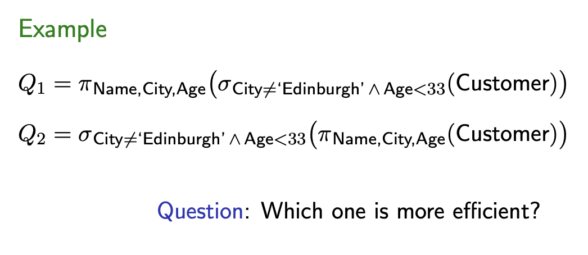

      - Answer: This depends on which query (q1 or q2) disregards more data first, which might change for different relations and different relational queries. $Q_1$ might be more efficient if there are few rows that satisfy $\theta$, and then selecting their attributes from $\alpha$ would be very quick. But then, assume that the selection operation yields almost all of the rows because most of them satisfy $\theta$. In that case, it might be more efficient to first filter out some columns using the projection operation so that when selecting almost all rows, less attributes fields per row are selected and "loaded" into the virtual table (since every single operation results in a virtual table).
        - Both selection and projection can make table smaller, so just depends which one makes the table smaller first.
- Cartesian product
  - Assume we have two tables $A$ and $B$ (could also be more tables)
  - $A\times B$ concatenates each tuple (row) of $A$ with all the tuples of $B$
  - **N.B.** the relations must have **disjoint** sets of attributes
    - This means that they must not share same attributes

    
  - It's an expensive operation
    - Because it does not reduce the output but makes it larger
    - $card(A\times B)=card(A)*card(B)$
      - Card is the number of rows
        - Example: 2 * 3 = 6
    - $arity(A\times B)=arity(A)+arity(B)$
      - Arity is the number of attributes
        - Example: 2 + 2 = 4
  - For RA it doesn't make a difference whether $R\times S$ or $S\times R$
    - In SQL it does!
- Joining Relations
  - Process of combining the Cartesian product and selection
  - Consider the following schema defining two relations:
    ```
    Customer: ID, Name, Ciy, Address
    ACcount:  Number, Branch CustID, Balance
    ```
  - We can join customers with the accounts they own as follows:

    $$\sigma_{ID=CustID}(Customer\times Account)$$

    - This takes the Cartesian product of `Customer` and `Account`
    - Then, selects the rows which satisfy `ID=CustID`
- Renaming
  - Process of giving new names to some of the attributes of a relation
  - Syntax:

    $$ρ_{replacements}(relation)$$

    - where a replacement has the form $A\rarr B$
    
  

  
    - We first rename `CustID` to `CustID'`
    - Then we compute the Cartesian product
    - FInally, we horizontally select all rows that satisfy `CustID=CustID'`
      - All of this makes sence since we'd otherwise have a 'CustID' name clash for comparison, so this is a possible resolution
      - For this particular situation there's actually a better way of achieving this, see *Natural join*
- Natural join
  - Process of joining two tables on their *common attributes*

    

    - That $\bowtie$ sign between `Customer` and `Account` notates the natural join operation
    - It's logically equivalent to exactly what we did above and projecting the union of all attributes of `Customer` and `Account`
      - Q: Would this statement result in a table with both `CustID` *and* `CustID'`, whereas a cleaner solution would be to only have one of those attributes? The $X\cap Y$ statement does not get rid of this because `CustID` and `CustID'` are two different attributes if we only look at their names.
      - A: Natural join removes the renamed version of the common attribute
  - If there are multiple common attributes, the condition of $\sigma$ will be a conjunction; all equalities will need to be true
- From SQL to relational algebra
  
  
- Set operations
  - **Work only on relations that have the same set of attributes**
  - Union $A\cup B$
    - Complements all elements in attribute $A$ with all elements in $B$ that are not already in $A$
  - Intersection $A\cap B$
    - Only shared elements
  - Set Difference $A - B$
    - Remove elements that are contained in both $A$ and $B$
  - Example
  
    
- Full relational algebra
  - Primitive operations: $\pi, \sigma, \times, \rho, \cup, -$
    - They're the most basic operations in relational algebra, can't remove those / express them differently
  - Derived operations
    - They're derived from combinations of primitive operations
    - $\bowtie$ can be expressed in terms of $\pi, \sigma, \times, \rho$
    - $\cap$ can be expressed in terms of difference:

      $$A\cap B\equiv A-(A-B)$$
      - This makes sense since we take all the elements which are in $B$ but not in $A$ ($A-B$) and remove them from $A$
  - Other derived operations

    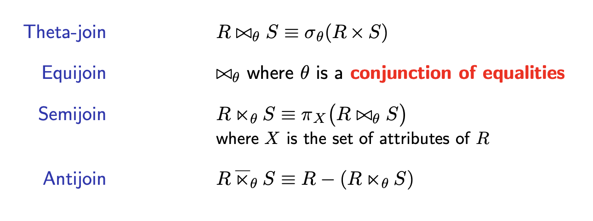

    - These operations mainly serve two purposes:
      1. To write things more succinctly
      2. They can be optimised independently
         - Q: What would be an example of individual optimisation?
         - A: If we have a theta-join expression, it's easier to recognise and DBMS can develop algorithms just for that expression which optimise it.
- Division
  - Assume we have two relations $R$ and $S$
    - $R$ has a set of attributes $X$
    - $S$ has a set of attributes $Y$
  - Constraint: $Y\subset X$, so all attributes in $Y$ are also in $X$
  - Let $Z=X-Y$
    - So that'd be the set of attributes which contains all the attributes that are in $X$ but not $Y$
  - Then,

    

    - Requirement: Y is a strict subset of X, so all attributes of S are included in X, but S does not have *all* of Xs attributes
    - Z denotes the attributes that are unique to R
      - The attributes that are in R but not in S
    1. Division gives you all the attributes that are unique to R.
    2. The relation returned by division will have those tuples from relation $X$ which are associated to every $S$'s tuple

    

    - TODO: explain this step by step via the equation above
- Can represent RA expression using a tree (TODO)
  - 
## Week 3: Propositional Logic

- Logic
  - Logics are formal languages for
    - Representing *what we know* about the world
    - Reasoning about this knowledge (draw conclusions from it)
  - Logics consist of two components:
    - *Syntax* defines the sentences in the language
      - How they need to be structured / grammar
    - *Semantics* defines the *meaning* of sentences
- Families of logics
  - There is not *one* logic, there are lots of families of logics
    - E.g. modal logics, description logics, ...
  - We are concerned with two *classical* logics
    - Propositional logic
    - First-order logic
- Propositional logic: building blocks
  - Atomic statements
    - Cannot be further decomposed
    - E.g.
      - "It is raining"
      - "The cat is on the table"
      - "The sky is blue"
    - Usually denoted with uppercase letters: $P,Q,...$
      - Called *propositional variables*
  - Logical connectives
    - Conjunction: $\land$ (and)
    - Negation: $\neg$ (not)
- Propositional logic: syntax
  - "Grammar" rules
  

  - TODO: what are $\phi$ and $ψ$?
    - both are formulae, different symbols because they may be distinct from each other?
- Propositional logic: semantics
  - Giving meaning to the language
  - Informally
    - Atomic statements can be either `true` ($t$) or `false` ($f$)
    - The truth value of a formula is determined by the truth values of its atoms
  - Formally
    - A *truth-value assignment* is a function:

      $$\alpha:\ Prop\rarr\{t,f\}$$

      - Assigns a proposition to a `true` or `false`value
  - Then, $\alpha$ *satisfies* a formula $\phi$ ($\alpha \models\phi$) as inductively as follows:
    - TODO: what does *inductively* mean in this context?

    

    1. "$\alpha$ satisfies $P$ iff $\alpha$ maps $P$ to $t$ (true)."
    2. "$\alpha$ satisfies the negation of a subformula $\phi$ iff it does not satisfy the subformula."
    3. "$\alpha$ satisfies the conjunction ($\land$) of two subformulas $\phi,\psi$ iff it satisfies both of them individually."
- Truth tables
  - They reflect the semantics of the connectives, e.g.:

    
  
  - How to use truth tables to find an $\alpha$  which $\alpha\models\phi$
    1. Take the $n$ different $P$, write out all possible combinations of truth values. To do so, create $n$ columns, one for each of $P$. Then in the first column, start $\frac{2^n}{2}$ rows with $t$, the other half with $f$. In the second column, do the same but alternate the truth value every $\frac{2^n}{4}$, etc. This will give us all possible truth value assignments.
    2. Dissassemble $\phi$ into easy-to-evaluate parts.
    3. Take those parts and build more complicated parts from the formula.
    4. Evaluate from left to right.

    

    

  - Given $\alpha$ and $\phi$, checking whether $\alpha\models\phi$ can be done in *plynomial time* in the size of $\phi$
    - TODO: what does "in the size of $\phi$" mean?
    - TODO: Why is the above true?
- Satisfiability and Validity
  - A formula $\phi$ is

    | Attribute     | Condition                                               |
    | ------------- | ------------------------------------------------------- |
    | satisfiable   | if there is some $\alpha$ that satisfies $\phi$         |
    | unsatisfiable | if $\phi$ is not satisfiable, i.e. there is no $\alpha$ |
    | falsifiable   | if there is some $\alpha$ that does not satisfy $\phi$  |
    | valid         | if every $\alpha$ satisfies $\phi$                      |

    - A valid formula $\phi$ is called a *tautology*
  - Consequences
    - $\phi$ is a tautology iff $\neg\phi$ is unsatisfiable
    - $\phi$ is unsatisfiable iff $\phi$ is a tautology
- Equivalence
  - Two formulas are *logically equivalent* ($\phi\equiv\psi$) if for all $\alpha$

    $\alpha\models\phi\iff\alpha\models\psi$

    - I.e. there is no assignment that satisfies one formula but not the other
  - Intuitive explanation
    - Equivalent formulae have the same meaning even though they may differ syntactically
    - They say the same thing in different ways
- Propositional logic: extended language
  - Syntax: new connectives

    

    

- Expressive power
  - Every formula in the extended language can be equivalently expressed using only $\land$ and $\neg$:

    
    
  - Hence, the new connectives do not add expressive power to the language, they're just *syntactic sugar*
  - But useful to write formulae more succinctly
    - Like derived operations in RA
- Equivalences

  
  

- Entailment
  - We extend the satisfaction relationship $\models$ to sets $\Sigma$ of formulae:

  

    - TODO: add explanation of the above expression
      - An assignement of truth values $\alpha$ entails a set $\Sigma$ of formulae iff that asssignment entails every single formula $\phi$ in $\Sigma$, which is only the case iff that assignment also satisfies the conjunctive concatenation of all those formulae.
    - That big tent $\land$ is like a sum sign $\Sigma$ but for "anding", i.e. connecting all $\phi$ with $\land$s
  - Then we say that $\Sigma$ entails a formula $\phi$ if for all $\alpha$

    $$\alpha\models\phi$$

    whenever

    $$\alpha\models\Sigma$$

    - I.e. every assignment that satisfies $\Sigma$ also satisfies $\phi$
- Properties of Entailment
  - TODO: explain the below properly / provide examples

    

- Decision problems
  - Definition
    - Takes (one or more) inputs
    - Answers a `yes/no` question
  - Example
    - The Boolean Satisfiability Problem (SAT)
      - "Given a propositional formula $\phi$, is $\phi$ satisfiable?"
        - I.e., can we find an assignment $\alpha$ such that $\alpha\models\phi$?
  - A *decision procedure* is an algorithm that
    - Always terminates
    - Solves a decision problem
  - A decision problem is *decidable* if there exists a decision procedure for it
- Solving SAT
  - Satisfiability in propositional logic is a *decidable* problem
  - Naïve algorithm to solve SAT

    ```md
    1. Enumerate all possible assignments
       (there are 2^n where n is the number of atoms in the formula)
    2. For each assignment check whether the formula is satisfied:
       1. if it is, stop and answer YES
       2. otherwise, continue to next assignment
    3. If there are no more assignments, stop and answer NO
    ```

    - This is rather similar to my explanation on how to use truth tables
  - SAT is an NP-complete problem:
    - A (candidate) solution can be verified in plynomial time
      - Candidate solution = potentially satisfying assignment
    - No known efficient (polynomial) way to locate a solution
      - In the worst case, it requires exponential time
- Reduction to satisfiability
  - Validity, equivalence and entailment are decision problems
    - If you formulate it like "is a given formula $\phi$ valid?"
  - Those decision problems can be reduced to checking satisfiability:

    

  - A decision producedure for satisfiability is all we need
- Additional terminology in PL
  
  | Terminology      | Meaning                 |
  | ---------------- | ----------------------- |
  | Atom             | atomic formula          |
  | Literal          | atom                    |
  | Positive literal | positive atom           |
  | Negative literal | negated atom            |
  | Clause           | disjunction of literals |
  | Term             | conjunction of literals |
  
- Normal forms
  - Formulae can be expressed in a standard syntactic form
    - (Remember the "can say the same thing in different ways"? This is about saying a thing in a standardised way.)
  
  

    - So NNF is a less strict form then DNF and CNF

- Converting to NNF, CNF and DNF
  - For every formula there exist *equivalent* formulae in CNF, DNF and NNF
  - First convert to NNF, then CNF or DNF:

    

- Purpose of normal forms
  - CNF helps us to determine whether a formula is *valid*:
    - If all clauses contain complementary literals, then the formula is a tautology
      - TODO: what are *complementary* literals?
    - Otherwise, the formula is falsifiable
  - DNF helps us to determine whether a formula is satifiable:
    - If all terms contain complementary literals, then the formula is unsatisfiable
    - Otherwise, the formula is satisfiable
## Week 3: First-Order Logic / Predicate Logic
- Motivation for predicate logic
  - Atomic formulas of propositional logic are too atomic
    - They are statements may be true or false
    - But they have no internal structure
      - Q: What do they mean by internal structure?
      - A: It's difficult to express relationships between objects, so it'd be handy to be able to do that within atomic statements.
  - First-Order Logic (FOL) introduced atomic formulas which are statements about *relationships between objects*
- Predicates and constants
  ```bash
  # All of the below statements can be expressed as atomic propositions only in propositional logic
  # Mary is female
  # John is male
  # Mary and John are sibling

  mary-is-female
  john-is-male
  mary-and-john-are-siblings
  ```
  - In FOL atomic statements, we use *predicates*
    - And *costants* are their arguments:
    ```java
    Female(mary)
    Male(john)
    Sibling(mary,john)
    ```
    - You can (kind of) think of predicates as as methods that take in parameters (the constants), and the method gives some meaning to the parameters
  - Arity of a predicate: the number of arguments it takes
    - The predicate is applied to those arguments
- Variables
  - Predicates may also have *variables* as arguments (not only constants)
  - The values of the variables may be bound by *quantifiers*
    | Quantifier  | Semantics             |
    | ----------- | --------------------- |
    | $\forall x$ | for all $x$           |
    | $\exists x$ | there exists some $x$ |
    - The $\forall$ symbol makes sense, it's an upside down $A$ (for $A$ll)
    - The $\exists$ symbol makes sense, it's a mirrored $E$ for "there $E$xists"
  - FOL expression examples:
    - $\forall x(Male(x)\lor Female(x))$
    - $\forall x(Male(x)\rarr\neg Female(x))$
- Syntax of FOL
  - Terms
    - Countably infinite supply of
      - **variable** symbols: $x,y,z,...$
        - End of alphabet letters, by convention
      - **constant** symbols: $a,b,c,...$
        - Start of alphabet letters, by convention
      - Predicate symbols: $P,Q,R,...$
        - Uppercase letters, by convention
    - Term

      

      - A term consists of either a variable or a constant
  - Formulas

    

    - Q: What does "if $x$ occurs free in $\phi$" mean?
    - A: It means that $x$ cannot be bound by another quantifier already in order to be quantified by this quantifier. See next paragraph for the formal definition of *free* variables.
- Free variables
  - Variables that are not in the scope of of any quantifier
  - A variable that is not free is *bound*
  - Example:
    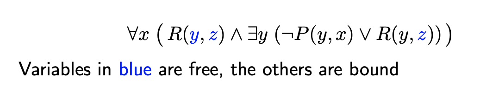
    - How can we determine this for more complex formulas? $\rarr$ syntax trees 🤩
- Syntax trees
  - Way of dissecting a FOL formula into its atomic statements
  ```bash
  # How to create a syntax tree for any FOL formula
  1. Look at the top-level operator (usually a quantifier).
  2. Take that operator and create branches for each part it is applied to.
  3. Repeat steps 1-2 until you have leaves with all the atomic statements.
  ```
  

  - Then, go through each leaf and go up the path to the root
    - If at any point on that path, a quantifier mentions that variable, the variable is bound
    - If not, it's free
- Semantics of FOL: Interpretations
  - A formula evaluates to either `true` or `false`
    - Depends on a given *interpretation*
  - A *First-order structure* is an interpretation for a FOL formula:
  
    $$\mathcal{I}=\langle\Delta,.^{\mathcal{I}}\rangle$$

  - $\Delta$ is a non-empty domain of objects
    - Also called universe
    - Objects can be people, things, etc.
  - $.^{\mathcal{I}}$ gives meaning to constant/predicate symbols:
    
    $$a^{\mathcal{I}}\in\Delta$$ 

    $$R^{\mathcal{I}}\subseteq\Delta^n$$
    - Interpretation $\mathcal{I}$ assigns an object from the universe $\Delta$ to a constant $a$
    - Interpretation $\mathcal{I}$ assigns a set of objects from $\Delta^n$ to a predicate $R$, where $n$ is the arity (number of parameters) of $R$
      - $\Delta^n=\Delta_0\times\Delta_1\times...\times\Delta_{n-1}$
      - Results in a matrix of cardinality $n$ with all possible permutations of objects from $\Delta$
      - So $\mathcal{I}$ chooses the "right" row out of that matrix for this specific interpretation
  - Variable assignment $\nu$
    - Maps each variable to an object in $\Delta$
    - Notation: $\nu[x/d]$ assigns object $d$ to variable $x$
    - If it's just $\nu$ by its own, it means that $v(x)$ would be an assignment of all possible objects to x, one by one (TODO: check this)
- Semantics of FOL: terms
  
  - A term $x$ given an interpretation $\mathcal{I}$ and a variable assignment $\nu$ is to be interpreted as whatever object $\nu$ assigns to $x$: $v(x)$
  - A constant $a$ given an interpretation $\mathcal{I}$ and a variable assignemnt $\nu$ is to be interpreted as whatever object $\mathcal{I}$ defines $a$ to be
    - Can ignore $\nu$ since $a$ is not a variable
- Semantics of FOL: formulas
  
  - The condition for the universal quantifier means that for every single object $d$ in the universe $\Delta$, the interpretation still needs to satisfy the formula $\phi$ if we assign that object  to the variable $x$
  - For the $\exists$ quantifier: there needs to be at least one such object $d$ in $\Delta$
  
- Equality
  - Equality can be seen as a *special predicate*
    
    - $t_1=t_2$ is `true` under a given interpretation if and only if $t_1$ and $t_2$ refer to the same project
- Examples of evaluating a FOL formula given a first-order structure $\mathcal{I}$
  
  1. First formula
     1. Recall that given a FOL structure, a constant just gets interpreted as the object specified in the FOL structure: $a^{\mathcal{I}}\in\Delta$.
     2. So from $Block(a)$ we take $Block^{\mathcal{I}}=\{d_1\}$, and $a^{\mathcal{I}}=d_1$.
     3. Since $d_1\in\{d_1\}$, $Block(a)$ evaluates to `true` given this interpretation.
     4. Similar process for $Block(b)$ since $a=b$ under this interpretation ($a^{\mathcal{I}}=b^{\mathcal{I}}$ since $d_1=d_1$). Hence, also evaluates to `true`.
     5. Intermediate state: $\top\land\top\land\neg(a=b)$
     6. We already established that the equality predicate holds `true` for $a=b$ so $\neg(a=b)$ becomes $\neg\top$ which is $\bot$.
     7. We end up with $\top\land\top\land\bot$ which evaluates to $\bot$, the interpretation does not satisfy the formula: $(\mathcal{I,\nu})\nvDash\phi$
       - $\phi$ refers to the formula we dissected above, I couldn't be bothered to type it out
       - Note how we did not pay any attention to $\nu$ since there occur no variables in the formula, only constants
  2. Second formula
     1. $Block(x)$ gets evaluated similarly to the first formula except now it's a variable assignment we need to consider: $x^{\mathcal{I},\nu}=\nu(x)=d_1$. And $d_1\in Block^{\mathcal{I}}\equiv\{d_1\}$ so $Block(x)\equiv_{\mathcal{I},\nu}\top$.
     2. $Red(y)$: $d_2\in\Delta$ so $\top$.
     3. $d_1\nvdash d_2$ so the entire formula is not satisfied.
     4. Usually, you could just start with evaluating $x=y$ if you sense that it might be `false` since then you don't need to check the other subformulas (it's a conjunction).
  3. Third formula
     1. TODO: write this out
     2. True since Red(x) refers to all elements in the universe and True -> True is true, and False -> X is always true (falsehood implies anything).
  4. Fourth formula
     1. TODO: write this out
     2. It's a tautology because Block(c) evaluates to either $\top$ or $\bot$, and then its negation ($\neq$) is the opposite. Since the two atomic statements are $\lor$ed, in total it's always $\top$.
- Satisfiability and validity
  - An interpretation $(\mathcal{I},\nu)$ is a **model** of $\phi$ is $(\mathcal{I},\nu)\equiv\phi$
  - Properties of a formula:
    | Property      | Condition                                           | Remark                                                       |
    | ------------- | --------------------------------------------------- | ------------------------------------------------------------ |
    | satisfiable   | if it has model                                     | if there is some interpretation that can satisfy the formula |
    | unsatisfiable | if it has no models                                 | there doesn't exist a single satisfying interpretation       |
    | falsifiable   | if there is some interpretation that is not a model |                                                              |
    | valid         | if every interpretation is a model                  | also called a tautology                                      |
- Equivalence
  - Don't think about this too much if you don't get it, it's not crucial for the exam
  - 
  - Questions:
    1. No, we can come up with an interpretation where the variable assignment maps $x$ and $y$ to different values, one that is in $P^{\mathcal{I}}$ and one that is not in $P^{\mathcal{I}}$ so the interpretation would satisfy $P(x)$ but not $P(y)$
    2. Yes, no matter which interpretation you take, if the interpretation is a model of one formula, it's also a model on the other one
- TODO: add personal notes / write out the below paragraphs
- Universal quantification
  - 
- Existential quantification
  - 
- Properties of quantifiers
  - 
- Quantifier duality
  - 
- Equivalences
  - 
  - 
  - 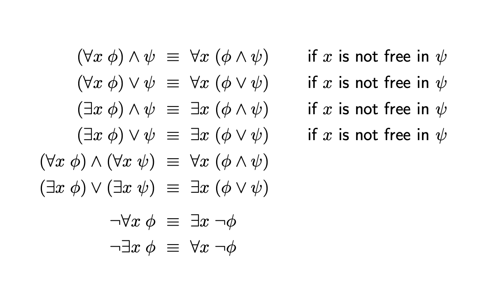
- Implication in plain English: "if...then"
## Week 3: Relational Calculus
- Recall first-order logic where
  
  - $\bf{free(\varphi)}=\{$ variables that are not in the scope of any quantifier $\}$
- Quantifiers bind until the end of the line
  
- Relational calculus
  - A relational calculus query is an expression of the form $\{\overline{x}|\varphi\}$
    - The set of variables in $\overline{x}$ is $\bf{free}(\varphi)$

    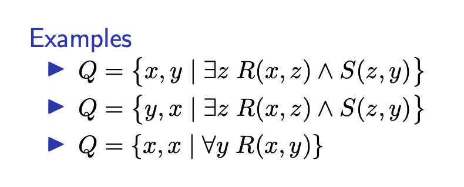
  - Queries without free variables are called Boolean queries
    
- Data model
  - Slightly different for relational calculus
  - Relations are **sets** of tuples of the same length
    - "Tables are sets of rows of the same length"
  - Schema
    - Set of relation names
    - Arity of each relation name
      - Arity = number of columns
    - Columns are ordered but have no names
      - Q: What does this mean?
      - A: This means that Relational Calculus is a positional query language which does not care about column names but only about their respective position in a relation. This is because in RC queries, we use variables and not the specific column names, so the variables and their indexes conventionally correspond to the position their index indicates.
        - E.g. $x_1$ corresponds to the first column
  - Instance
  - Each relation name of arity $k$ is associated with a $k$-ary relation
    - That is, a set of tuples that are all of length $k$
- Examples for the relational calculus data model


  - Q1 remarks: Note that the existential quantification $\exists x,z$ is necessary since any customer which has a name $y$ should also have an ID and age, it should not be a partial customer
  - Q3 remarks: the "in every branch" bit is tricky, it basically says "in all accounts, there exists one account with a number $u'$ associated with custID $x$, for all branches $w$.
  - In general, existentially quantify $\exists$ variables you do not want to query $\rarr$ because then they won't be in the RA expression header since they are not free anymore
- Interpretations
  - Same first-order structure $\mathcal{I}$ applies:
    
  - Additionally, we have the Standard Name Assumption (SNA) in relational calculus:
    > Every constant is interpreted as itself: $c^{\mathcal{I}}=c$
- Answers to queries
  - Does this just say that the query answer consists of the variable assignments (i.e. object in the universe, i.e. database instances) and the database and the variable assignment must satisfy $\varphi$?
  - TODO: https://piazza.com/class/ktn3wckjzhd2fv?cid=70
  - The answer to a Boolean query is either the set of an empty tuple $\{()\}$ (`true`) or an empty set $\varnothing$ (`false`)
- Safety
  - A query if *safe* if:
    1. It gives a *finite answer* on *all* databases
    2. the query answer does not depend on the universe $\Delta$
    
    - Remark Q1: depends on domain $\Delta$, if 
  - Whether a relational calculus query is safe is undecidable
- Active domain
  - Using the notion of an active domain allows us to write safe queries only
  - It's called active domain because it's part of the universe that is actually being used by that database
  - Notated using $Adom(R)$
    - I.e. the active domain of a relation $R$
  - Or $Adom(D)$
    - That's the active domain of an entire database $D$
  - The set of all distinct constants which occur in the passed parameter
- Active domain semantics
  - TODO: last two slides of Relational Calculus slides, add content if turns out to be relevant in exam questions
## Week 4: Equivalence of Calculus and Algebra
- TODO: main differences between RA and RC (in terms of data model)
- RA = Relational algebra
- RC = Relational calculus
- Fundamental theorem of database theory:
  > Relational algebra and safe relational calculus are equally expressive.
  - For every query in safe relational calculus there exists an equivalent query in relational algebra
  - For every query in relational algebra there exists an equivalent query in safe relational calculus
- Assumption: We can use a hybrid data model
  - Columns have names (don't have names in RC) and they are ordered
    - So we could have a relation $R$ over $A,B,C$ which means the $1$st column is $A$, the $2nd$ is $B$, the $3$rd is $C$
- From RA to RC
  - Idea: first translate each RA expression $E$ into a FOL formula $\varphi$
    - That formula is going to be the body of the RC expression 
    - The free variables head of the RC expression can be done post-translation, that's easy
  - Environment $\eta$
    - Is an *injective* map from attributes to variables
      - Q: What does injective mean again?
      - A: Injective is an attribute for a function. An injective function maps no more than one object from the domain to one item in the range. So there can't be two domain objects which get mapped to the same range object.
        
    - Unless stated otherwise, for an attribute $A$ we assume $\eta(A)=x_A$
      - In general, the chosen variable names can be arbitraty though, so $\eta(A)=y_A$ would be as valid
  - Base relation
    - $R$ over $A_1,...,A_n$ is translated to $R(\eta(A_1),...,\eta(A_n))$
      - The $A_i$s are the distinct attributes
      - The relation gets translated by taking each $A_i$ and mapping it via the environment $\eta$
    - Example
      - 
        - $A\mapsto x_A\equiv\eta(A)=x_A$
  - Renaming
    - $\rho_{old\rarr new}(E)$
      - Recall: $E$ is our RA expression
      1. Translate $E$ to FOL formula $\varphi$
      2. If there is no mapping for $new$ in $\eta$, add $\{new\mapsto x_{new}\}$
      3. Replace every occurrence of $\eta(new)$ in $\varphi$ with a *fresh* variable
         - TODO: what does fresh mean? just a new variable with a name that has not been used before?
      4. Replace every free occurrence of $\eta(old)$ in $\varphi$ by $\eta(new)$
      
  - Projection
    - $\pi_{\alpha}(E)$ is translated to $\exists X\varphi$
      - where:
      - $\varphi$ is the translation of $E$
      - $X=\bf{free}(\varphi)-\eta(\alpha)$
        - I.e., attributes that are *not* pojected become quantified
      
  - Selection
    - $\sigma_{\theta}(E)$ is translated to $\varphi\land\eta(\theta)$
    - Where:
      - $\varphi$ is the translation of $E$
      - $\eta(\theta)$ is obtained from $\theta$ by replacing each attribute $A$ by $\eta(A)$
        
  - Cartesian product, union, difference
    
    - For intersection $\cap$:
      - Just take $\land$
        - See translation exercises
    
    - Recall what $\bowtie$ means:
      - It's a natural join on common attributes, in this case on $CustID$
      - Expressed in basic operations:
        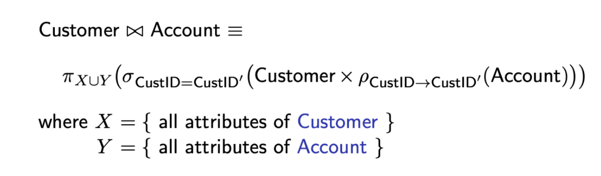
      - Should be:

        $$
          x_{CustID}=x_{CustID'}\land Customer(x_{CustID},x_{Name})\land Account(x_{number},x_{CustID'})
        $$

      - And then map via $\eta$:
        - Add $\{CustID'\mapsto x_4\}$:

        $$
          x_1=x_4\land Customer(x_1,x_2)\land Account(x_3,x_4)
        $$

      - Need to quantify $x_4$ since it's not an attribute of Account (at least initially) and all not-projected variables get quantified during the translation:


        $$
          \exists x_4.x_1=x_4\land Customer(x_1,x_2)\land Account(x_3,x_4)
        $$

  - Active domain in relational algebra
    - For a relation $R$ over attributes $A_1,...,A_n$, the active domain $\bf{Adom}(R)$ is given by:

      

      - Rename all attributes to the same name ($A$) so that you can take the union of them. Will the set of all instances.
    - Active domain of a dataset

      $$\bf{Adom(D)}=\bigcup_{R\in D}\bf{Adom}(R)$$

      - I.e. the union of all active domains of all relations in $D$
    - On a database $D$, we denote by $\bf{Adom}_N$ the RA expression that returns a table
      - with a single column named $N$
      - consisting of all elements of $\bf{Adom}(D)$
- From RC to RA:
  - Translate each FOL formula $\varphi$ into an RA expression $E$
  - Assumptions

    

  - Environment $\eta$
    - Injective map from variables to attributes
      - As opposed to an injective map from attributes to variables for RC $\rarr$ RA
    - Unless stated otherwise, for a variable $x$ we assume $\eta(x)=A_x$
      - We assume for a variable named $x$ that the environment maps it to attribute $A_x$
    - But in general, the chosen attribute names can be arbitrary
      - So a variable named $x$ could also be mapped to $A_y$ if stated explicitly
  - Let relation $R$ be over attributes $A_1,...,A_n$
  - Predicate Translation
    
    - A predicate $R$ is translated to a relation $R$ where each attribute is named according to $\eta(predicate\ inputs)$

    
  - Existential quantification translation
    
    - Translate FOL formula $\varphi$
    - Remove all columns corresponding to existentially bound variables

    
  - Comparisons translation
    - Recall that the following **op**erations are available for comparisons:
      - op ∈ {=, <>, <, >, <=, >=}

    
    - Take the crossproduct of the active domain of $\eta(x)$ (of whatever attribute $\eta$ maps to from $x$) and $\eta(y)$
    - Select rows with the condition $\eta(x)\bf{op}\eta(y)$
      - So it's comparising the fields of the two attributes row-wise and selecting rows

    
      - The second line makes sense since $1$ is an identity of the crossproduct operation
  - Negation translation
    
    - Take the crossproduct of all the active domains of all free variables
    - Subtract $E$

    
  - Disjunction translation
    

  - Conjunction translation
    - Same as disjunction, but use $\bigcap$ instead of $\bigcup$
  - Example combining all of above
    
    
## Week 4: Multisets and Aggregation
- Multisets
  > Sets where the *same element* can occur *multiple times*.
  - So far, we considered relational algebra on *sets*
  - SQL uses multisets, i.e. sets which allow duplicates
  - Multisets are also called bags
- Multiplicity
  - The number of occurrences of an element is called its *multiplicity*
    
- Relational Algebra on bags
  - Relations are bags / multisets of tuples
    - Recall: tuple = row = data instance
  - Projection
    
  - Cartesian product
    
  - Selection
    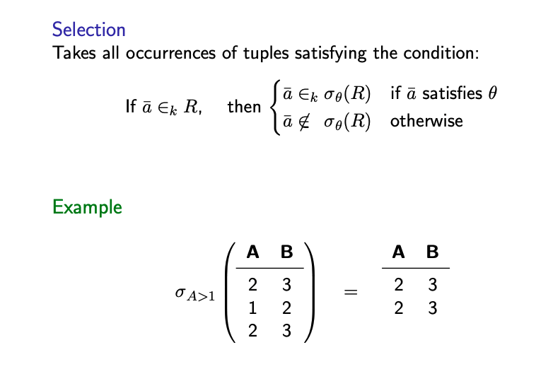
    - If there are $k$ occurrences of tuple $\bar{a}$ in relation $R$, then:
      - If the tuple (and therefore everysingle occurrence of that tuple too) satisfies condition $\theta$ $\rarr$ all $k$ occurrences of $\bar{a}$ are included in the selection $\sigma_{\theta}(R)$
      - If does not satisfy $\theta$: none of $\bar{a}$ are included in the selection
  - Duplicate elimination $\varepsilon$
    
  - Union
    
    - If there are $k$ instances of tuple $\bar{a}$ in relation $R$ and $n$ instances in $S$, in the union of $R$ and $S$ there are going to be $k+n$ instances
  - Intersection
    
    - If there are $k$ instances of tuple $\bar{a}$ in relation $R$ and $n$ instances in $S$, there will be $min(k,n)$ instances in the intersection of $R$ and $S$
      - Whatever is smaller
  - Difference
    
    - Can subtract up to all instances but no more
- RA on sets vs RA on bags
  - Equivalences of RA on sets do not necessarily hold on bags
    
    - On the other hand, using the $\varepsilon$ operator (duplicate eliminator), the equality holds again since it transforms multisets back into normal sets:
    
- Basic SQL queries 
  
  - TODO: Tidy this up
  - So far, only had `WHERE`, FROM and SELECT 
  - Now we add
    - DISTINCT
      - This is optional (that's why it's in square brackets)
      - This is duplicate elimination
        - Remove duplicates from the output
    - UNION
      - Union under set semantics (without duplicates, removes them)
      - UNION ALL
        - Union under bags semantics (duplicates kept)
    - INTERSECTION
      - Intersection under set semantics
      - INTERSECTION ALL  
        - Intersection under bags semantics  
    - EXCEPT
      - Difference under set semantics
        - EXCEPT ALL
          - Difference under bags semantics
- SQL and RA on bags compared
  
  - TODO: add explanation after having watched lecture
  - Note that for set difference, we do not remove the from the right input, only from the left input
    
- Duplicates and aggregation
  - Aggregation includes operations where multpile instance (-fields) need to be aggregated to calculate some value
    - E.g. to get the average ($\frac{1}{n}\Sigma_{i=1}^n x_i$)
  - For some aggregation operations, we want to keep duplicates, for others, we want to discard duplicates using $\varepsilon$
  - `Average
    - Want to keep duplicates:
      
    - SQL keeps duplicates by default:
      ```sql
      SELECT AVG(age)
      FROM   Customer ;
      ```
  - `COUNT`
    - We want to remove duplicates:
      
    - SQL keeps duplicates by default, so we need to explicitly remove them:
      ```sql
      SELECT COUNT(DISTINCT branch)
      FROM   Account ;
      ```
- Aggregate functions in SQL
    | Aggregate Function | Purpose                               | Duplicates make difference? |
    | ------------------ | ------------------------------------- | --------------------------- |
    | `COUNT`            | Number of elements in a column        | Yes                         |
    | `AVG`              | Average value of elements in a column | Yes                         |
    | `SUM`              | Adds up all elements in a column      | Yes                         |
    | `MIN`              | Minimum value of elements in a column | No                          |
    | `MAX`              | Maximum value of elements in a column | No                          |
    - Using `DISTINCT` with `MIN` and `MAX` makes no difference
    - `COUNT (*)` counts all rows in a table
    - `COUNT (DISTINCT *)` is **illegal**
      - To count all distinct rows of a table $T$ use
        ```sql
          SELECT COUNT (DISTINCT T.*)
          FROM   T ;
        ```
      - TODO: wathc lecture 51min -> explain why first query is illegal
- Aggregation and empty tables
  - Suppose table $T$ has a column (of numbers) called $A$
    ```sql
    SELECT MIN(A),MAX(A),AVG(A),SUM(A),COUNT(A),COUNT(*)
    FROM   T
    WHERE  1=2 ;
    ```
    - TODO:
      - Q: What's `1=2`?
      - A: A condition that is always false, so will select no rows?
  - The above query will return: 
    | min | max | sum | avg | count | count |
    | --- | --- | --- | --- | ----- | ----- |
    |     |     |     |     | 0     | 0     |
    - TODO: tidy this
      - min, max, sum, avg return NULL, an empty bag
## Week 5: Aggregation with Grouping
- General idea
  - Consider the following table:
  
  - Want to query: How much money does *each* customer have in total *across all of his accounts*?
  - Idea:
    ```sql
    1. Partition Account into groups (one per customer) of rows
    2. Sum balances in each group separately
    3. Take union of the results for each group
    ```
  
- Grouping in SQL
  - Can express the above query in SQL:
    ```sql
    SELECT   A.custid, SUM(A.balance)
    FROM     Account A
    GROUP BY A.custid ;
    ```
  - Answer:

    | CustID | SUM     |
    | ------ | ------- |
    | 1      | 1780.00 |
    | 2      | 1756.00 |
- Grouping in SQL: another example
  - Recall the `Account` table
  - Query: how much money is there in total in each branch?

    ```sql
    SELECT    A.branch, SUM(A.balance)
    FROM      Account A
    GROUP BY  A.branch ;
    ```
  - Answer:
    | Branch    | SUM     |
    | --------- | ------- |
    | London    | 3086.00 |
    | Edinburgh | 450.00  |
  - What's happening:
    
- Beware
  - In queries with `GROUP BY`, attributes in `SELECT` **must**:
    - Appear in the `GROUP BY`, or
    - Be used in an aggregate function
  - The following query gives an error:
    ```sql
    SELECT    A.custid, A.branch, SUM(A.balance)
    FROM      Account A
    GROUP BY  A.branch ;
    ```
    - Error because `A.custid` does not appear in `GROUP BY` or aggregation function
- Filtering based on aggregation
  - Query: What are branches with a total balance (across accounts) of at least `500`?
    - $\rarr$ use `HAVING` keyword
    ```sql
    SELECT    A.branch, SUM(A.balance)
    FROM      Account A
    GROUP BY  A.branch
    HAVING    SUM(A.balance) >= 500 ;
    ```
  - Anwer:
    | Branch | SUM     |
    | ------ | ------- |
    | London | 3086.00 |
- Order of evaluation in SQL queries
  ```sql
  1. Take rows from the (joined) tables listed in FROM
  2. Discard rows not satisfying the WHERE condition
  3. Partition rows according to attributes in GROUP BY
  4. Compute aggregates
  5. Discard rows not satisfying the HAVING condition
  6. Output the values of expressions listed in SELECT
  ```
  - Q: What's the difference between `HAVING` and `WHERE`?
  - TODO: tidy this up
    - WHERE -> Decisdes which rows are fed into aggregation
    - A: HAVING is similar to WHERE in the sense that it takes a condition and returns the rows which satisfy them. However the crucial difference is that HAVING is evaluated after aggregation -> decides which rows to keep from aggregation result
- Aggregation and arithmetic (1)
  - Consider the updated `Account` table below:
    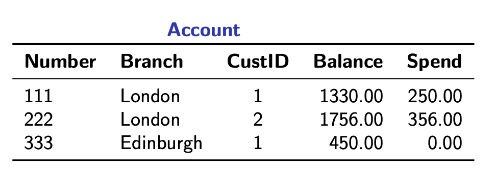
  - Query: money available in total to each customer across his accounts
    ```sql
    SELECT    A.custid, SUM(A.balance - A.spend)
    FROM      Account A
    GROUP BY  A.custid ;
    ```
  - Answer:
    | CustID | SUM     |
    | ------ | ------- |
    | 1      | 1530.00 |
    | 2      | 1400.00 |
  - What's happening?
    
- Aggregation and arithmetic (2)
  - Consider the updated `Account` table from earlier
  - Query: money available in total to each customer across his accounts
    ```sql
    SELECT    A.custid, SUM(A.balance) - SUM(A.spend)
    FROM      Account A
    GROUP BY  A.custid ;
    ```
  - Answer:
    | CustID | ?column? |
    | ------ | -------- |
    | 1      | 1530.00  |
    | 2      | 1400.00  |
    - TODO: What is that `?column?` name?
      - postReg uses aggregation name for the column by default
        - But if we involve aggregation in combination with arithmetic, the default is `?column?`
      - Good practice: give explicit name to such column where we use aggregation + arithmetic using `AS`
  - What's happening?
    
## Week 5: Nested Queries
- Aggregate results in `WHERE`
  - It is possible to have nested queries, i.e. queries withing queries
  - Recall the account table we've seen a couple of times already:

    
  - Then how can we express the following query in SQL:
    > Accounts with a higher balance than the average of all accounts.
    ```sql
    SELECT A.number
    FROM   Account A
    WHERE  A.balance > ( SELECT AVG(A1.balance)
                         FROM   Account A1 ) ;
    ```
  - Answer:

    | Number |
    | ------ |
    | 111    |
    | 222    |
  - This would not work:
    ```sql
    SELECT A.number
    FROM   Account A
    WHERE  A.balance > AVG( SELECT A1.balance
                         FROM   Account A1 ) ;    
    ```
    - It would not work because aggregate function **can only be used in `SELECT` and `HAVING`**
- Comparisons with subquery results
  ```sql
  SELECT ...
  FROM   ...
  WHERE term op ( subquery ) ;
  ```
  - Allowed as long as `subquery` returns a *single value*

  ```sql
  SELECT ...
  FROM   ...
  WHERE (term1,...,termN) op ( subquery ) ;
  ```
  - Allowed as long as `subquery` returns a *single row* with $N$ columns
    - If this confuses you, see *Comparisons between tuples* section for further clarification
- The `WHERE` clase revisited
  
  - TODO: Add explanations for below after lecture:
    - (term,...,term) op ANY (query):
      - The operator condition is true if there is one term and one attribute in query that is ture
    - (term,...,term) op ALL (query):
      - Every single must be true
    - (term,...,term) op [NOT] IN (query):
      - terms must appear in query
    - EXISTS (query):
      - query does not return empty bag
- Comparisons between tuples
  
  - Equality: every element must be equal to positionally same element in other tuple
  - Inequality: at least one of the corresponding elements must not be equal so that the tuples are not equal
  - Smaller than:
    1. We compare the first two elements
       1. If A > B, it's true overall
       2. If A < B, it's false overall
       3. If A = B, we move on to compare the next element with the same rulesss
       4. ...
       5. If last two elements, not move on with = , it's false then
  - Smaller or equal than: TODO
- `ANY`
  - Recall
    ```sql
    (term, ..., term) op ANY ( query )
    ```
    - True if *there exists* at least one row $\overline{r}$ in the results of `query` such that (term, ..., term) $\bf{op}$ $\overline{r}$ is true
    - 
    - Last question: Error because query yields empty bag so comparison invalid
      - TODO: verify this
        - Subquery does give you an empty set
        - Evaluates for false because "is there a row that makes the comparison true" must be answered with false because there is no row
- `ALL`
  - True if *for all* rows $\overline{r}$ in the results of `query`, (term, ..., term) $\bf{op}\overline{r}$ is true
    
    - Last question: True
      - TODO: We cannot find any row that makes the comparison false.
- Examples with `ANY` and `ALL`
  - Consider the following schema:
    ```sql
    Customer: ID, Name, City
    Account: Number, Branch, CustID, Balance
    ```
  - Query: ID of customers from London who own an account
    ```sql
    SELECT C.id
    FROM   Customer C
    WHERE  C.city = 'London'
      AND  C.id = ANY( SELECT A.custid
                       FROM   Account A );
    ```
    - The `ANY` expression says "there exists at least one `A.custid` in the subquery which equals `C.id`"
  - Customers living in cities without a branch
    ```sql
    SELECT *
    FROM   Customer C
    WHERE  C.city <> ALL( SELECT A.branch
                          FORM   Account A );
    ```
- `IN` / `NOT IN`
  - This one is fairly easy
  ```sql
  (term, ..., term) IN ( query )
  -- same as
  (term, ..., term) = ANY ( query )
  ```
  - So `IN` $\equiv$ `= ANY`
  ```sql
  (term, ..., term) NOT IN ( query )
  -- same as
  (term, ..., term) <> ALL ( query )
  ```
  - So `NOT IN` $\equiv$ `<> ALL`
- Examples with `IN` and `NOT IN`
  - Note how these examples relate to the examples from the section above, for comparison
  - ID of customers from London who own an account
    ```sql
    SELECT C.id
    FROM   Customer C
    WHERE  C.city = 'London'
      AND  C.id IN ( SELECT A.custid
                     FROM   Account A );
    ```
  - Customers living in cities without a branch
    ```sql
    SELECT *
    FROM   Customer C
    WHERE  C.city NOT IN ( SELECT A.branch
                           FROM   Account A );
    ```
- `EXISTS`
  - `EXISTS ( query )` is true if the result of the `query` is non-empty
  - (Trivial) Example: Return all the customers if there are some accounts in London
    ```sql
    SELECT *
    FROM   Customer C
    WHERE  EXISTS ( SELECT 1
                    FROM   Account
                    WHERE  branch = 'London' );
    ```
    - `SELECT 1` translates to "get value 1 for each row that matches the condition"
      - It's often used to check that a table is not empty, in combination with `EXISTS` because we don't care about the
        actual row values, just if they exist (so we discard the row values)
- Correlated subqueries
  - All nested queries can refer to attributes in the parent queries
  - Example: Return customers who have an account in London
    ```sql
    SELECT *
    FROM   Customer C
    WHERE  C.id IN ( SELECT A.custid
                     FROM   Account A
                     WHERE  A.branch = 'London' );
    ```
    - TODO: Would this also work?
  - Better:
    ```sql
    SELECT *
    FROM   Customer C
    WHERE  EXISTS ( SELECT 1
                    FROM  Account A
                    WHERE A.branch = 'London'
                      AND A.custid = C.id );
    ```
    - TODO: why better?
- **parameters** = attributes of a subquery that refer to outer queries
  - Like `C.id` in the example above
- Examples with `EXISTS` / `NOT EXISTS`
  - ID of customers from London who own an account
    ```sql
    SELECT C.id
    FROM   Customer C
    WHERE  EXISTS ( SELECT *
                    FROM   Account A
                    WHERE  A.custid = C.id );
    ```
  - Customers living in cities without a branch
    ```sql
    SELECT *
    FROM   Customer C
    WHERE NOT EXISTS ( SELECT *
                       FROM   Account A
                       WHERE  A.branch = C.city );
    ```
- Scoping
  - A subquery has
    - a *local scope* (its `FROM` clause)
    - $n$ outer scopes (where $n$ is the *level of nesting*)
      - These are the `FROM` clauses of the parent queries
    - TODO: clarify this when you're less tired and not at 10.12pm at the library :(
  - For each reference to an attribute
    ```md
    1. Look for a binding in the local scope
    2. If no binding is found, look in the **closest** outer scope
    3. If no binding is found, look in the next closest outer scope
    4. ...
    5. If no binding is found, give error
    ```
- Attribute binding
  ```sql
  SELECT *
  FROM   table1
  WHERE  EXISTS ( SELECT 1
                  FROM   table2
                  WHERE  A = B );
  ```
  - Above is a bad query: what `A`, `B` refer to depends on the attributes in `table1` and `table2`
    - This is why we should always give **aliases** to tables
    - Always prefix the attributes with the tables they refer to (i.e. fully reference them)
  ```sql
  SELECT *
  FROM  table1 T1
  WHERE EXISTS ( SELECT 1
                 FROM   table2 T2
                 WHERE  T2.A = T1.B );
  ```
- The `FROM` clause revisited
  
  - TODO: add explanation after lecture
    - [[AS] T1] means we can give the table a reference name
      - don't need to explicitly write `AS`
    - table is either
      - base-table (what we defined in our schema)
      - join-table
      - query
        - this is new!
    - join-table is a table we constructed using the explicit `JOIN` syntax
      - NATURAL JOIN and CROSS JOIN are irrelevant for this course, can just write them out ourselves
- Subqueries in `FROM`
  - Must always be given a name
    ```sql
    -- ERROR: subqeury in FROM must have an alias
    SELECT * FROM ( SELECT * FROM R );
    ```
  - Cannot refer to attributes of other tables in the same `FROM` clause
    ```sql
    -- ERROR: invalid reference to FROM-clause entry for table "r"
    SELECT *
    FROM   R, ( SELECT * FROM S WHERE S.a=R.a ) S1 ;
    ```
- Example of avoiding `HAVING`
  - Branches with a total balance (across accounts) of at least 500
    ```sql
    SELECT   A.branch
    FROM     Account A
    GROUP BY A.branch
    HAVING   SUM(A.balance) >= 500 ;
    ```
  - Same query without `HAVING`
    ```sql
    SELECT   subquery.branch
    FROM     ( SELECT   A.branch, SUM(A.balance) AS total
               FROM     Account A
               GROUP BY A.branch ) AS subquery
    WHERE    subquery.total >= 500 ;
    ```
- Example: Aggregation on aggregates
  - Average of the total balances accros each customer's accounts
  - Strategy:
    1. Find the total balance across each customer's accounts
    2. Take the average of the totals
  ```sql
  SELECT  AVG(subquery.tot)
  FROM    ( SELECT   A.custid, SUM(A.balance) AS tot
            FROM     Account A
            GROUP BY A.custid ) AS subquery ;
  ```
## Week 6: Other Bits of SQL
- Ordering
  ```sql
  -- Syntax
  ORDER BY <column1> [DESC], ..., <columnN> [DESC]
  ```
  - Sorts the output rows according to the values of `column1`
  - If two rows have the same value for `column1`, they are sorted by the values of `column2` and so on
  - Default ordering is **ascending** (can be specified with `ASC`)
  - **Descending** ordering is specified by `DESC`
- Ordering example
  
- Casting
```sql
CAST( term AS <type> )
```
- Cast a term to a certain type
- **Rounding**
  ```sql
  CAST( 102, 4675 AS NUMERIC(5,2) )
  -- Gives 102.47
  ```
  - Useful also to produce values in a specific format
- **Aggregation**
  ```sql
  AVG( CAST( term AS NUMERIC(P,S) ) )
  ```
  - Avoids rounding errors in some systems
- Conditional expressions
  - Syntax
    ```sql
    CASE WHEN <bool-expr>
        THEN <value-expre>
        ...
        WHEN <bool-expr>
        THEN <value-expr>
        ELSE <value-expr>
    END
    ```
    - Each `bool-expr` is evaluated in order (from top to bottom)
    - When `bool-expr` is true, then the value produced by the corresponding `value-expr` is returned and the `CASE` ends
      - I.e (subsequent `WHEN` are not evaluated)
    - If no `WHEN` evaluates to true, the value produced by `value-expr` in `ELSE` is returned
    - `ELSE` is optional (if missing, the default value is `NULL`)
  - Conditional expressions can be used in `SELECT`, `WHERE`, and `HAVING`
  - Example
    - Return the values of column $A$ replacing `NULL` values with $0$
    ```sql
    SELECT CASE WHEN R.A IS NULL THEN 0
           ELSE      R.A END
    FROM R ;
    ```
- Pattern matching
  ```sql
  term LIKE pattern
  ```
  - It's a comparison
  - `pattern` is a string consisting of
    - characters (case-sensitive)
    - `_` wildcard matching any one character
    - `%` wildcard matching any substring (including empty), of any length
  - Example
    - Customers with a name that begins with 'K' and has at least 5 characters
  ```sql
  SELECT *
  FROM  Customer
  WHERE name LIKE 'K____%';
  ```
## Week 6: Database Constraints
- Integrity constraints
  - Databases are often required to satisfy some integrity constraints
  - Such constraints determine what tuples can be stored in the database
  - Instances that satisfy the constraints are called *legal*
  - Common constraints: *keys* and *foreign keys*
    - These are special cases of more general constraints
      - **Functional dependencies**
      - **Inclusion dependencies**
- Functional dependencies (FDs)
  - Constraints of the form $X\rarr Y$, where $X,Y$ are sets of attributes
    - This is just syntax, not equivalent to a logical implication!
    - "the valuse of the attributes in $X$ determine the values of the attributes in $Y$
  - Semantics (on sets)
    - A relation $R$ satisfies $X\rarr Y$ if for every two tuples $t_1,t_2\in R$
      
    - Intuition: The values for the $X$ attributes determine the values for the $Y$ attributes
    - Intuition 2: If we take any combination of two tuples for which the attribute values from $X$ are the same,
    then if we take their $Y$ values, they must also be the same. Must be true for all combinations of tuples.
      - Think of it as "The combination of attributes from $X$ is a deterministic injective map to a value for the attributes from $Y$, values are always paired up the same way depending on the value of an attribute from $X$."
    - Not true if we can find a tuple for which their $X$ attribute values are the same but for $Y$ attributes they differ from each other
    - Trivial FDs: $X\rarr Y$ where $Y\subseteq X$
      - Trivial since the values of any set always determine the values of any subsets
  - Examples of FDs
    
    - Which of the following FDs would the above relation satisfy?
      1. Department $\rarr$ Manager `True`
      2. Employee $\rarr$ Department `False`
         - See: John + Finance vs John + Sales
      3. {Employee, Manager} $\rarr$ Department `False`
         - See: John, Smith + Finance vs John, Smith + Sales
      4. Manager $\rarr$ Departement `False`
         - See: Smith + Finance vs Smith + Sales
- Keys
  - A set of attributes $X$ is a **key** of relation $R$ if for every $t_1,t_2\in R$

    $$\pi_X(t_1)=\pi_X(t_2)\implies t_1=t_2$$

  - In the case that the attributes from $X$ are a key, if we project over $X$ and the tuples $t_1$ and $t_2$ agree, then the tuples must be the same row
  - A key for a table is a set of attributes that *uniquely identify a row*
    - $\implies$ no two rows caan have the same values for key attributes
  - Key constraints: special case of FDs $X\rarr Y$
    - Where $Y$ is the *whole set of attributes* of a relation
    - So the constraint for a key to be a key is just a special case of an FDs
- Inclusion dependencies (INDs)
  - Constraints of the form $R[X]\subseteq S[Y]$
    - Where $R,S$ are relations and $X,Y$ are **sequences** of attributes
      - These sequences are of the same length
      - Q: What are sequences of attributes?
      - A: TODO
  - Semantics
    - $R$ and $S$ satisfy $R[X]\subseteq S[Y]$ if
      - for every $t_1\in R$ there exists $t_2\in S$ such that $\pi_X(t_1)=\pi_Y(t_2)$
    - **Important**: the projection must respect the attributes order
    - Basically, want the attributes in $X$ of any sub-tuples of $R$ to be among the sub-tuples of $S$ among the attributes of $Y$
      - Like set containment, hence the inclusion symbol $\subseteq$
  - INDs are *referential constraints*: **link** the contents of one table with the contents of another table
    - We want some parts of $R$ to be contained in some parts of $S$, where these parts are defined in $X$ and $Y$
  - A *foreign key* constraint is the conjunction of two constraints:
    1. $R[X]\subseteq S[Y]$   (an IND)
    2. $Y$ is a key for $S$   (a key constraint)
  - Examples of INDs
    
    - Which of the following INNDs would the above relation satisfy?
      - Exmployees[Dep] $\subseteq$ Departments[Name] `True`
      - Exmployees[Name] $\subseteq$ Departments[Mgr] `False`
        - See: Linda or Susan
      - Departments[Mgr] $\subseteq$ Employees[Name] `True`
      - Departments[Mgr,Name] $\subseteq$ Employees[Name,Dep] `False`
        - See: Linda + Sales
- Basic SQL constraints
  | Constraint Keyword(s) | Purpose                              |
  | --------------------- | ------------------------------------ |
  | `NOT NULL`            | Disallow null values                 |
  | `UNIQUE`              | Declare keys                         |
  | `PRIMARY KEY`         | Key + not null                       |
  | `FOREIGN KEY`         | Reference attributes in other tables |
  - `NULL` values are ignored when checking constraints
    - Except for `NOT NULL` and `PRIMARY KEY`
- `NOT NULL`
  - Declaring an attribute as `NOT NULL` disallows null values for that attribute
  ```sql
    CREATE TABLE Account (
      accnum  VARCHAR(12) NOT NULL,
      branch  VARCHAR(30),
      custid  VARCHAR(10),
      balance NUMERIC(14,2) DEFAULT 0
    );
  ```
  - The following instertion would fail:
    ```sql
    INSERT INTO Account(branch,custid)
      VALUES ('London','cust1');
    ```
- Keys
  ```sql
  CREATE TABLE Account (
    accnum  VARCHAR(12) UNIQUE,
    branch  VARCHAR(30),
    custid  VARCHAR(10),
    balance NUMERIC(14,2)
  );
  ```
  - The following insertion would fail:
  ```sql
  INSERT INTO Account VALUES
    (1, 'London', 'cust1', 100),
    (1, 'Edinburgh', 'cust3', 200);
  ```
  - Fails because duplicated `accnum`
  - The following insertionn succeeds:
  ```sql
  INSERT INTO Account VALUES
    (NULL, 'London', 'cust1', 100),
    (NULL, 'Edinburgh', 'cust3', 200);
  ```
    - Succeeds because `NULL` values are ignored for `UNIQUE`
- Compound keys
  - Compound keys are keys consisting of more than one attribute
  - Compound keys must be declared using a different syntax
  ```sql
  CREATE TABLE Movies (
    m_title     VARCHAR(30),
    m_director  VARCHAR(30),
    m_year      SMALLINT,
    m_genre     VARCHAR(30),
    UNIQUE (m_title,m_year)
  );
  ```
  - Declares the set `{m_title, m_year}` as a key for `Movies`
- Primary keys
  - Essentially `UNIQUE` + `NOT NULL`
  - Can only declare one primary key per relation
  - So attributes that don't have any duplicates and no `NULL` values
  ```sql
  CREATE TABLE Account (
    accnum  VARCHAR(12) PRIMARY KEY,
    branch  VARCHAR(30),
    custid  VARCHAR(10),
    balance NUMERIC(14,2)
  );
  
  -- Same as:
  CREATE TABLE Account (
    accnum  VARCHAR(12) NOT NULL UNIQUE,
    branch  VARCHAR(30),
    custid  VARCHAR(10),
    balance NUMERIC(14,2)
  );
  ```
- Foreign keys in SQL (1)
  ```sql
  CREATE TABLE Customer (
    id      VARCHAR(10) PRIMARY KEY,
    name    VARCHAR(20),
    city    VARCHAR(30),
    address NUMERIC(30)
  );

  CREATE TABLE Account (
    accnum  VARCHAR(12) PRIMARY KEY,
    branch  VARCHAR(30),
    custid  VARCHAR(10) REFERENCES Customer(id),
    balance NUMERIC(14,2)
  );
  ```
  - Every value for attribute `custid` in $Account$ must appear among the values of the **key** `id` in $Customer$
- Foreign keys in SQL (2)
  - General syntex for declaring foreign keys
    - Useful for declaring compound foreign keys
  ```sql
  CREATE TABLE <table1> (
    <attr> <type>,
    ...
    <attr> <type>,
    FOREIGN KEY (<list1>)
    REFERENCES <table2>(<list2>)
  );
  ```
  - Where:
    - `<list1>` and `<list2>` are lists with the **same number of attributes**
    - Attributes in `<list1>` are from table `<table1>`
    - Attributes in `<list2>` are **unique** `<table2>`
- Referential integrity and database modifications (1)
  - Deletion can cause problems with foreign keys
    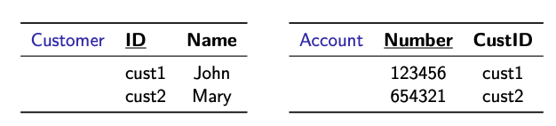
  - What happens if one deletes `(cust1,John)` from $Customer$?
  - Three approaches are supported in SQL:
    1. Reject the deletion operation (default)
    2. Propogate it to $Account$ by deleting also `(123456,cust1)`
    3. "Don't know" approach: keep the tuple in $Account$, but set `CustID` value to `NULL` (this approach is not advisable)
- Referential integrity and database modifications (2)
  - All of the three approaches are supported in the SQL
    ```sql
    CREATE TABLE <table1> (
      <attr> <type>,
      ...
      FOREIGN KEYY <list1> REFERENCES <table2>(<list2>)
        <approach>
    )
    ```
    - Where `<approach>` can be:
      1. Empty: Reject deletions from `<table2>` causing the FK to be violated
         - This is default when `<approach>` is not specified
         - Q: What's FK?
         - A: Foreign key, duh
      2. `ON DELETE CASCASE`: Propogate the deletion to `<name>` (tuples in `<table1>` that violate the FK will be deleted)
      3. `ON DELETE SET NULL`: "Don't know" approach
         - (The values of the attributes in `<list1>`, for tuples in `<name>` that violate the FK, are set to `NULL`)
## Week 7: Entailment of Constraints
- Implication of constraints
  - Constraints are FDs or INDs
  - A set $\Sigma$ of constraints **implies / entails** a constraint $\phi$ if
    - **every** instance that satisfies $\Sigma$ also satisfies $\phi$
  - Notation: $\Sigma\models\phi$
- Implication problem
  - Problem formulation:
  > Given $\Sigma$ and $\phi$, does $\Sigma$ imply $\phi$?
  - Relevant because:
    - We never get the list of all constraints tha hold on a database
    - We have explicit constraints but they may come with implicit constraints we have not discovered yet
    - The given constraints may look fine, but imply some bad ones
    - The given constraints may look bad, but imply only good ones
- Axiomatisation of constraints
  - Axiomatisation is a set of rules (**axioms**) to derive constraints
    - **Sound**: every derived constraint is implied
      - Everything that we derive using the syntactic rules is entailed semantically
    - **Complete**: every implied constraint can be derived
      - Every semantically implied constraint can be derived using syntactic rules
  - A sound and complete axiomatisation gives a procedure $\vdash$ such that
    - $\Sigma\models\phi\iff\Sigma\vdash\phi$
      - A constraint is implied if and only if we can derive it, adhering to the axiomatisation rules
- Notation
  - Attributes are denoted by $A,B,C,...$
  - If $A$ and $B$ are attributes, $AB$ denotes the set $\{A,B\}$
  - Sets of attributes are denoted by $X,Y,Z,...$
  - If $X$ and $Y$ are sets of attributes, $XY$ denotes their union $X\cup Y$
  - If $X$ is a set of attributes and $A$ is an attribute, $XA$ denotes $X\cup\{A\}$
- Armstrong's axioms
  - Sound and complete axiomatisations for FDs
    - Recall FDs: Functional dependencies are constraints of the form $X\rarr Y$, where $X,Y$ are sets of attributes
  
- Closure of a set of FDs
  - Let $F$ be a set of FDs
  - The closure $F^+$ of $F$ is the set of all FDs implied by the FDs in $F$
  - Can be computed using Armstrong's axioms
  - Example:
    - Closure of $\{A\implies B,B\implies C\}$
    - Answer: Tuesday lecture from 02/11/2021, 21:13min
    - We don't need to do this in the exam
- Closure of attributes / attribute closure
  - The closure $C_F(X)$ of a set $X$ of attributes w.r.t. a set $F$ of FDs
    - Is the set of attributes we can derive from $X$ using the FDs in $F$
      - i.e., all the attributes $A$ such that $F\vdash X\implies A$
  - Properties
    
    - First: the set of attributes we can derive from $X$ using the FDs in in $F$ is a superset of $X$, so it includes all attributes of $X$
    - Second: self-explanatory
    - Third: We can't derive any further attributes from a attribute closure set using the same FDs, we'll get the same set.
  - Solution to the implication problem
    - $F\models Y\implies Z$ if and only if $Z\subseteq C_F(Y)$
- Closure algorithm
  - How to get the attribute closure:
  
  - Step 1:  we initialise a set of functional dependencies called unused. Start with $\Sigma$ because we haven't used any of these yet
  - Step 2: we initialise a set of attributes called closure. Start with $X$ because everything in $X$ is trivially in the closure of it (first property of an attribute closure above)
  - Step 3: While there is an unused functional dependence of the form $Y\rarr Z$ such that its left hand-side ($Y$) is contained in the current closure
    - Extend the closure by adding the attributes on the right hand-side ($Z$) of the FD to the closure
    - Remove the FD from `unused`
  - Example
    - Closure of $A$ w.r.t. $\{AB\implies C, A\implies B, CD\implies A\}$
    
      - TODO: explain this
  - Runtime of closure algorithm: lecture from Tue 02/11/21, ~last 10min
- Keys, candidate keys, and prime attributes
  - Let $R$ be a relation with a set of attributes $U$ and FDs $F$
  - $X\subseteq U$ is a key for $R$ if $\Sigma\models X\rarr U$
    - Intuively, this is saying: the value for the attributes in $X$ determine the value of the the attributes in $U$
    - Since $U$ is the set of all attributes in the relation, and $X$ determines all values $U$, $X$ is a key
  - Equivalently, $X$ is a key if $C_{\Sigma}(X)=U$
    - If the closure of $X$ with respect to the given FDs is exactly the set of all attributes $U$
      - Q: Why is that the case?
      - A:
        
  - Candidate keys
    - Keys $X$ such that, for each $Y\subset X$, $Y$ is not a key
    - Intuitively, keys with a *minimal* set of attributes
      - A key for which when you remove any of its attributes, it's not a key anymore
  - Prime attribute: an attribute of a candidate key
- Attribute closure and candidate keys
  - Given a set $F$ of FDs on attributes $U$, how do we compute all candidate keys?
  - Candidate key algorithm
    
  - We want to compute the set of all candidate keys (ck) for all functional dependencies $\Sigma$ on a set of attributes $U$
    1. Initialise the set of candidate keys as the empty set, will be populated with sets of attributes (because each set of attribute is a potential key)
    2. Build graph G which is a directed graph
       - Nodes are elements of the powerset of $U$
       - Considers all possible subsets of $U$ and takes them as nodes of $G$
       - Put an edge between two (random) nodes $X$ and $Y$ of the graph if the set difference between the two node sets yields a single attribute
         - I.e. put edges between nodes that differ in only one attribute
       - Direction of edge goes from bigger set to the smaller one
    3. Loop that removes nodes from graph until it's empty, once empty we are done
       1. Find a node in that does not have childen
       2. Compute the closure for that node (which is a set of attributes)
       3. If what we obtain is the whole set of attributes, it means that we have found a candidate key $\rarr$ add it to set `ck`
       4. Delete that node and all its ancestors from $G$ because if we add attributes to this key, it's not a minimal key anymore
       5. Else (if closure is not whole set $U$): delete node $X$ from $G$
    4. Return set of candiate keys cd
- Implication of INDs
  - Recall inclusion dependencies (INDs)
    - Constraints of the form $R[X]\subseteq S[Y]$
      - Where $R,S$ are relations and $X,Y$ are **sequences** of attributes
        - Q: What is a sequence?
        - A: An ordered list.
  - Given a set of INDs, what other INDs can we infer from it?
    
    - Projection: means that we can take project two different sequences of attributes on the relations if the size of the sequence is the same, and the subset property still holds
      - E.g. $R[A,B,C]\subseteq S[F,G,L]$ $\rarr$ $R[B,C]\subseteq S[G,L]$
      - So in photo, $X$ and $W$ don't necessarily refer to single attributes, they are sequences of attributes as stated earlier
    - Premutation: can change order of LHS as long as you do it for the RHS in the same manner
- FDs and INDs together
  - We have established:
    - Given a set $F$ of FDs and a FD $F$, we can decide whether $F\models f$
    - Given a set $G$ of INDs and an IND $g$, we can decide whether $G\models g$
  - What about $F\cup G\models f$ or $F\cup G\models g$?
    - This problem is **undecidable**: no algorithm can solve it
  - What if we consider only *keys* and *foreign keys*?
    - The implication problem is still undecidable
  - Unary inclusion dependencies (UINDs)
    - They are INDs of the form $R[A]\subseteq S[B]$ where $A,B$ are attributes
    - The implication problem for FDs and UINDs is decidable in PTIME
- Further reading
  - Abiteeboul, Vianu, Hill: Foundations of Databases. Addison-Wesley, 1995
    - Algorithm for checking implication of INDs
    - Proof that implication of INDs is PSPACE-complete
    - Undecidability proof for implication of FDs and INDs
    - Axiomatisation for FDs and UINDs
## Week 7: Normal Forms
- Bad design
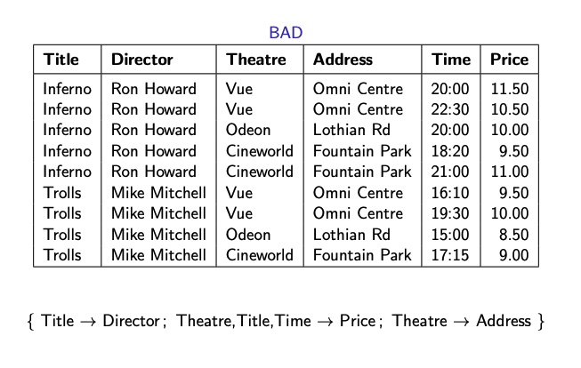
  - We have a relation, and a given set of functional dependencies
    - Set of FDs says:
      - E.g. for Title $\rarr$ Director: if we have two rows with the same title, then they need to have the same director too
  - Redundancy
    - Many facts are repeated
      - For every showing we list both director and title
      - for every movie playing we repeat the address
  - Update anomalies
    - Address must be changed for all movies and showtimes
    - If a movie stops playing, association title $rarr$ director is lost
    - Cannot add a movie before it starts playing
- Good design

  - No redundancy
    - Every FD defines a key
      - TODO: what does this mean?
  - No information loss
    - All the information from the bad database is still there, in fact, we can construct exactly $BAD$ from the well designed database:
      
  - No constraints are loss
    - All of the original FDs appear as constraints in the new tables
- Boyce-Cood Normal Form (BCNF)
  - Problems with bad designs are caused by non-trivial FDs $X\rarr Y$ where **$X$ is not a key**
  > A relation with FDs $F$ is in BCNF if for every $X\rarr Y$ in $F$
  > 1. $Y\subseteq X$ (the FD is trivial), or
  > 2. $X$ is a key.
  - A database is in BCND if all relations are in BCNF
  - Determnine if a set of functional dependencies & delation is in BCNF: lecture 1 from 09/11/21, 22min in (TODO)
- Decompositions
  - Given a set of attributes $U$ and a set of FDs $F$, a *decomposition* of $(U,F)$ is a set
    $$(U_1,F_1),...,(U_n,F_n)$$
  - Such that $U=\bigcup_{i=1}^n U_i$ and $F_i$ is a set of FDs over $U_i$
  - A decomposition is a BCNF decomposition if each $(U_i, F_i)$ is in BCNF
  - Criteria for good decompositions
    - Losslessness: no information is lost
    - Dependency preservationn: no constraints are lost
- Good decompositions
  - A decomposition of $(U,F)$ into $(U_1,F_1),...,(U_n,F_n)$ is
    - **Lossless** if for every relation $R$ over $U$ that satisfies $F$
      - Each $\pi_{U_i}(R)$ satisfies $F_i$
        - I.e., if you project that attribute from any relation, it still satisfies the corresponding functional constraint $F_i$
      - $R=\pi_{U_1}(R)\bowtie...\bowtie\pi_{U_n}(R)$
        - You can construct any relation $R$ from the natural joins of the projections of $U$ from $R$
          - Intuitively: you deconstruct, *decompose*, a Lego house into its basic building blocks and check that when you're putting it back together, it still creates the entire house
    - **Dependency preserving** if $F$ and $\bigcup_{i=1}^n F_i$ are equivalent
      - That is, they have the same closure
- Projection of FDs
  - Let $F$ be a set of FDs over attributes $U$
  - The **projection** of $F$ on $V\subseteq U$ is the set of all FDs over $V$ that are implied by $F$
    
  - Can be often represented compactly as a set of FDs $F'$ over $V$ s.t.
    
- BCNF decomposition algorithm
  - **BCNF is examinable, the decomposition algorithm is not.**
  - *Input*: A set of attributes $U$ and a set of FDs $F$
  - *Output*: A database schema $S$
  ```python
  # S is a set of attributes, each associated with a functional dependency
  S = {(U,F)}
  # Check whether every (U_i,F_i) pair is in BCNF:
  while not all_in_BCNF(S):
    # Let's call the pair that is not in BCNF (U_i,F_i)
    Replace (U_i,F_i) by decompose(U_i,F_i)
  Remove any (U_i,F_i) from S for which there is (U_j,F_j) with U_i in U_j
  Return S

  # Subprocedure decompose:
  def decompose(U,F):
    Choose (X -> Y) in F that violates BCNF
    # TODO: what does line below do?
    V = C_F(X)
    Z = U - V
    Return (V, projection_V(F)) and (XZ, projection_XZ(F))
  ```
- Properties of the BCNF algorithm
  - The decomposed schema is in BCNF and lossless-join
  - The output depends on the FDs chosen to decompose
  - *Dependency preservation* is **not guaranteed**
- Example: apply the BCNF to the bad schema example we showed earlier
  - TODO
- BCNF and dependency preservation
  - Take the relation $Lectures$
    - Attributes $U$: **C**lass, **P**rofessor, **T**ime
    - FDs $F=\{C\rarr P,PT\rarr C\}$
  - $(CPT, F)$ is not in BCNF:
    - $(C\rarr P)\in F$ is non-trivial and $C$ is not a key
  - If we decompose using the BCNF algorithm we get
    $$(CP, C\rarr P) and (CT,\varnothing)$$
  - We lose the constraint $PT\rarr C$
- Third Normal Form (3NF)
  - A looser form of BCNF
  - $(U,F)$ is in 3NF if for every FD $X\rarr Y$ in $F$ one of the following holds:
    1. $Y\subseteq X$ (the FD is trivial), or
    2. $X$ is a key, or
    3. All of the attributes in $Y$ are prime
       - Q: What does it mean to be prime?
       - A: The RHS of FDs are allowed to be prime. It is ok for a FD to be non-trivial, to have its LHS not a key, as long as all the attributes in the RHS are prime. They are attributes that belong to some candidate key. Compute all the candidate keys over the schema and all the attributes that are in these keys qualify for 3NF.
  - Intuition: in 3NF FDs where the left hand-side is not a key are allowed as long as the right hand-side consists only of prime attributes
  - Every schema in BCNF is also in 3NF
- 3NF and redundancy
  - Consider again the relation $Lectures$
    - Attributes $U$: **C**lass, **P**rofessor, **T**ime
    - FDs $F=\{C\rarr P,PT\rarr C\}$
  - $(CPT,F)$ is in 3NF: $PT$ is a *candidate key*, so $P$ is prime
  - More redundancy than in BCNF
    - Each time a class appears in a tuple, the professor's name is repeated
    - We tolerate this because there is no BCNF deomposition that preserves dependencies
- Trade-off BCNF vs 3NF
  - Do we want 0 redundancy (BCNF) but potential dependency loss, or 0 dependency loss but some necesssary redundancy?
- Minimal covers
  - Let $F$ and $G$ be sets of FDs
  - $G$ is a *cover* of $F$ if $G^+=F^+$
    - TODO: what does the `+` denote?
  - A cover is *minimal* if:
    - Each FD in $G$ has the form $X\rarr A$
      - That is, RHS consists of a single attribute
    - No proper subset of $G$ is a cover
      - We cannot remove FDs without losing equivalence to $F$
        - Q: What's a proper subset again?
        - A: A subset that has strictly fewer elements.
    - For $(X\rarr A\in G$ and $X'\subset X$, $A\notin C_F(X')$
      - We cannot remove attributes from the left hand-side of FDs in $G$
  - UNtuition: $G$ is small representation of all FDs in $F$
- Finding minimal covers
  1. Convert the FDs in standard form: so there's only one attribute on RHS of each FD
    - Use Armstrong's decomposition axium
    - Split $X\rarr A_1...A_n$ into $n$ FDs: $X\rarr A_1,...,X\rarr A_n$
  2. Minimise the LHS of each FD
    - Check whether attributes in the LHS can be removed
    - For $(X\rarr A)\in F$ and $X'\subset X$ check whether $A\in C_F(X')$
     - If yes, replace $X\rarr A$ by $X'\rarr A$ and repeat
     - Q: What's $C_F(X')$?
     - A: It's the closure of $X'$.
  3. Delete redundant FDs
    - For each $(X\rarr A)\in F$, check whether $F-\{X\rarr A\}\models X\rarr A$
- Finding minimal covers: example (covered and explaineds in lecture 2 from 09/11/21, ~20min in)
  
- 3NF synthesis algorithm
  - Input: A set of attributes $U$ and a set of FDs $F$
  - Output: A database schema $S$
    
- Properties of the 3NF algorithm
  - The synthetised schema is
    - In 3NF
    - Lossless-join
    - Dependency-preserving
- Example: apply the 3NF algorithm to the $Lectures$ schema (it's already in 3NF, but let's do it anyway)
  - Covered in lecture 2 from 09/11/21, ~35min in
- Another example
  - Covered in lecture 2 from 09/11/21, ~48min in
  - TODO: left as exercise
    - Not in 3NF because only candidate key if CD (compute this yourself, as an exercise)
- Schema design: summary
  - Given the set of attributes $U$ and the set of FDs $F$
  - Find a **lossless**, **dependency-preserving** decomposition into:
    - BCNF if it exists
    - 3NF is BCND decomposition cannot be founds
- Data administrators may decide to de-normalise tables to reduce the number of joins
  - TODO: what does this mean?
## Week 8: SQL Constraints and Triggers
- **Triggers are non-examinable**
  - Constraints are though
- Check constraints (1)
  - Syntax: `CHECK ( conditional-expression )`
  - An update or insertion is *rejected* if the condition does not evaluate to true
  - Example
    ```sql
    CREATE TABLE Products (
        pcode   INTEGER PRIMARY KEY,
        pname   VARCHAR(10),
        pdesc   VARCHAR(20),
        ptype   VARCHAR(20),
        price   NUMERIC(6,2) CHECK ( price > 0),
        CHECK ( ptype IN ('BOOK', 'MOVIE', 'MUSIC'))
    );
    ```
    - Checks that the price is greater than $0$ and that the product is a book, movie, or music
- Check constraints (2)
  - SQL allows queries in `CHECK`
    - Not implemented in PostgreSQL
  - Another example
    ```sql
    CREATE TABLE Invoices (
        invid   INTEGER PRIMARY KEY,
        ordid   INTEGER NOT NULL UNIQUE,
        amount  NUMERIC(8,2) CHECK ( amount > 0 ),
        issued  DATE,
        due     DATE,
        CHECK ( ordid IN SELECT ordid FROM Orders ),
        CHECK ( due >= issued )
    );
    ```
    - Check that `ordid` is contained in `Orders`
    - Check that the due date of an invoice is later than the issue date
- Domain constraints (1)
  - A **domain** is essentially a data type with optional constraints
  - Syntax
    ```sql
    CREATE DOMAIN name datatype [ DEFAULT value ] [ constraint ]
    ```
    - where `constraint`is `NOT NULL | CHECK ( conditional-expression )`
  - In the `CHECK` expression, use `VALUE` to refer to the value being tested
  - Example
    ```sql
    CREATE DOMAIN posnumber NUMERIC(10,2)
        CHECK ( VALUE > 0);

    CREATE DOMAIN category VARCHAR(20)
        CHECK ( VALUE IN ('BOOK', 'MUSIC', 'MOVIE') );
    ```
  - Can then use the domains as you would declare data types:
    ```sql
    CREATE TABLE Products (
        pcode   INTEGER PRIMARY KEY,
        pname   VARCHAR(10),
        pdesc   VARCHAR(20),
        ptype   category,
        price   posnumber
    );

    CREATE TABLE Invoices (
        invid   INTEGER PRIMARY KEY,
        ordid   INTEGER NOT NULL UNIQUE,
        amount  posnumber,
        issued  DATE,
        due     DATE,
        CHECK ( ordid IN SELECT ordid FROM Orders ),
        CHECK ( due >= issued )
    );
    ```
- Assertions
  - Assertions are essentially a `CHECK` constraint not bound to a specific table
  - Syntax: `CREATE ASSERTION name CHECK ( condition )`
  - Example
    ```sql
    CREATE ASSERTION too_many_customers
        CHECK ( ( SELECT COUNT(*)
                  FROM   customers ) <= 1000 ) ;
    ```
  - Assertions are standard SQL
  - Not implemented in any of the currently available DBMSs
  - The problem is allowing queries in `CHECK`
- Triggers
  - Triggers are used to specify an action to executre if certain events took place
  - **Event**: a change to the database that **activates** the trigger
    - An insertion, a deletion, or an update
  - **Condition**: a query or test checked when the trigger is activated
    - For a query: empty is false, non-empty is true
  - **Action**: a procedure executred when the condition is true
    - Can refer to old/new values of modified tuples
    - Can examine answers to the condition query
    - Can execute new queries
    - Can make changes to the database
      - Both data and schema
    - Can be executred before / after the event for each row or for each statement
- Triggers: example 1
  - Suppose we have a schema
    ```sql
    Products : pcode, pname, price
    Orders   : ordid, odate, ocust, final (bool)
    Details  : ordid, pcode, qty
    Prices   : ordid, pcode, price
    ```
  - Goal: whenever a new detail for an order is inserted we want to save the price of the corresponding products
    ```sql
    CREATE TRIGGER save_price AFTER INSERT ON details
      REFERENCING NEW TABLE AS inserted
      FOR EACH STATEMENT
      WHEN TRUE
      BEGIN
        INSERT INTO prices(ordid,pcode,price)
        SELECT I.ordid, I.pcode, P.price
        FROM   inserted I JOIN products P
               ON I.pcode = P.pcode
      END ;
    ```
    - TODO: explanation after lecture
- Triggers: example 2
  - Suppose we have a schema
    ```sql
    Products : pcode, pname, price
    Orders   : ordid, odate, ocust, final (bool)
    Details  : ordid, pcode, qty
    Prices   : ordid, pcode, price
    Invoices : invid (serial), ordid, amount, issued, due
    ```
  - Goal: whenever an order becomes `final` we want to generate an invoice for it
    - TODO: what is final? What does that meaaaan? Hä?
    ```sql
  CREATE TRIGGER invoice_order
    AFTER UPDATE OF final ON orders
    REFERENCING OLD ROW AS oldrow
                NEW ROW AS newrow
    FOR EACH ROW
    WHEN oldrow.final = FALSE AND newrow.final = TRUE
    BEGIN
      INSERT INTO invoices(ordid,amount,issued,due)
      SELECT O.ordid, SUM(D.qty * P.price),
             O.odate, O.odate+7d
      FROM orders O, details D, prices P
      WHERE O.ordid = newrow.ordid
        AND O.ordid = D.ordid
        AND D.ordid = P.ordid
        AND D.pcode = P.pcode
    END ;
    ```
    - TODO: explain after lecture
- Triggers in real systems
  - In PostgreSQL (and similarly for other DBMSs):
    
- Triggers for database consistency
  | Constraints                      | Triggers                        |
  | -------------------------------- | ------------------------------- |
  | Protection against any statement | Activated by specific statement |
  | Defined declaratively            | Defined operationally           |
  | Easier to understand             | Effect may be obscure           |
  | Easier to optimise               | More flexibility                |
- Other uses of triggers
  - Alert users
  - Logging events
  - Gather statistics
  - Replication
  - Workflow management
  - Business rules enforcement
- Caution with triggers
  - An event may activate more than one trigger
  - Activated triggers are processed in some **arbitrary** order
  - Actions can activate other triggers: we get a chain
  - *Recursive trigger*
    - The action directly/indirectly activates the same trigger
      - Collegions of triggers can have unpredictable effects
## Week 8: Transaction Management
- A *transaction* is a sequence of operations on database objects
  - All operations together form a *single logical unit*
- Example
  - Transfor £100 from account A to account B
    ```python
    1. Read balance from A into local buffer x
    2. x = x - 100
    3. Write new balance x to A
    4. Read balance from B into local buffer y
    5. y = y + 100
    6. Write new balance y to B
    ```
- Life-cycle of a transaction
  
  | Stage               | Meaning                                       |
  | ------------------- | --------------------------------------------- |
  | Active              | Normal execution state                        |
  | Partially Committed | Last statement executed                       |
  | Failed              | Normal execution cannot proceed               |
  | Aborted             | Rolled-back. Previous database state restored |
  | Committed           | Successful completion. Changes are permanent  |

  - Schedules
    - A *schedule* is a sequence $S$ of operations from a set of transactions such that the order of operations in each transaction is **the same** as in $S$
      - TODO: in simpler wording?
    - A schedule is *serial* if all operations of each transaction are executed before or after all operationso f another transaction
    
      - TODO: explain this after lecture
- Concurrency
  - Typically, more than one transaction runs on a system at the same time
  - Each transaction consists of many I/O and CPU operations
  - We don't want to wait for a transaction to completely finish before excuting another
    - More efficient this way
  - Concurrent execution
    - The operations of different transactionns are **interleaved**
      - Increases throughput
      - Reduces responnse time
- The ACID properties
  - **A**tomicity
    - Either all operations are carried out or none are
  - **C**onsistency
    - Successful execution of a transaction leaves the database in a coherent state
  - **I**solation
    - Each transaction is protected from the effects of other transactions excuted concurrently
  - **D**urability
    - On successful completion, changes persist
- Motivating example
  - $T_1$: transfer £100 from account A to account B
  - $T_2$: transfer 10% from account A to account B
  
  - There are different ways of executing the transactions:
  
  
  
- Transaction model
  - The only important operations in schedulring are **read** and **write**
    - $r(A)$ read data item $A$
    - $w(A)$ write data item $A$
  - Other operations do not affect the schedule
  - We represent transactions by a sequence of read/write operations
  - The transactions in the `motivating example` above can be represented as:
    - $T_1:r(A),w(A),r(B),w(B)$
    - $T_2:r(A),w(A),r(B),w(B)$
- Transaction model: schedules
  - The schedules in the `motivating example` are represented as
    
- Serialisability
  - Two operations (from *different* transactions) are **conflicting** if
    - They refer to the same data item, and
    - At least one of them is a write
      - Bc if they both just read, then that's no problem
  - Two **consecutive** non-conflicting operations ina  schedule can be *swapped*
  - A schedule is **conflict serialisable** if it can be transformed into a serial schedule by a sequence of swap operations
- Precedence graph
  - Captures all potential conflicts between transactions in a schedule
    - Each node is a transaction
    - There is an edge from $T_i$ to $T_j$ (for $T_i\neq T_j$ if an action of $T_i$ **precedes** and **conflicts** with one of $T_j$'s actions
    > A schedule is *conflict serialisable* if and only if its precedence graph is acyclic
      - TODO: acyclic?
      - -> means that there are no cycles within the graph
  - An equivalent serial schedule is given by any **topological sort** over the precedence graph
    - TODO: topological sort?
      - Means getting all the total orders that are consistent with the underlying partial orders prescribed by the precedence graph
- Precedence graph: example
  
- Schedules with aborted transaction (1)
  - We assumed transactions commit successfully after the last operations
  - But `abort` and `commit` must be taken explicitly into account
  
  - $T_2$ reads uncommited changes made by $T_1$
  - But $T_2$ has not yet committed
  - We can recover by aborting also $T_2$
    - Called a *cascading abort*
- Schedules with aborted transactions (2)
  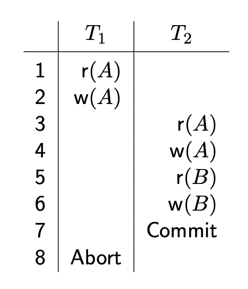
  - $T_2$ reads uncommited changes made by $T_1$
  - But $T_2$ has already committed
  - The schedule is **unrecoverable**
  - Recoverable schedules without cascading aborts
    - Transactions commit only after, and if, all transactions whose changes they read have committed
- Lock-based concurrency control
  - Lock
    - Bookkeeping object associated with a data item
    - Tells whether the data item is available for read and/or write
    - Owner: transaction currently operating on the data item
  - Shared lock
    - Data item is available for read to owner
    - Can be acquired by more than one transaction
  - Exclusive lock
    - Data item is available for read/write to owner
    - Cannot be acquired by other transactions
  - Two locks on the same data item are **conflicting** if one of them is exclusive
- Transaction model with locks
  - Operations:
    | Operation | Purpose                         | Mnemonic      |
    | --------- | ------------------------------- | ------------- |
    | $s(A)$    | shared lock on A is acquired    | s = shared    |
    | $x(A)$    | exclusive lock on A is acquired | x = X-clusive |
    | $u(A)$    | lock on A is released           | u = unlock    |
    | Abort     | transaction aborts              |               |
    | Commit    | transaction commits             |               |
  - In a schedule:
    - A transaction cannot acquire a lock on $A$ before all exclusive locks on $A$ have been released
    - A transaction cannot acquire an exclusive lock on $A$ before all locks on $A$ have been released
- Examples of schedules with locking
  
  - TODO: explain after lecture
- Two-Phase Locking (2PL)
  1. Before reading/writing a data item, a transaction must acquire a shared/exclusive lock on it
  2. A transaction cannot request additional locks once it releases **any** lock
  - Each transaction has
    - *Growing phase* when locks are acquired
    - *Shrinking phase* when locks are released
  - Every completed schedule of *committed* transactions that follow the 2PL protocol is conflict serialisable
- 2PL and aborted transactions
  
  - $T_1$ and $T_2$ follow 2PL
  - BUt $T_2$ cannot be undone since it has been committed already
  - The schedule is **unrecoverable**
- Strict 2PL
  1. Before reading/writing a data item a transaction must acquire a shared/exclusive lock on it
  2. **All locks held by a transaction are released when the transaction is completed** (aborts or commits)
  - Ensures that
    - The schedule is always *recoverable*
    - All aborted transactions can be rolled back *without cascading aborts*
    - The schedule consisting of the committed transactions is *conflict serialisable*
- Deadlocks
  - Deadlock describes the sitaution when a transaction requesting a lock must wait until all conflicting locks are released
  - We may get a *cycle of "waits"*
  
- Deadlock prevention
  - Each transaction is assigned a **priority** using a *timestamp*:
    - The older a transaction is, the higher priority it has
  - Suppose $T_j$ requests a lock and $T_j$ holds a conflicting lock
  - Two policies to prevent deadlocks in this situation:
    - *Wait-die*: $T_i$ waits if it has higher priority, otherwise aborted
    - *Wound-wait*: $T_j$ aborted if $T_i$ has higher priority, otherwise $T_i$ waits
  - In both schemes / policies, the higher priority transaction is never aborted
  - **Starvation**: a transaction keeps being aborted because it never has sufficiently high priority
    - *Solution*: restart aborted transactions with their initial timestamp
- Deadlock detection
  - Waits-for graph
    - Nodes are active transactions
    - There is an edge from $T_i$ to $T_j$ (with $T_i\neq T_j$) if $T_i$ waits for $T_j$ to release a (conflicting) lock
    - Each cycle represents a deadlock
  - Recovering from deadlocks
    - Choose a minimal set of transactions such that rolling them back will make the waits-for graph acyclic
- Crash recovery (**non-examinable**)
  - The log (a.k.a **trail** or **journal**) records every action executed on the database
  - Each log record has unique ID called *log sequence number* (LSN)
  - Fiels in a log record:
    | Field   | Meaning                    |
    | ------- | -------------------------- |
    | LSN     | ID of the record           |
    | prevLSN | LSN of previous log record |
    | transID | ID of the transaction      |
    | type    | type of action recorded    |
    | before  | value before the change    |
    | after   | value after the change     |
    - TODO: value of what in before/after?
  - The state of the database is periodically recorded as a **checkpoint**
- ARIES (**non-examinable**)
  - Is a recovery algorithm used in major DBMSs
  - Works in three phases
  
  - Principles behind ARIES
    - Write-Ahead Logging
      - Before writing a change to disk, a corresponding log record miust be inserted and the log forced to stable storable
    - Repeating history during Redo
      - Actions before the crash are retraced to bring the database to the state it was when the system crashed
    - Loggin changes during Undo
      - Changes made while undoing transactions are also logged (protection from further crashes)
## Week 9: PL / SQL
- Using SQL from applications
  - Embedded SQL is the use of SQL commands within a *host language* program
  - All major programming languages provide APIs and drivers to
    - Establish a *connection* with a database
    - Execute SQL commands/transactions
    - Convert SQL data types to appropriate ones
  - Simple rule: if you know SQL and the host programming language then you know embedded SQL
- Cursors
  - They allow a programming language to *operate on collections of rows*
  - Cursors are defined in the SQL standard
  - Cursor declaration:
  ```sql
  DECLARE cursorname CURSOR FOR query
  ```
  - A cursor is essentially a *pointer* to a row in a table
  ```
  OPEN  : position the cursor just before the first row
  FETCH : retrieve the next row
  CLOSE : dispose of the cursor
  ```
- Transactions
  - For a psycopg2 connection (but very similar for other languages):
    - A *transaction* is started before executing the first command: if `commit()` is not called, changes will be lost
    - `rollback()` reverts to the start of any pending transaction
    - Closing without committing causes an *implicit rollback*
- Dynamic SQL
  - Statements where some values are known only at runtime
    - E.g. because they are provided by the user
  - SQL injection
    - User input can contain malicious SQL statements
    - To avoid these from harming:
      - Set appropriate permissions on the database
      - Use *read-only* transactions for queries
      - Always *validate* user input within the application
## Week 10: The NULL Value
- `NULL`: all-purpose marker to represent incomplete information
- Main source of problems and inconsistencies
- What does `NULL` mean?
  - Depending on the context:
    - *Missing value*: there is a value, but it is currently *unknown*
    - *Non-applicable*: there is no value (*undefined*)
  - But it also behaves as:
    - *Constant*: like any other value
    - *Unknown*: a truth-value in addition to `True` and `False`
- Meta-incompleteness
  - We never really know what `NULL` means because the meaning is ultimately defined by the applicationn
  - But we must know how `NULL` *behaves* according to the Standard and this behaviour depends on the context in which it is used
- Missing value vs Non-applicable
  
  - There is no way of knowing whether a `NULL` here means that
    - There is a currently unknown value for phone (*missing value*), or
    - There is no value for phone (*non-applicable value*)
- `NULL` and schema design
  - ...
- `NULL` and constraints
  - Nulls are not allowed in primary keys
  - Nulls seem to behave as distinct missing values in `UNIQUE`
- `NULL` and arithmetic operations
  - Every arithmetic operation that involves a `NULL` results in NULL`
  - Observe that `SELECT NULL/0` also returns `NULL` instead of throwing a `DIVISION BY ZERO` error!
  - Here, `NULL` is treated as an *undefined* value
- `NULL` and aggregation
  - Aggregate functions ignore nulls
  - Except for `COUNT(*)`
  - Aggregation (except `COUNT`) on an empty bag results in `NULL`
- `NULL` and set operations
  - `NULL` is treated like any other value
- `NULL` in selection conditions
  - See slide 9, `NULL` makes all comparisons evaluate to false
  
- `NULL` and comparisons
  - `SELECT 1=NULL OR TRUE AS result;` $\rarr$ results in a row of `t`(for true) since `NULL` is treated as a truth-value
- Inner and outer join: slide 12ff