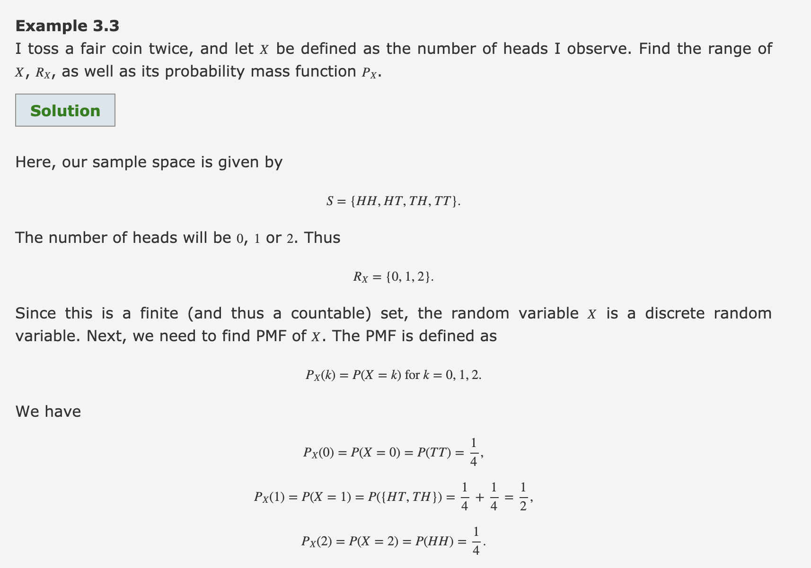
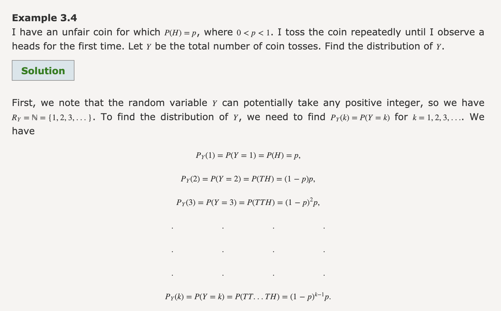

```toc
from-heading: 2
to-heading: 6
```

## Probability Mass Function (PMF)

- https://www.probabilitycourse.com/chapter3/3_1_3_pmf.php
  - We notate sample space w $\Omega$


- https://www.probabilitycourse.com/chapter3/3_1_3_pmf.php
  - Add that N is $Z^{\+}$ (positive integer), instead of the other definition? or why would they add the other definition


- https://www.probabilitycourse.com/chapter3/3_1_3_pmf.php
  - Geometric sum?
  - The k -> j substitution makes sense, think of it like this:
    - k starts with 1 so if we take any value of k it'll be (j + 1) - 1

## Discrete Distributions
- [ ] sth w normalising

## Joint Distributions
- [ ] Lecture example (dart-scheibe)

## Marginal Probabilities

## Conditional Probability
- [ ] Product rule
- [ ] Bayes' rule
- [ ] Independence
- [ ] Conditional Independence
- [ ] Marginal vs conditional independence

## Continuous RVs
- [ ] Density function
- [ ] Mean and variance
- [ ] Uniform distribution
- [ ] Gaussian distribution
- [ ] Bivariate gaussian