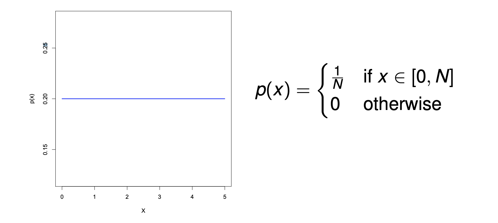

```toc
from-heading: 2
to-heading: 6
```

## Week 0: Maths and Probability

- Random variables (RVs)
    - Set of all possible outcomes of an experiment is called _sample space_ $\Omega$
    - *Events* are subsets of $\Omega$
      - Often singletons, i.e. sets with one element
      - This means that an event is a specific outcome (or multiple specific outcomes) of an experiment
    - A RV takes values from a collection of _mutually exclusive_ and _collectively exhaustive_ states
      - All of those states correspond to a possible event
      - Mutually exclusive: one state does not include the other
      - Collectively exhaustive: between all of the states, they take up all the possible outcomes
    - A RV $X$ is a map from the sample space $\Omega$ to the set of states of events
    - Example
      - Imagine you're tossing two coins.
        - That's our experiment.
      - Let's define a RV $X=(number\ of\ heads)^2$.
      - Possible outcomes, i.e. the sample space $\Omega$ of this experiment, where $T=tails$ and $H=heads$:
      
        $$\Omega=\{(T,T),(T,H),(H,T), (H,H)\}$$

      - Possible states of specific outcomes:
    
        $${0, 1, 4}$$
        
    - Use capital letters to denote a RV, e.g. like $X$ above
- Probability Mass Function (PMF)
  - Use lowercase letters to denote values that RVs take
  - E.g. $p(X=x)$ refers to "the probability that RV $X$ takes value $x$"
    - Usually shortened to $p(x)$
  - $p(x)$ is called a probabiltiy mass function
    - I.e. a function that returns the probability of the event $X=x$ ("the event that RV $X$ takes value $x$")
  - This applies to discrete RVs:

      $$\Sigma_{x}p(x)=1$$

    - All the probabilities of all possible events sum up to 1
      - Makes sense since we start with $100% (1)$ and all the events divide those $100%$ amongst themselves
    - Discrete means: counting values with no in-between values
      - Like integers, values a die can take (${1,2,3,4,5,6}$)
  - The name *probability mass function* comes from "where we have higher probability, there is more mass"

  .')

- Discrete Distributions, via an example
  - A RVs can take discrete values (but not only!)
  - If we have multiple iterations of an experiment, we can plot a frequency distribution
    - That is, which of events `x` how often they occur


- We can make that plot even more useful by **normalising** it
    > Process of Normalisation: Divide each count by the total number $n$ of samples.
  - Why is it actually more useful?
    - It will turn the counts into proabilities which add up to $1$
    - And we're dealing with lower values
- Joint Distributions
  - Refer to when there are two ore more RVs involved
  - Example
    - RV $X$: an email contains the word `password`
      - $\Omega_X={pass, nopass}$
    - RV $Y$: an email is spam
      - $\Omega_Y={spam, nospam}$
    - So $p(X=pass, Y=nospam)$ denotes the probability that an email contains `password` but is not spam
    - Assuming the below probabilities given, we can create a joint distribution table
    |            | $Y=nospam$ | $Y=spam$ |
    | ---------- | ---------- | -------- |
    | $X=pass$   | $0.01$     | $0.25$   |
    | $X=nopass$ | $0.49$     | $0.25$   |

    - We can read from the table:  $p(X=pass, Y=nospam)=0.01$
    - This table is already normalised
      - To normalise a table, again, take each RV state and divide by the total count
- Marginal Probabilities
  - Called marginal because we're marginalising (ruling out) one of the RVS
  - E.g. $p(X=pass)$ rules out $Y$, and can be calculated like this:
    $$\Sigma_yp(X=pass,Y)=0.01+0.25=0.26$$

    |            | $Y=nospam$ | $Y=spam$ |
    | ---------- | ---------- | -------- |
    | *$X=pass$* | *$0.01$*   | *$0.25$* |
    | $X=nopass$ | $0.49$     | $0.25$   |
  - This is called the *sum rule* because we are summing up probabilities
- Conditional Probability
  - Assume we have two RVs
    - Also assume that we know the value of one of them; then, can we figure out the distribution of the other one?
      - The *conditional probability distribution* (CPD) is exactly that:
        - Given $Y=y$, the CPD of $X$ is

        $$p(X=x | Y=y)=p(x|y)=\frac{p(x,y)}{p(y)}
    - Spam email example:

      $$p(X=pass | Y=nospam)=\frac{p(pass,nospam)}{p(noham)}=\frac{0.01}{0.01+0.49}=0.02$$

        - The probability that an email contains `password` after we already know that it's not spam
  - Product rule

    $$p(X,Y)=p(Y)p(X|Y)=p(X)p(Y|X)$$

    - This means it doesn't matter whether $p(X,Y)$ or $p(Y,X)$

    $$\Sigma_xp(X|Y)=1, for all y$$

    - The probabilities of $X$ given $Y$ sum up to $1$ for all possible values of $y$
  - Bayes' Rule
        $$p(Y|X)=\frac{p(X|Y)p(y)}{p(X)}$$
    - Can derive this from the product rule:
      - Todo: neat latex

        $$
          p(X,Y)=p(Y)p(X|Y)\\
          p(X,Y)=p(X)p(Y|X)\\
          p(Y|X)=\frac{p(Y)p(X|Y)}{p(X)}
        $$
    - Bayes' Rule explained:
      - $Y$ is a *class label*, and $X$ is an *observation*
      - Then: $p(Y)$ is the *prior* distribution for a label,
      - $p(Y|X)$ is the *posterior* distribution for $Y$ given datapoint $X$
        - Spam example: Y is an email and X is the observation that, exemplarily, the email is spam. Bayes' rule allows us to determine how likely it is now that the email contains `password`.
    - If we are missing the denominator $p(X)$, we can compute it:
        $$
          \Sigma_yp(X|Y)p(Y)
        $$
  - Independence
    - Two RVs are independent if they don't influence each other
    - Marginal Independence
      - Recall marginal probabilities
      - $X$ is marginally independent of $Y$ if
          $$p(X|Y) = p(X)$$
          - "The probabilitiy of $X$, given $Y$, is still just $p(X)$ since $Y$ doesn't influence it"
        - Same as saying:
          $$p(X,Y)=p(X)p(Y)$$
    - Conditional Independence
      - One variable can be conditionally independent of another variable given a third one
      - $X_1$ is conditionally independent of $X_2$ given $Y$ if
          $$p(X_1|X_2,Y) = p(X_1|Y)$$
            - "Once I know $Y$, knowing $X_2$ doesn't provide additional information about $X_1$"
      - **Marginal independence does not imply conditional independence, nor vice versa!**
        - Think of it like this: Sometimes we only know that $X_1$ is independent of $X_2$ if we are given $Y$, but $X_1$ might not be independent of $X_2$ in all cases (<- check if this makes sense when you're less tired, Eric)
  - Continuous RVs
    - Are RVs that are not discrete, no counting steps, we have "in-between" values
    
    - Density function
      - $p(x)$ is called *density function* for continuous RVs
        - "Density" because it's more dense where there is more data (more sample measurements near one point)
    - Using the density function to calculate probabilities
      - The probability of a particular (x-)value is $0$ but over a range it is:

          $$Pr\{X\in[a,b]\}=\int_a^bp(x)dx$$
          
      - Thst's the probability that $X$ lies within $a$ and $b$
    - Mean and variance
      - Notation: $\mu$ for mean, $\sigma^2$ for variance
      - Mean is the expected value
        - Mean may also be notated using $EX$ (expected value)
      - Variance is an indicator of how wide-spread the data is
        - Variance may also be notated using $VX$ (variance of x)
      - For continuous RVs:
        - $\mu=\int p(x)dx$
        - $\sigma^2=\int(x-\mu)^2p(x)dx=\int x^2p(x)dx-(\int xp(x)dx)^2$
          - Alternative mathematical notation for mean and variance
            - $EX=\int xp(x)dx$
            - $VX=E(X-\mu)^2=\int (x-\mu)^2p(x)dx$
      - For discrete RVs:
        - Approach: convert integrals to sums
      - Example: uniform distribution
        - A continuous distribution
        - Definition
          - RV $X$ is a variable on $[0,N]$ such that all points are equally likely

            
          - Calculating EX and VX for the above uniform distribution:
            - $EX=\int_0^5x*\frac{1}{5}dx=2.5$
            - $VX=\int_0^5(x-2.5)*\frac{1}{5}dx=0$
  - Gaussian distribution
    - Also called normal distribution
    - Often a reasonable model for many continuous quantities due to various central limit theorems
      - CLTs are about how some RVs can be modelled using a Gaussian distribution, especially for large sample sizes $n$
    - Definition
      
      $$p(x|\mu,\sigma^2)=N(x;\mu,\sigma^2)=\frac{1}{\sqrt{2\pi\sigma^2}}e^{-\frac{(x-\mu)^2}{2\sigma^2}}

    - $\mu$ is the mean of the Gaussian
    - $\sigma^2$ is the variance of the Gaussian
    - If $\mu = 0$ and $\sigma^2=1$ then $N(x,\mu,\sigma^2)$ is called a *standard Gaussian*
      
    - All Gaussians look more or less the same, subject to scaling and displacement
      - Mean moves entire shape left or right
      - Variance changes width of shape
        - Since it's an indicator about how much the data varies from the expected value
    - Scale any Gaussian to standard
      - Can do so by *substituting variables*
      - If $x$ is distributed $N(x;\mu,\sigma^2)$ then $y=\frac{x-\mu}{\sigma}$ is distributed $N(y;0,1)$
  - Bivariate Gaussian
    - *Bivariate* means that there are two RVs $X_1, X_2$
    - If $X_1$ and $X_2$ are independent: (TODO latex)
      
    - Can also use vectors:
      
      - $\Sigma$ is called a *covariance matrix*
      
  - Covariance and multivariate Gaussian

## Week 1: Thinking About Data