```toc
from-heading: 2
to-heading: 6
```

## Week 0: Maths and Probability

- Random variables (RVs)
    - Set of all possible outcomes of an experiment is called _sample space_ $\Omega$
    - *Events* are subsets of $\Omega$
      - Often singletons, i.e. sets with one element
      - This means that an event is a specific outcome (or multiple specific outcomes) of an experiment
    - A RV takes values from a collection of _mutually exclusive_ and _collectively exhaustive_ states
      - All of those states correspond to a possible event
      - Mutually exclusive: one state does not include the other
      - Collectively exhaustive: between all of the states, they take up all the possible outcomes
    - A RV $X$ is a map from the sample space $\Omega$ to the set of states of events
    - Example
      - Imagine you're tossing two coins.
        - That's our experiment.
      - Let's define a RV $X=(number\ of\ heads)^2$.
      - Possible outcomes, i.e. the sample space $\Omega$ of this experiment, where $T=tails$ and $H=heads$:
      
        $$\Omega=\{(T,T),(T,H),(H,T), (H,H)\}$$

      - Possible states of specific outcomes:
    
        $${0, 1, 4}$$
        
    - Use capital letters to denote a RV, e.g. like $X$ above
- Probability Mass Function (PMF)
  - Use lowercase letters to denote values that RVs take
  - E.g. $p(X=x)$ refers to "the probability that RV $X$ takes value $x$"
    - Usually shortened to $p(x)$
  - $p(x)$ is called a probabiltiy mass function
    - I.e. a function that returns the probability of the event $X=x$ ("the event that RV $X$ takes value $x$")
  - This applies to discrete RVs:

      $$\Sigma_{x}p(x)=1$$

    - All the probabilities of all possible events sum up to 1
      - Makes sense since we start with $100% (1)$ and all the events divide those $100%$ amongst themselves
    - Discrete means: counting values with no in-between values
      - Like integers, values a die can take (${1,2,3,4,5,6}$)
  - The name *probability mass function* comes from "where we have higher probability, there is more mass"

  .')

- Discrete Distributions, via an example
  - A RVs can take discrete values (but not only!)
  - If we have multiple iterations of an experiment, we can plot a frequency distribution
    - That is, which of events `x` how often they occur


- We can make that plot even more useful by **normalising** it
    > Process of Normalisation: Divide each count by the total number $n$ of samples.
  - Why is it actually more useful?
    - It will turn the counts into proabilities which add up to $1$
    - And we're dealing with lower values
- Joint Distributions
  - Refer to when there are two ore more RVs involved
  - Example
    - RV $X$: an email contains the word `password`
      - $\Omega_X={pass, nopass}$
    - RV $Y$: an email is spam
      - $\Omega_Y={spam, nospam}$
    - So $p(X=pass, Y=nospam)$ denotes the probability that an email contains `password` but is not spam
    - Assuming the below probabilities given, we can create a joint distribution table
    |            | $Y=nospam$ | $Y=spam$ |
    | ---------- | ---------- | -------- |
    | $X=pass$   | $0.01$     | $0.25$   |
    | $X=nopass$ | $0.49$     | $0.25$   |

    - We can read from the table:  $p(X=pass, Y=nospam)=0.01$
    - This table is already normalised
      - To normalise a table, again, take each RV state and divide by the total count
- Marginal Probabilities
  - Called marginal because we're marginalising (ruling out) one of the RVS
  - E.g. $p(X=pass)$ rules out $Y$, and can be calculated like this:
    $$\Sigma_yp(X=pass,Y)=0.01+0.25=0.26$$

    |            | $Y=nospam$ | $Y=spam$ |
    | ---------- | ---------- | -------- |
    | *$X=pass$* | *$0.01$*   | *$0.25$* |
    | $X=nopass$ | $0.49$     | $0.25$   |
  - This is called the *sum rule* because we are summing up probabilities
- Conditional Probability
  - Assume we have two RVs
    - Also assume that we know the value of one of them; then, can we figure out the distribution of the other one?
      - The *conditional probability distribution* (CPD) is exactly that:
        - Given $Y=y$, the CPD of $X$ is

        $$p(X=x | Y=y)=p(x|y)=\frac{p(x,y)}{p(y)}
    - Spam email example:

      $$p(X=pass | Y=nospam)=\frac{p(pass,nospam)}{p(noham)}=\frac{0.01}{0.01+0.49}=0.02$$

        - The probability that an email contains `password` after we already know that it's not spam
  - Product rule

    $$p(X,Y)=p(Y)p(X|Y)=p(X)p(Y|X)$$

    - This means it doesn't matter whether $p(X,Y)$ or $p(Y,X)$

    $$\Sigma_xp(X|Y)=1, for all y$$

    - The probabilities of $X$ given $Y$ sum up to $1$ for all possible values of $y$
  - Bayes' Rule
        $$p(Y|X)=\frac{p(X|Y)p(y)}{p(X)}$$
    - Can derive this from the product rule:

        $$
          p(X,Y)=p(Y)p(X|Y)\\
          p(X,Y)=p(X)p(Y|X)\\
          p(Y|X)=\frac{p(Y)p(X|Y)}{p(X)}
        $$
    - Bayes' Rule explained:
      - $Y$ is a *class label*, and $X$ is an *observation*
      - Then: $p(Y)$ is the *prior* distribution for a label,
      - $p(Y|X)$ is the *posterior* distribution for $Y$ given datapoint $X$
        - Spam example: Y is an email and X is the observation that, exemplarily, the email is spam. Bayes' rule allows us to determine how likely it is now that the email contains `password`.
    - If we are missing the denominator $p(X)$, we can compute it:
        $$
          \Sigma_yp(X|Y)p(Y)
        $$
  - Independence
    - Two RVs are independent if they don't influence each other
    - Marginal Independence
      - Recall marginal probabilities
      - $X$ is marginally independent of $Y$ if
          $$p(X|Y) = p(X)$$
          - "The probabilitiy of $X$, given $Y$, is still just $p(X)$ since $Y$ doesn't influence it"
        - Same as saying:
          $$p(X,Y)=p(X)p(Y)$$
    - Conditional Independence
      - One variable can be conditionally independent of another variable given a third one
      - $X_1$ is conditionally independent of $X_2$ given $Y$ if
          $$p(X_1|X_2,Y) = p(X_1|Y)$$
            - "Once I know $Y$, knowing $X_2$ doesn't provide additional information about $X_1$"
      - **Marginal independence does not imply conditional independence, nor vice versa!**
        - Think of it like this: Sometimes we only know that $X_1$ is independent of $X_2$ if we are given $Y$, but $X_1$ might not be independent of $X_2$ in all cases (<- check if this makes sense when you're less tired, Eric)
  - Continuous RVs
    - Are RVs that are not discrete, no counting steps, we have "in-between" values
    
    - Density function
      - $p(x)$ is called *density function* for continuous RVs
        - "Density" because it's more dense where there is more data (more sample measurements near one point)
    - Using the density function to calculate probabilities
      - The probability of a particular (x-)value is $0$ but over a range it is:

          $$Pr\{X\in[a,b]\}=\int_a^bp(x)dx$$
          
      - Thst's the probability that $X$ lies within $a$ and $b$
    - Mean and variance
      - Notation: $\mu$ for mean, $\sigma^2$ for variance
      - Mean is the expected value
        - Mean may also be notated using $EX$ (expected value)
      - Variance is an indicator of how wide-spread the data is
        - Variance may also be notated using $VX$ (variance of x)
      - For continuous RVs:
        - $\mu=\int p(x)dx$
        - $\sigma^2=\int(x-\mu)^2p(x)dx=\int x^2p(x)dx-(\int xp(x)dx)^2$
          - Alternative mathematical notation for mean and variance
            - $EX=\int xp(x)dx$
            - $VX=E(X-\mu)^2=\int (x-\mu)^2p(x)dx$
      - For discrete RVs:
        - Approach: convert integrals to sums
      - Example: uniform distribution
        - A continuous distribution
        - Definition
          - RV $X$ is a variable on $[0,N]$ such that all points are equally likely

            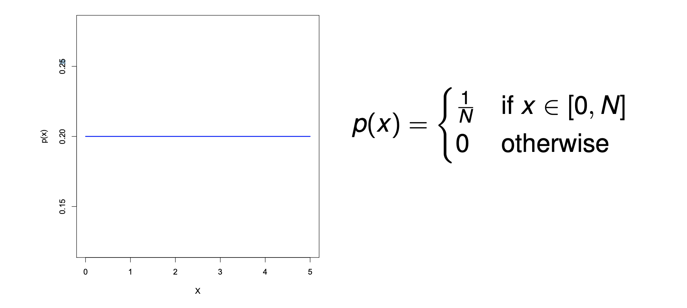
          - Calculating EX and VX for the above uniform distribution:
            - $EX=\int_0^5x*\frac{1}{5}dx=2.5$
            - $VX=\int_0^5(x-2.5)*\frac{1}{5}dx=0$
  - Gaussian distribution
    - Also called normal distribution
    - Often a reasonable model for many continuous quantities due to various central limit theorems
      - CLTs are about how some RVs can be modelled using a Gaussian distribution, especially for large sample sizes $n$
    - Definition
      
      $$p(x|\mu,\sigma^2)=N(x;\mu,\sigma^2)=\frac{1}{\sqrt{2\pi\sigma^2}}e^{-\frac{(x-\mu)^2}{2\sigma^2}}

    - $\mu$ is the mean of the Gaussian
    - $\sigma^2$ is the variance of the Gaussian
    - If $\mu = 0$ and $\sigma^2=1$ then $N(x,\mu,\sigma^2)$ is called a *standard Gaussian*
      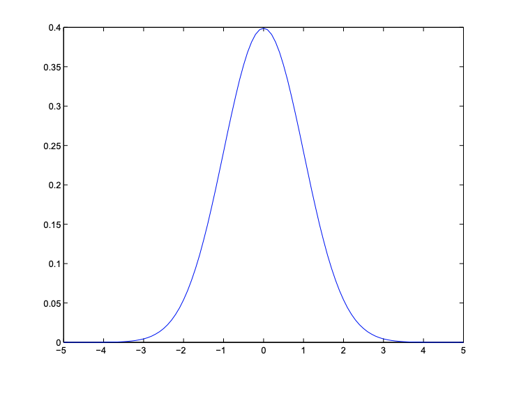
    - All Gaussians look more or less the same, subject to scaling and displacement
      - Mean moves entire shape left or right
      - Variance changes width of shape
        - Since it's an indicator about how much the data varies from the expected value
    - Scale any Gaussian to standard
      - Can do so by *substituting variables*
      - If $x$ is distributed $N(x;\mu,\sigma^2)$ then $y=\frac{x-\mu}{\sigma}$ is distributed $N(y;0,1)$
  - Bivariate Gaussian
    - *Bivariate* means that there are two RVs $X_1, X_2$
    - If $X_1$ and $X_2$ are independent:
      
    - Can also use vectors:
      
      - $\Sigma$ is called a *covariance matrix*
      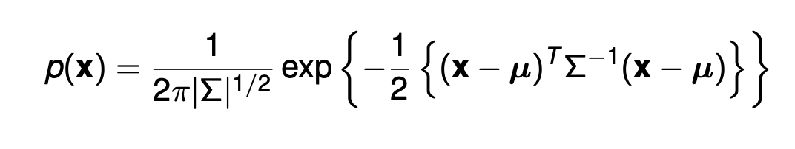
  - Multivariate Gaussian
    - More than 2 variables
    - Instead of $p(x\in\mathbb{R})=\int p(x)dx$, we now look at multiple $x$s
      - Express them using a vector $\vec{x}$:

        
      - $d$ is the number of elements in the vector, cardinality
    - $\Sigma$ is the covariance matrix:
      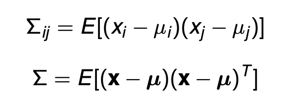
      - $\Sigma$ is symmetric
  - Estimation / Estimated distributions
    - Estimated distributions are also called models
    - Given some data, how do we estimate what the distribution is where that data came from
    - What makes a good or bad estimation?
      - One approach is to say that an estimated distribution is *good* if it increases the probability of the given data
      - That's called the **Maximum Likelihood Approach**
    - Maximum Likelihood Aproach / Estimate
      - Likelihood of a model is given by:

        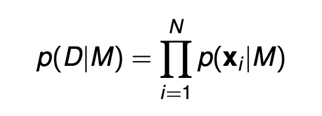

        - $D$ is the given data
        - The probability of the data $D$ given a model $M$
        - It's just the product of the probabilities of generating each data point individually, using our model
      - Approach: try different $M$, pick the $M$ which maximises $p(D|M)$
  - Estimating the Bernoulli Distribution
    - Recall Bernoulli distributions
      - Are relevant when we have experiments with multiple iterarions, and binary results (`true/false` or `1/0` etc)
    - Example:
      - We are given the below data $D$
        - `[1,0,0,1,0,1,0,1,0,0,0,0,0,1,0,1,1,1,0,1]`
      - (So we have `n=20` observations)
    - Now we're trying to find an apt model (by guessing, for now). We come up with two hypotheses / models:
      1. $M_1$: the data was generated from a fair coin. 1 is heads, 0 is tails
      2. $M_2$: the data was generated from a die throw: 1 if die shows 1, 0 if it shows one of $\{2,3,4,5,6\}$
    - Let's look at the likelihoof of data. Let $c$ = number of ones
      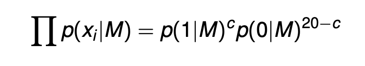
      - $M_1$: $0.5^{20}=9.5\times 10^{-7} (o.5^9*0.5^{11}=0.5^{20})$
      - $M_2$: $(\frac{1}{6})^9*(\frac{5}{6})^11=1.8\times 10^{-8}$
    - So can now see which model is more likely
  - More conceptual approach for testing models
    - Let's take the same data $D$ as before
    - Imagine a continuous range of hypotheses: $M=\theta$ where $\theta$ ranges from $0$ to $1$
    - Likelihood of data: again, let c = number of tosses (data points)
      
      - To get the model $\theta$ which *maximises* the likelihood, differentiate with respect to $\theta$
      - It's quite tricky to differentiate so we differentiate $log(p(D|M))$ instead
        - Since log is monotonically increasing, you can get the same maximum whether you work with the log or the original likelihood formula
          - Q: I don't really get this, why does "monotonically increasing" guarantee the same maximum?
          - A: [Preservation of extrema](https://math.stackexchange.com/questions/3593338/monotonic-transformation-preserves-extrema)
  - Estimating Gaussians
    - Can do Maximum Likelihood Estimation for Gaussians too
      - Consider a univariate Gaussian, with $\mu$ and $\sigma^2$ (that's our model)
      - Then, with $n$ data points

      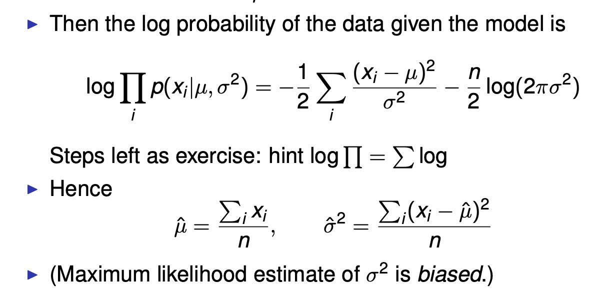
      
## Week 1: Thinking About Data

- What is Machine Learning (ML)?
  - The way we use ML is like it's a "magic box that predicts stuff" for us
    - You have some data $X$, a predictor (the "magic box") $f$
      - $f$ is a deterministic function, i.e. it always returns the same result for the same input
      - Output of $f$: the prediction for $X$, $f(x)$

      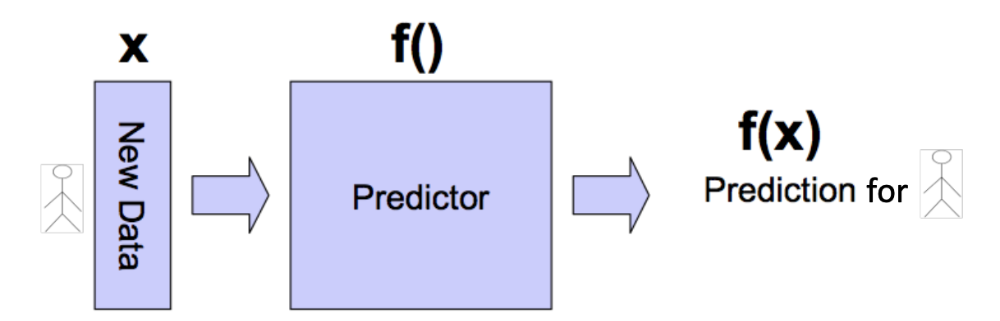
      - This course is about how we build that magic box predictor $f$
- Learning Algorithms
  - They're algorithms we put data into, and the ouput is a function that tried to predict something
    - In short, they build predictors
  - Input data: $x$ and $f^{*}(x)$
    - $f^{*}(x)$ is the expected prediction for $x$
    - This is called training examples
- Prediction tasks
  - Classification
    - A classification algorithm tries to build a predictor
    - The predictor takes the form of a *decision boundary*
      - It cuts the collection of data points into two parts, draws a boundary in the space of data points so that all the points that are expected to have the same label are in one group
      - For the same data set, the decision boundary will look different for different initial label inputs
  - Regression
    - We have numbers instead of classifying labels, they're called *observations*
      - That's different because the set of labels is finite, the set of numbers not
    - The predictor assigns numbers to data points it hasn't seen before
      - Output: predicted number for various data points
  - Supervised tasks
    - Classification and regression are both *supervised prediction tasks* because in both cases our input is something specific to learn from
      - Like labels
    - The learing algorithm is given *examples* of what we want to see come out of it
      - It's given *supervision*
    - We're trying to predict a specifiy quantity
    - We can mmeasure the accuracy of the predictor directly
  - Unsupervised tasks  
    - Trying to *understand* the data
    - Looking for structure/unusual patterns
    - *Not* looking for specific values
    - Labeled data is not required
    - Evaluation
      - You cannot say how accurate your algorithm is using labels, there's no direct evaluation
      - Instead, there's indirect / qualitative evaluation
        - Qualitative: by looking at the results and asking whethere they help us to understand our data better
        - Indirect: by using the results of unsupervised tasks to improve some other component in our system, and that component could give us direct evaluation feedback
  - Semi-Supervised
    - In practice, you'll get data sets where you have lots of unlabeled instances, and a small amount of labeled data
    - use unsupervised algorithms to understand the structure and to improve the supervised algorithm we're going to apply otherwise
  - Clustering
    - Goal: discover subpopulations in the population
      - Or subgroups in an overarching group
    - We're not giving any examples, just the data set
      - That's what makes it *unsupervised*
    - Useful for detecting outliers in our data
      - It's an outlier if $|subpopulation|=1$
        - I.e. the cardinality of the subpopulation is exactly $1$
- Representing data
  - Task is to represent input mathematically, usually numerically
    - Numerically since it's easy to operate on numbers (though we need to make sure that these operations make sense)
    - Since our predictor is just a mathematical function $f(x)$, it manipulates numbers (input $x$) and spits out numbers $x'$
  - Attribute-value pairs
    - Attribute: the "category"
      - Like age, height, eye-color
    - Values: values that the attribute can take
    - Have to convert data set to what attribute-value pairs the learning algorithm is expecting
      - During the lecture video about attribute-value pairs we speak about converting the data set to attribute-value pairs which the learning algorithm is expecting. I did not really get this, is there an example for this conversion?
    - Types of attributes
      - Categorical: discrete and finite list of possible values, no ordering
        - Like `[red, blue, brown]` (unless you argue that you want to order them by physical attributes, e.g. wavelength $\lambda$)
      - Ordinal: just like categorical but there's a given ordering
        - Like `[bad, medium, good]`
      - Numeric: numbers (integers, floats, binary, ...)
    - Categorical attributes
      - Every attribute-value pair has one, and exactly one, category only
      - Encoded as numbers
      - Can test for equality using `=`
      - Don't do number arithmetic or comparison, doesn't make sense if you decode the numbers later-on
        - What would $1*2$ mean if $1$ encoded `green` and $2$ encoded `yellow`? Doesn't make sense
    - Ordinal attributes
      - Encoded as numbers
      - Can test for equality and compare using `<, =, >`
      - No number arithmetic
    - Numerical attributes
      - Integers or real numbers
        - Arithmetic is meaningful
      - Usually need to *normalise values*
        - Because for raw numeric data we don't have any control over the scale!
      - Normalising algorithm for numeric attributes
        
        1. Choose one attribute.
        2. Calculate the mean and the standard deviation for that attribute.
        3. $x'=\frac{x-\mu}{\sqrt{\sigma^2}}$
           - $x'$ is the new value for that attribute, $x$ was the old one
        4. Repeat the above steps for all other attributes.
    -  Issues with numerical attributes
       -  Outliers
          - Outliers are unusually extreme high or low values
          - Normalisation is sensitive to outliers
            - Since the normalisation uses the mean $\mu$, and $\mu$ is sensitive to outliers!
          - Must handle this *before* normalisation
            - One solution would be to make use of confidence intervals, "cut off" the highest and lowest $c%$ of the data set
       -  Skewed distributions
          - That's when we have systematic extreme values
            - e.g. personal wealth, there is a significant amount of people that have an extreme amount of money
              - They skew the distribution, they're not representative for the total population
           - Since these values are systematic, we can't just remove them like outliers (one by one)
           - However, we can deskew the distribution:

            1. $log(x)$ or $atan(x)$ the distribution
               - $log$ if the distribution is positive only, if there are negative values use $atan$
            2. Normalise 
       -  Non-monotonic attributes or prediction relationships
       -  Recall what it means for a function to be *monotonic*
          - A function that preserves an order
            - If the slope of the function is positive it stays positive, same for negative
          - Example monotonic: there is a monotonic relationship between net worth and the risk of giving a loan to an individual
            - The richer an individual, the less the risk of not getting the money back
              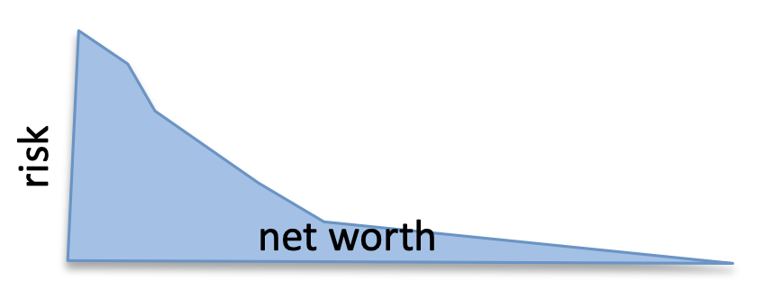
          - Example non-monotonic
            - The probability of winning a marathon, over the x-axis of age
              - There's a sweet spot: not too young, not too old
              
              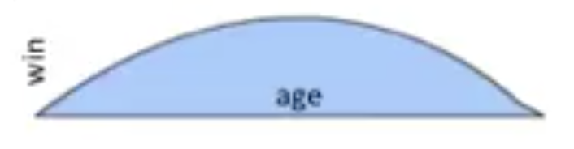

          - Quantisation
            - Fix for non-monotonic attributes
            - Split range into (overlapping) groups
            - Remove numeric attributes
            - Replace with ordinal labels
            
              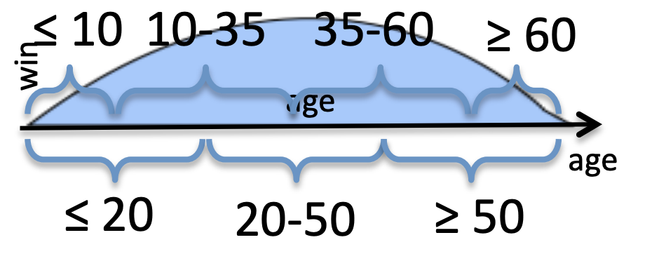

    - What's the difference between training data and test data?
      - Training data: used as input for the learning algorithm to create a predictor
      - Testing data: used once we have a predictor and want to test whether it works correctly
    - Multi-class vs binary classification
      - So far, we considered data sets with two classes
        - Like our ham/spam email example, m/f, yes/no
      - There are data sets with more than two classes
        - The classes are always mutually exclusive
          - Means that an instance is of exactly one class
      - Some algorithms can't deal with multi-class classifiers
        - We can take multi-class classifier and turin it into *one-vs-rest* classifier:
          - For instance, `{category a}` vs `{not a}` where `not a` are all the other classes
          - Do that for each class, individually
            - You'll get for each one a decision boundary
            - Put all those decision boundaries together and you get a useful combination we can work with
            - This means that instances can be of one, multiple or no classes
    - Generative vs discriminative classifiers
      - Generative approach
        - Try to build a model of the positives and a model of the negatives
          - Model is some characterisation of the entire population
      - Discriminative approach
        - Focus on decision boundary
          - Looks at points closest to decision boundary, far-away points are less relevant
          - Hence, ignores most of the data
        - Not designed to use unlabeled data
        - Only supervised tasks
    - Representing structure
      - Problem: pure attribute-value representation does not allow us to represent structure in the data
        - Q: Why is that?
        - A: Imagine we have a tree-like structure in the data. If we have a simple attribute-value representation, we can only store the tree node-by-node, no structure is preserved. In general, we can only store values with that approach, no structures between the values.
      - Solution: whatever structure we have in the data (chains, trees, ...), *embed* it in attributes
      - Tree example

        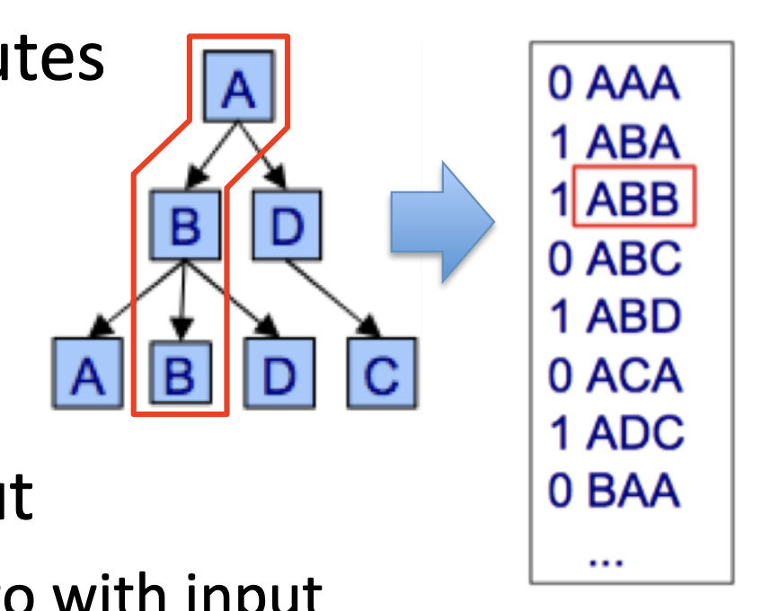
        
        - Instead of representing each node of the tree with an individual attribute (which would not preserve the structure), we represent root-to-leaf paths in the attributes
        - Predictors can't directly output structures, instead we can search for structured outputs by including hypothetical outputs and evaluating for `yes/no`
    - Outliers revisited
      - Isolated instances of a class that are unlike any other instances of that class
        - They affect all learning algorithms to various degrees
      - Outlier detection
        - Might have extreme attribute values
          - Just crceate confidence intervals
        - In general, try to visualise data and use your eyes to detect outliers
## Week 2: Naïve Bayes

- Bayesian classification
  - Recall that for classification we are learning a predictor function which is going to look at some data coming in and it's going to make predictions about that data
  - The Bayesian classification has the same goal:

    $$learning\ function\ f(x)\rarr y$$
    
    - $y=$ one of $k$ classes (e.g. ham/spam)
    - $x=x_1 ... x_d$ = values of attributes
      - In spam exapmle it'd be the word frequency vector
      - Can be numeric or categorical
      - Representation of the data
- Probabilistic classification
  - Bayesian classification is part of a family of probabilistic classifiers
  - All probabilistic classifiers *predict the class based on the computed probability of that class*
    - Pick the class with the highest probability given the observation
  - All probabilistic classifiers compute this quantity:

    $$\hat{y}=argmax_yP(y|x)$$

    - In spam example:
      - $x=$ emails (has words as representation)
      - $y=y_i\in\{spam, ham\}$
        - (One of the set members)
      - Our classifier is going to compute two probabilities:
        - Probabilitiy of spam given an email x
        - Probabilitiy of haml given an email x
      - And will then look whichever of those two probabilities has the higher probabilitiy
        - That's the class that's more likely then
- Bayesian probailitiy of a class
  - To be able to calculate the two above mentioned probabilities, we need to calculate the Bayesian probability of a class:

    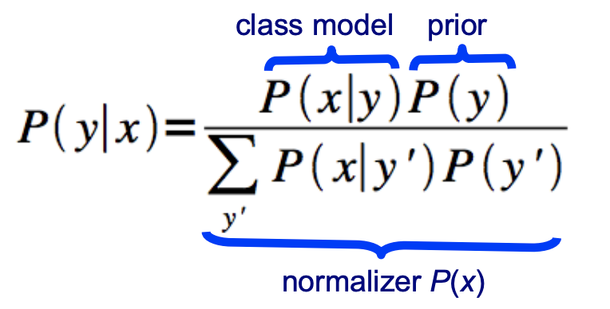

    - This is our probabilitiy of an email being spam given whatever words we observe in it
    - Any Bayesian classifier is going to compute the probabilitiy the this way
    - Prior: $P(y)$ says "what's the probability of a class independently of $x$"
    - Class model: "Assuming that a class $y$ is the case, how likely am I going to see a particular observation"
    - Normaliser: normalises probabilitiy across observations
      - Just another way of writing $P(x)$
      - Sometimes left out since it does not affect which class is most likely as we take $argmax$
      - However, allows us to compare $P_1(x|y)$ to $P_2(x|y)$ etc.
        - Q: Why is that?
        - A: Because before the normalisation, we do not have any scale for the data, there could be arbitrarily large or low values. Normalising puts everything into scale (between 0-1) and allows comparison. (Not too sure about this.)
      - Also allows us to detect outliers
        - they have a low probabilitiy under every class
        
        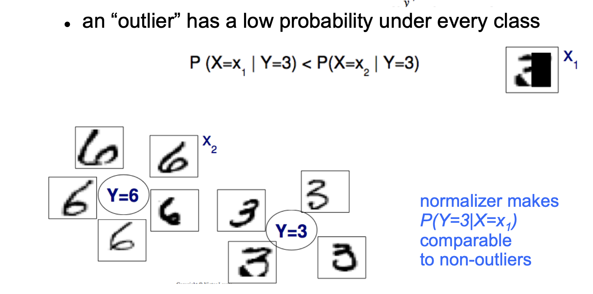
        
- Naïve Bayes: a generative model
  - Naïve bayes is a generative model
  - This means it computes its predictions by modelling each class and not by just looking at the boundaries between the classes
    - It constructs a model of each class and then for each input it ckecks to which model that ipnut fits better
      - That's our class model in the formula above
      - $P(x|y)$: what's the probabilitiy of input $x$ given class model $y$
    - As opposed to creating a direct decision boundary and to just check whether the input is above/below the boundary
    - $P(x|y)$ *generates* synthetic observations
      - "How likely am I going to see these observations given class $y$"
    - Not all probabilistic classifiers are generative
      - E.g. logistic regression

- Independence assumption
  - At the core of the Naïve Bayes classification is the independence assumption
    - That's what makes this classifier "naïve"!
  - When dealing with class probabilities, we run into a problem:
    - We must compute all these model-based probabilities ($P(x|y)$)
    - It gets difficult because our $x$ is not just a single variable
    - It's a bunch of variables, on for every attribute
    - $x=x_1,...,x_d$ where $d=$ number of attributes
    - So there are usually lots of possible combinations for $x$ which is not computable
  - Solution to this problem: make independence assumption
    - Idea: assume $x_1 ... x_d$ are **conditionally** independent given $y$
    
      $$P(x_1 ... x_d | y)=\Pi^d_{i=1}P(x_i|x_1...x_i-1, y)=\Pi^d_{i=1}P(x_i|y)$$

      - We have $d$ different attributes
      - We take all the attributes one by one
      - Originally, they're dependent on other $x_d$s
      - That's not computable so we assume that $x_1$ is independent of $x_1...x_i-1$! (second half of formula)
  - Conditional vs mutual independence
    - For Naïve Bayes we assume *conditional* independence, not mutual
    - Example to illustrate conditional independence
      - Assume that in general, the probabilities of going to the beach $P(B)$ and getting a heatstroke $P(S)$ are not independent:

        $$P(B,S) > P(B)*P(S)$$

      - But they may be independent if we know that the weather was hot $P(H)$

        $$P(B,S|H)=P(B|H)*P(S|H)$$
      - The hot weather explains all the prior dependence between beach and heatstroke
      - In classification, a class value explains *all* the dependence between attributes (that's our independence assumption)

        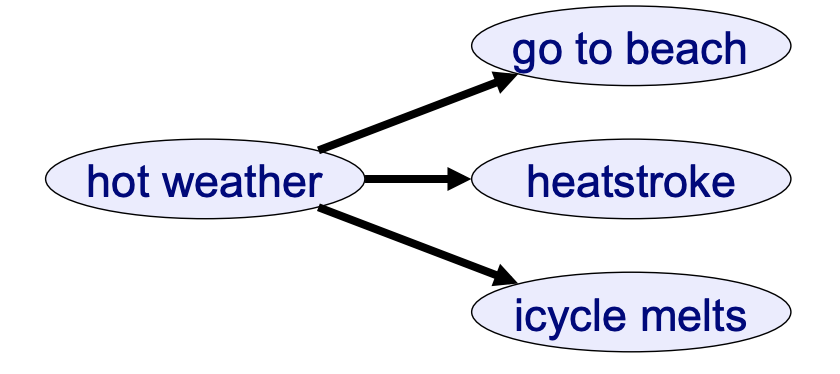
- Calculating class probabilities (prior)
  - It's simply $P(a)=\frac{n_a}{n}$
    - Where $n=$ total number of all individuals, and $n_a$ the number of class $a$ individuals
  - Example
    - Assume a data set containing information about $4$ adults ($a$) and $12$ children $(c)$
    - $P(a)=\frac{4}{4+12}$ = 0.25$
    - $P(c)= 1-0.25=0.75$
      - Since we only have two classes
- Modelling a class
  - Mean: $\mu_{attribute,\ class}=\frac{1}{n_{class}}\Sigma_{i:y_i=class}attribute$
    - Take all given attributes for that class and divide by the number of class individuals
  - Variance: $\sigma^2_{attribute,\ class}=\frac{1}{n_{class}}\Sigma_{i:y_{i=a}}(attribute_i-\mu_{attribute,\ class})$
- Problems with Naïve Bayes
  - Covariance problem
    - Estimated distributions for different classes can be on top of each other

      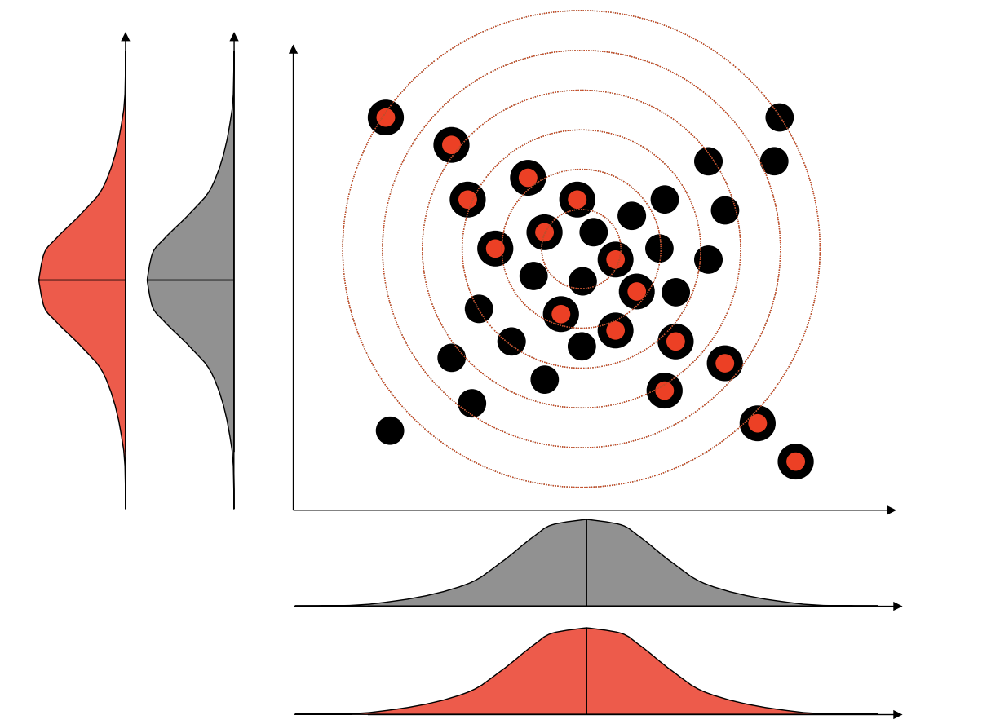

    - This means that Naïve Bayes cannot distinguish between these classes
    - The problem is that it's not $\mu$ or $\sigma^2$ that differentiates these classes, it's the **covariance**
      - Naïve Bayes cannot distinguish covariance :(
  - Zero-frequency problem
    - If an attribute never appears in one class, the probability will always be $0$
      - The will eliminate all other attribute probabilities which is not sensible
    - Solution: Laplace smoothing
      - Add a small positive number to all counts

        $$P(w|c)=\frac{num(w,c)+\epsilon}{num(c)+2\epsilon}$$
  - Independence assumption
    - This assumption is problematic since we can just manipulate the outcome
      - E.g. by adding lots of words that are associated with `ham` at the end of a `spam` email
        - Will drag it to the `ham` class
- Naïve Bayes: good at dealing with missing data
  - There might be a value missing for some attribute $x_i$
    - E.g. an applicant's credit history is unknown
  - How can we still compute $P(X_1=x_1, X_2=x_2,...X_k = ?, ... X_d=x_d|y)$?
  - It's easy with Naïve Bayes
    - Just ignore the attribute in the instance where it's missing
    - Compute the likelihood on observed attributes
    
      $$P(X_1 ... X_k ... X_d|y)=\Pi^d_{i\neq k}P(x_i|y)$$
      
      - Proof
## Week 3: Decision Trees
- Decision trees are a form of classifier
- We try to *understand* how much each attribute plays into a decision
- Creating a decision tree
  - We look at which rows are positive or negative, e.g. like this:
    - Trying to decide whether will play tennis or not in future, given some data. Training data:
    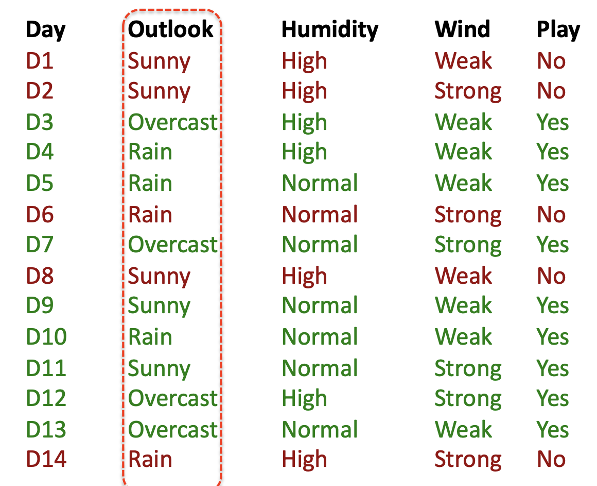
    - A pure subset would be a subset containing only green rows
  - Works in a **divide and conquer** fashion:
    - This is a concept, please look at the ID3 Algorithm in the next section and follow that one
    ```md
    1. Take the training data set.
    2. Pick 1 of the attributes.
    3. Use this attribute to **split up** this training set into a bunch of little training sets.
    4. If a subset is all pure then that's a strong indicator.
    5. If it's mixed, keep taking smaller subsets.
    ```
    - Will talk about step 2 in detail later
    - Step 3: Splits into all possible values for this attribute, and each set contains only data instances which have that particular attribute value
      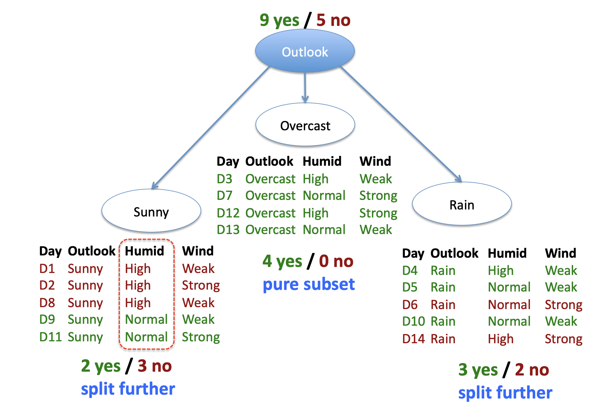
- After creating the branches
  - Replace the leaves (pure subsets of the data set) with decision labels (yes/no)
    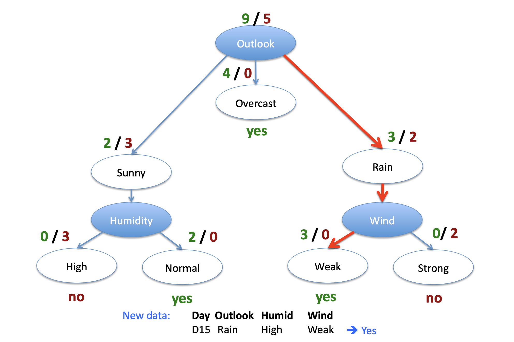
  - Given new data, we can just follow the tree and choose the label at the leaf we end up at
- Counts and pruning
  - We keep track of the counts (how pure/unpure the subset is, like `3 yes / 1 no`)
  - We keep them at the nodes
  - These numbers are important because sometimes we want to prune the tree
    - E.g. we stop after some node even though it's note a leaf
      - Maybe because there's a missing attribute in the input
    - Can then just use counts to decide for yes or no
- ID3 Algorithm
  - That's the algorithm that *builds* the decision tree
  - Recursive
  - It operates in turn on each node of the tree
    - For each node, you get a node and a subset of training examples
  ```python
  Split(node, {examples}):
    A = the best attribute for splitting {examples}
    Decision attribute for this node = A
    For each value of A, create new child node
    Distribute training {examples} to child nodes depending on their value for A
    For each child node / subset:
      if subset is pure: STOP
      else: Split(child_node, {subset})
  ```
- How to pick the best attribute
  - What we want out of a decision tree is a split that gives you subsets that are heavily biased towards yes or no
    - Bc if you have a subset that's mostly positive, it tells you a lot about what you're trying to predict
  - We want to *measure the purity* of the split
    - Want to be more certain after the split
      - If there's a pure set (e.g. `0 yes / 4 no`) $\rarr$ completely certain ($100\%$)
      - If there's a impure set (e.g. `2 yes / 2 no`) $\rarr$ completely uncertain ($50\%$)
    - The problem is that we can't just use $P(yes|set)$, that is the probability that given a set, we encounter yes, and just search for the highest $P$ and then choose that set
      - Doesn't work because a set with very low $P(yes|set)$ might still be very good and pure if it's shifted towards negative
    - So we want a formula for that purity measure that is *symmetric*
      - It shouldn't care about whether it's positive or negative, just tries to pick out the purest subset
- Decision Tree Entropy
  - Way of measuring the purity of a data subset
  - Definition:
    $$H(S)=-p_{(+)}log_2p{(+)}-p_{(-)}log_2p_{(-)}\ bits$$
    - $S$ = subset of training examples
    - $p_{(+)}/p_{(-)}$ = $\%$ of positive / negative examples in $S$
  - Interpretation: assume item $X$ belongs to $S$
    - How many bits do we need to tell if $X$ is positive or negative
      - Entropy actually in $[0,1]$ so better to think of this as "how many fractions of a bit do we need"
    - It's weird to think of fractional bits but it basically just *quantifies the uncertainty* about whether a randomly picked item is positive or negative
    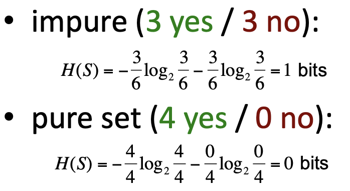
    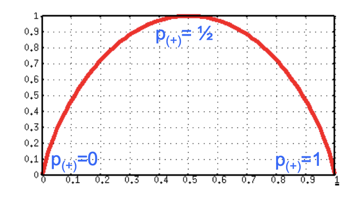
  - Higher entropy value: more impure
  - Lower entropy value: more pure
- Information gain
  - When building a decision tree, at each node you're going to have a bunch of children so there will be *multiple* subsets
    - For which subset should we calculate the entropy? Can't just choose one
    - Hence, we take the average for each of the subsets
    - We expect the entropy to drop after a split, called a *Gain*
      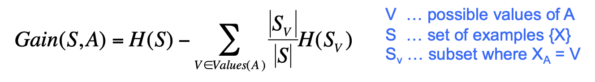
    - $\frac{|S_V|}{|S|}$ tells us how big each subset is
      - if it's small, it counts less into the subtraction because we want many items in pure sets
    - Why are we doing this?
      - We are computing an average of the entropies for each of the subsets
        - This makes sense because maybe one of the subsets has only 1 instance in it
        - Would be pure by definition!
          - That subset is a very small fraction of the data so we want to reward splits that produce pure subsets for a large number of instances
    - $Gain(S,A)$ takes into account the child subsets $S_V$ of a node
      - Takes the average entropy after the split
      - Biased towards larger subsets
      - Subtracts avg entropy from entropy before the split
- How to use the information gain to determine which attribute to pick?
  - We want to *maximise the gain*
    - Gain tells you how much more certain the positives and negatives become if you pick that attribute
  - So take every attribute you have in your data
    - Then compute the information gain for each one of them
    - Select the attribute with the highest information gain
      - That'll do the purest possible split
  - Do it recursively, for each branch split, and take every attribute except the ones that you already split on
- Overfitting decision trees
  - Question is, will using the information gain to qualify "best" attributes always produce the most efficient decision tree?
    - Yes: can *always* classify training examples perfectly
      - We just keep splitting until each node contains 1 example
    - No: Doesn't work on new data as well
  - Once we haev split up the data to a very fine-grained level and we have singleton subsets, we don't have confidence at all in our predictions
    - because really, all we're saying is any data point that falls into that leaf is positive just because we haev seen 1 positive example in our training data $\rarr$ seems foolish
    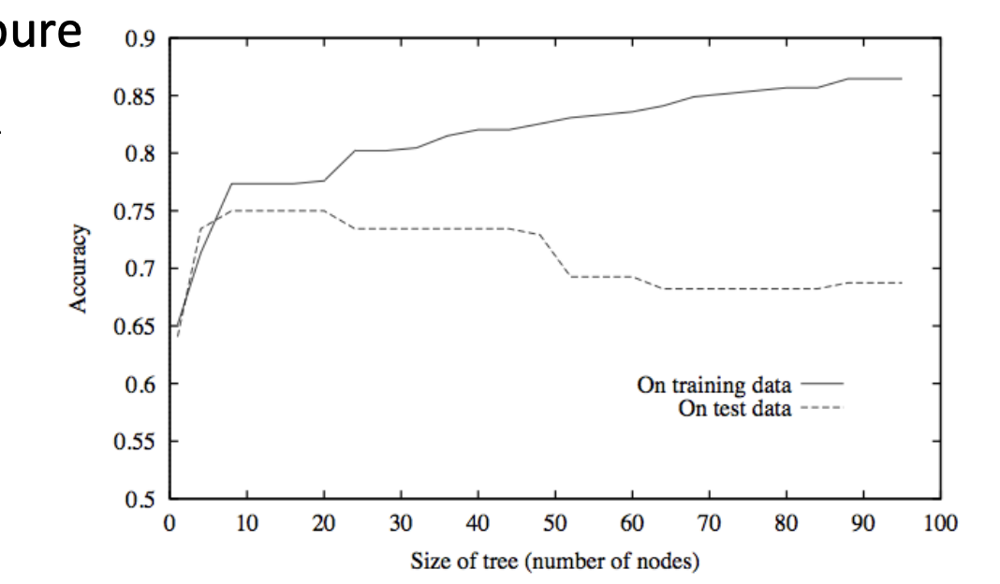
      - Accuracy on training data keeps increasing with tree size
      - Test data not, after while, the accuracy will decrease with increasing tree size
        - Called **overfitting**
          - Decision tree has become too tailored to the training data
            - Captures the nosie in that training data but the noise is not repeated in the test data
      - If we want to build a good decision tree, that is one that works on predictions well too, we want to stop building it before it becomes too specific to your training data
- Decision tree pruning
  - If we want to build a good decision tree, that is one that works on predictions well too, we want to stop building it before it becomes too specific to your training data
    - I.e. avoid overfitting
  - Use a validation subset for pot-pruning the tree
    - You take your training set (all the examples you have) and split it into two parts
      - We take one of the parts and hide it from the algorithm
        - That's the validation set
      - Take the other part and train a full decision tree on it, with 100% accuracy
        - That's the training set
    - Then, pull out the validation set, run validation set through tree and you get an accuracy
      - That accuracy is not going to be 100% because the tree is too specific, overfitted to the training proportion of the data
    - Then, take the tree, go through nodes one by one and then
      - Pretend to remove that node and all its children
      - Re-measure accuracy on validation set
      - Remove the node that results in greatest accuracy improvement
      - Repeat until any further pruning is harmful to accuracy
    - You basically try to remove every single possible subtree and check for each new tree the accuracy
      - It's a greedy procedure: we look for the cut with the maximum performance improvement
        - Commit to that cut and move on to next one
- Problems with Information Gain
  - Biased towards attributes with many values
  - Won't work for new data
    - Attribute values we haven't seen before because we don't have a tree branch for them!
- Gain Ratio: one solution for information gain bias
  - Penalises attributes with many values
    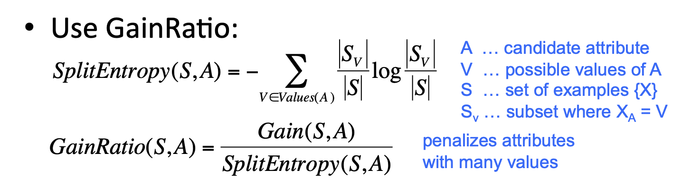
    - $SplitEntropy$ is the entropy of the split itself (without considering the positives or negatives)
      - Tells you "does this attribute give me lots of tiny attributes or not?"
        - High value if lots of tiny subsets
        - Low value if few of big subsets
  - Use $GainRatio$ if you have attributes that lead to tiny fractoring of the data
- Decision trees are DNF formulae
  - Means that DT are interpretable by humans
  - DNF = disjunctive normal form
    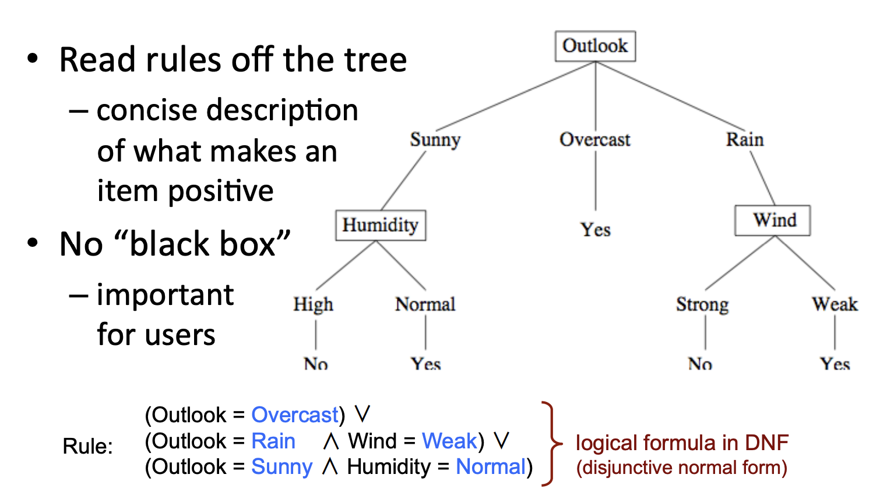
- Decision trees on continuous attributes
  - Decision trees can also deal with continuous-valued attributes:
    - DT doesn'T split based on value
    - Instead, it tries to pick a **threshold**
    - Will go through all possible values for threshold
      - Split on those thresholds ("take all instances where their specific `attribute_value` > threshold")
        - Will split data into two parts, one part contains all instances are lower than threshold, other part the larger instances
  - Need to add a search over the possible values of the threshold
    - Recursively repeat for all attributes
  - You can end up using the same attribute multiple times
    - Does not work for categorical data because once split, all of that category will be in that substree so when attempting a new split on that attribute, it wouldn't work
    - Can split again because we can choose different threshold
- Multi-class and regression
  - So far, we considered binary classification for decision trees
    - Yes/no, tennis/no-tennis
  - Trivial to use decision trees for multi-class classification
  - Instead of just the positives and the negatives we have $k$ different classes
    - We'll predict the **most frequent class in the subset**
    - To do so, we need slightly different definition for entropy:
      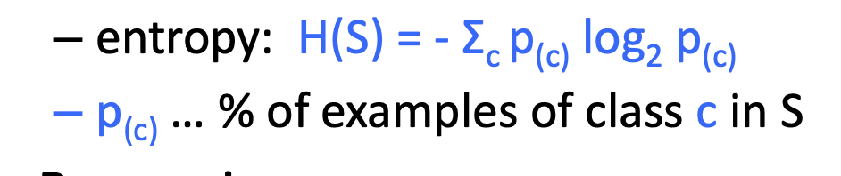
      - If leaf is not pure, choose class that is most frequent in it
- Decision trees for regression
  - Recall regression
    - Instead of predicting a class, we're predicting a real number
      - E.g. the stock price of a company tomorrow
  - Don't have classes anymore, which comes with 2 difficulties:
    1. How do you do precitions once you've sorted the data?
    2. HOw do yo define entropy now that yuo don't have classes?
  - INstead of trying to maximise the entropy, or the gain, we try to find subsets such taht each subset has *the smallest variance of whatever it is you're trying to predict*
    - More on this in a few lectures time
- Pros and cons of decision trees
  | Pro                                                                              | Con                                                                                                            |
  | -------------------------------------------------------------------------------- | -------------------------------------------------------------------------------------------------------------- |
  | Interpretable: humans can understand decisions                                   | Only axis-aligned splits of data (no angled decision boundaries through data set)                              |
  | Easily handles irrelevant attributes (Gain will be 0)                            | Greedy (might not find the best tree) because otherwise would need to find optimal in exponentially many trees |
  | Can handle missing data                                                          |                                                                                                                |
  | Very compact: the number of nodes is much smaller than the dimension of the data |                                                                                                                |
  | Very fast at testing time: $O(depth)$                                            |                                                                                                                |

- Random decision forest
  - This is a generalisation algorithm of ID3
  - Basic idea: instead of growing on DT on our data set, we're going to grow $k$ different DTs
    - Randomise input to get different trees
    - Take set of examples
    - Pick random subset $S_r$
    - Use $S_k$ to build full decision tree (whitout pruning)
      - ONly difference: when splitting, don't use all attributes but a subset
    - Repeat for $r=1...k$
  - Given new data point $X$:
    - Classify $X$ using each of the trees $T_1...T_k$
    - Use majority vote: class predicted most often
## Week 3: Generalisation and Estimation
- Recall the what the term *training data* refers to: $\{x_i,y_i\}$
  - We have data points $x_i$ and their true label $y_i$
    - A specific tuple of $x_i$ and $y_i$ is called an example, e.g. $\{x_1,y_1\}$
      - Q: Is it actually the tuple or just x_i that is the example?
      - A: The tuple. It's an example of what datapoint $x_i$ is classified as ($y_i$)
  - We use these examples to train our predictor
- Future data: $\{x_i,?\}$
  - We have examples that our classifier has never seen before
  - That's our input for the predictor
- Eventually, we want to do well on future data, not on the training data
  - It's easy to build a perfect predictor for training data (see overfitted decision trees)
  - Does not mean that the predictor will do well on future data
    - Can overfit to noise of training data
- Under- and overfitting
  - Overfitting
    - Predictor is too complex
      - Too flexible, overfits to small data branches
      - Fits "noise" in the training data
      - Predicts patterns that only eist in the training data
    - Predictor $F$ overfits data if
      - We can find another predictor $F'$ which makes more mistakes on training data: $E_{train}(F') > E_{train}(F)$
        - $E_{train}$ is the error rate on the training set
      - But fewer mistakes on unseen future data: $E_{gen}(F') < E_{gen}(F)$
        - $E_{gen}$ is the error rate on the geneeralised, future data
  - Underfitting
    - Predictor is too simplistic
      - It's not flexible enough, too rigid
      - Not powerful enough to capture salient patterns in data
        - Salient = non-trivial
    - Predictor $F$ underfits data if
      - We can find another predictor $F'$ which makes fewer mistakes both on training and future data set than $F$
  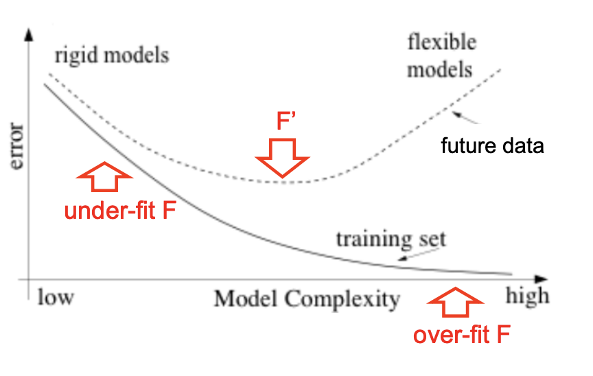
    - For the training set, the more complex the predictor, the smaller the error rate
    - For future data, there's a sweetspot between too simplistic and too complex
      - Too complex will make error rate go up again because of captured noise in trainign data
      - Too simplistic will make error rate go up because of non-captured complexity in future data
  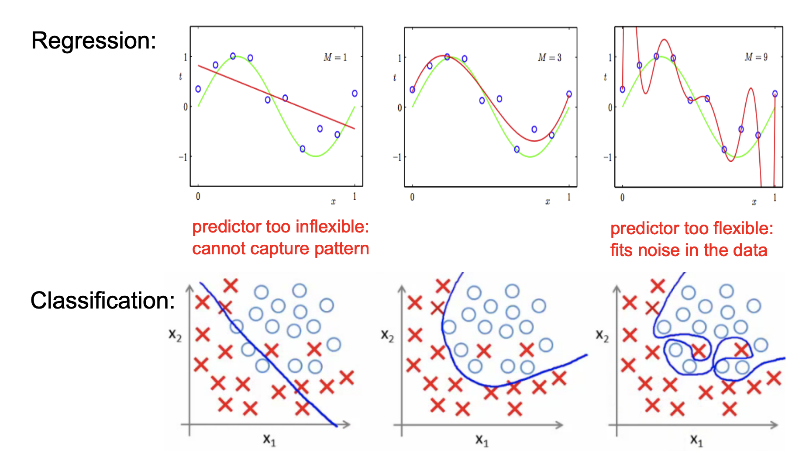
- Flexible vs inflexible predictors
  - Each data set needs a different level of flexibility for a predictor
    - Depends on task complexity and available data
    - Want a "dial" to get rigid / flexible predictor
      - That dial adjusts complexity
- Training vs generalisation error
  - Training error
    - The error the predictor gets on the training set
    
    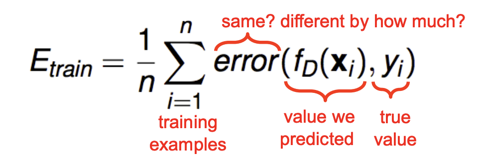
    - We sum up for each training example its individual error by evaluating how much different the predicted value $f_D(x_i)$ is from the true value $y_i$
      - The $error$ function is some measure which tells you how close the predicted value is to the true value
        - In classification it's just an equality test (same / not same)
        - Will talk about possible error functions later
  - Generalisation error
    - Measure of how well the predictor does on future data
    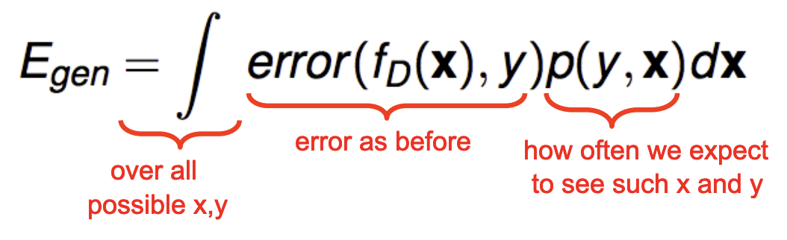
    - Problem: we don't know what $x_i$ there will be in the future, neither what true label $y_i$ it will have
      - Hence, **we can never directly compute the generalisation error**
    - But we do know all the possible values for $x$ and $y$ (their range)
      - E.g. x: all possible `20x20` possible black/white bitmaps, y: `{0,1,...,9}` digits
- Estimating the generalisation error
  - Even though we cannot compute the generalisation error, we can *estimate* it
  - Can estimate it by computing a *testing error*

    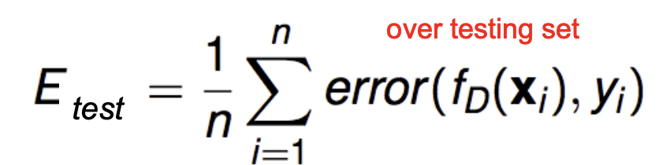
  - Testing data
    - We have training data
      - We split off a certain part of it $\rarr$ called *test data* or testing set
    - Learn predictor without using any of the test data
    - Predict values for testing set, compute testing error
    - This gives us an *estimate* of the true generalisation error
      - Only meaningful if the testing set is an *unbiased* sample from $p(x,y)$:
        - $lim_{n\rarr\infty}=E_{test}=E_{gen}$, by the law of large numbers
        > Law of large numbers: the more $n$ in the testing set, the closer is $E_{test}$ to $E_{gen}$
        - That "if unbiased" means "if the testing set is representative of the future data input"
- Confidence interval for future error  
  - We don't knoe exactly *how close* the $E_{test}$ will be to $E_{gen}$
    - Since it depends on the testing set size $n$
  - So we create a *confidence interval* such that $\%$ of future test sets fall within that interval
    - E.g. $p=95$
    $E_{test}\pm\Delta E$
    - $\Delta E$ = a range of errors
- True error rate
  - $E_{test}$ is an unbiased estimate of $E$, the true error rate
    - Assuming the test set was sampled in a representative way
    - The true error rate $E$ is the probability that our predictor will misclassify a random instance
      - I.e. got a positive but classified as negative, or vice versa
    - The question is: If we take a random set of $n$ instances, how many get misclassified?
      - Over those sets, the mean number of misclassified will be
        - $\mu=n*E$
        - $\sigma^2=n*E(1-E)$
- Future error rate
  - That's just the number of misclassified instances divided by the sample size
    $$E_{future}=\frac{|misclassified|}{n}$$
  - E_{future} follows a Gaussian distribution, so:
    - $\mu=E$
    - $\sigma^2=\frac{E(1-E)}{n}$
  - The $p\%$ confidence interval for the future error is:
    
    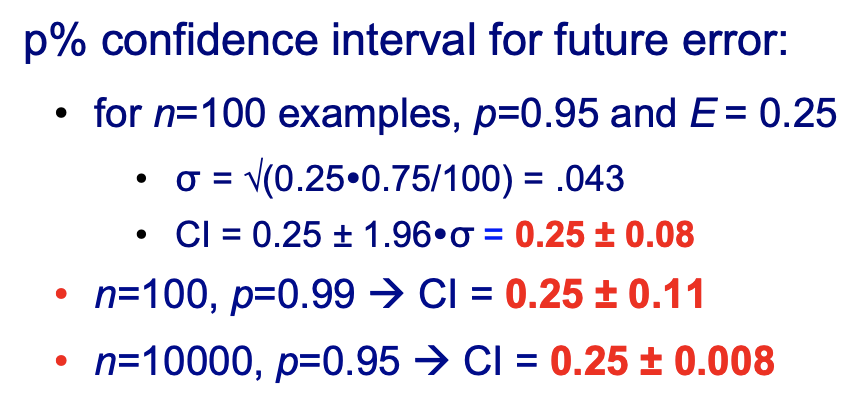
- Validation sets
  - Need a separate set of data to pick values for the "dials" of classifier
  - Recall:
    - Training set $\rarr$ used to learn / build / construct classifier
    - Validation set $\rarr$ used to
      - Pick the algorithm and choose the dial settings for it
      - Pick best-performing algorithm (NB vs DT vs ...)
      - Fine-tune dials (tree depth, k in kNN, c in SVM)
  - By using the validation set to choose the classifier, we slightly overfit the classifier to that validation set
    - so still need testing set which the classifier has never seen before to compute the estimate of the future error rate
- General rules for the testing set
  - Usually only run the classifier once on the testing set, and take the result of that run
  - Or report results of every run
  - **Never** report best of many runs
  - Split the data randomly to avoid bias
- Cross-validation
  - Problem: when splitting the data set, we have *conflicting priorities*
    - On the one hand, we want to estimate the future error as accurately as possible
      - So we want a large testing set because large $n_{test}\rarr$ tight confidence interval
    - On the other hand, we want to learn the classifier as accurately as possible
      - Large training set: large $n_{train}\rarr$ better estimates
    - Unfortunately, we only have so many data isntances, training and testing data cannot overlap:
      $$n_{train}+n_{test}=n_{total}$$
        - $n_{total}$ is a constant, a fixed number, a exhaustible resource
  - Solution: cross-validation
  - Idea of cross-validation:
    - Use the same data twice
    - We first split up into train/test, like usually
      - As normally, train classifier using training set and estimate performance using test set
    - Then, flip the sets around:
      - Build a classifier on the testing set and then run on training instances and compute the error rate on them
    - Why is this legal to do?
      - We are still not using overlapped data because at each step, we use each instance only in one way
        - Only once for training and once for testing
      - We effectively use every point both for testing and training but **never at the same time**
        - This reduces the chance of getting a biased testing set
  - k-fold crodd-validation
    - In general, we don't split the data into just 2 sets bu in $k$ sets
      - $k=5$ or $k=10$ are conventional values for $k$
      - E.g. $5$-fold cross-validation would look like this:

        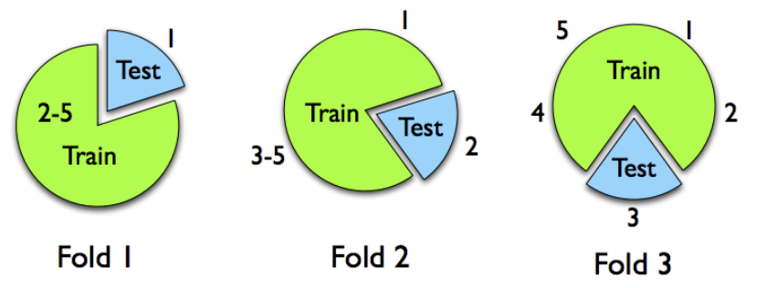
      - To get estimated error, avergae the results over $5$ folds
      - To build the final classifier we're going to use in practice, take $100\%$ of the data
        - Cannot compute estimated error for that classifier as there's no data left for testing
          - But typically, it would not be greater than the previously computed average error of the k-fold cross-validation
  - Leave-one-out
    - That's n-fold cross-validation
      - n = total number of instances
      - Subsets which are of size $1$ (just one instance each)
    - This is cross-validation at its limit
    | Pros                                                                | Cons                                                   |
    | ------------------------------------------------------------------- | ------------------------------------------------------ |
    | Best possible classifier learned since we use n-1 training examples | High computational cost: re-learn everything $n$ times |
    |                                                                     | Classes are not balanced in training / test sets       |
- Stratified sampling
  - Problems with leave-one-out:
    - Training / testing sets have classes in different proportions
    - That problem is not limited to leave-one-out only
      - k-fold cross-validation: random splits $\rarr$ inbalance
  - Solution: Stratification
    - Way of keeping class labels balanced across training / testing sets
    - It's a simple way to guard against unlucky splits
    ```md
    # Recipe
    1. Randomly split each class into k parts
    2. Assemble ith part from all classes to make the ith fold
    ```
- Evaluation measures
  - There are lots ways for deciding if
## Week 4: Linear Regression
- The Regression Problem
  - Compare it to the classification problem:

    | Classification Problem           | Regression Problem                 |
    | -------------------------------- | ---------------------------------- |
    | Target of prediction is discrete | Target of prediction is continuous |

  - Training data: Set $\mathcal{D}$ of pairs ($\bf{x}_1,y_i$) for $i=1,...,n$
    - $\bf{x_i}$ is a vector
    - $y_i$ is the expected output of your prediction
    - Where $x_1\in\mathbb{R}^D$ and $y_i\in\mathbb{R}$
      - First expression just means that all elements from the vector are drawn from the real numbers ($D$ is the dimension of the vector, number of elements)
  - *Linear* regression $\rarr$ the relationship between $\bf{x}$ and $y$ is linear
- The Linear Model
  - The linear model is shown below, the equation on the top:
  
  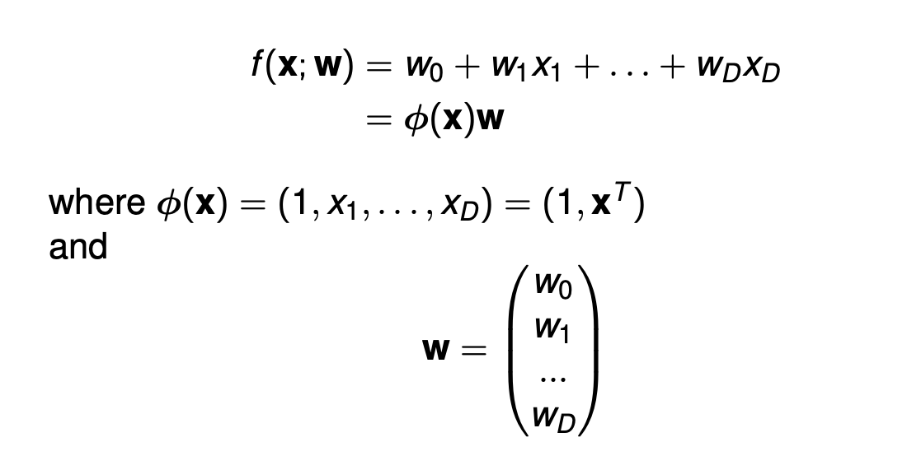

  - Equation explained
    - $\bf{x}$ is the input data
    - $\bf{w}$ is our model parameters
    - $w_0$ is the first model parameter
    - $D$ is the number of dimensions in the data
  - We can write that as the dot product of two vectors:
    $$\phi(\bf{X})\cdotp\bf{W}$$
    - A row vector
    - It has the components $1$ and then the components of the input data $\bf{X}$
      - $\bf{X}$ is a column vector so we need to transpose it
    - $W$ is written as a column vector
    - The dot product is the equation, the $1$ in $\phi(\bf{X})$ gives us the first parameter $W_0$
    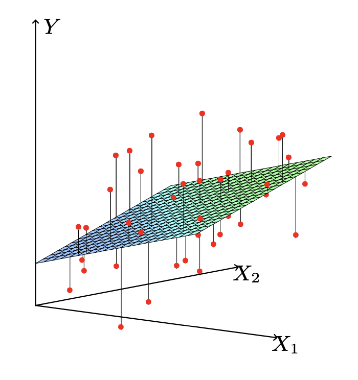
- Fitting the parameters / linear algebra formulation
  - Design matrix
    - Got $n$ rows and $D+1$ columns
      - $n$ is the number of datapoints (each a vector)
      - $D$ is the dimension of the vectors
      - $D+1$ columns since we have that separate column filled with $1$s only, and then all the dimensions

    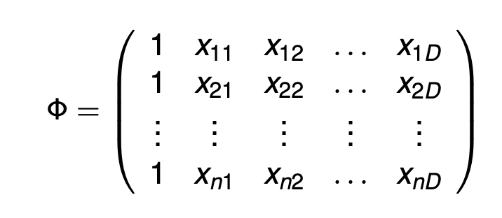

      - Each of the rows represents one of the training instances
        - Column-wise, it's the vector "spread-out"
      - The first column, the $1$s are going to be used to get the $W_0$s in each of the equations 
    - $x_{ij}$ is the $j^{th}$ component of the training input instance $\bf{x}_i$
    - Let $\bf{y}=(y_1,...,y_n)^T$
      - That is, the column vector of the correct/expected output
    - And then $\bf{w}$ is our model (also a column vector)
    - Then $\hat{y}=\Phi\bf{w}$
      - That's the model's predicted values on training inputs (it's a vector of all the equations)
  - Solving for Model Parameters
    - We are given this equation:
      $$\bf{y}=\Phi\ldotp\bf{w}$$
    - We know $\bf{y}$ and $\Phi$ but not $\bf{w}$
      - Can't just invert $\Phi$ to get $\bf{w}$
        - Since $\Phi$ is not square
        - $n$ is usually much larger than $D+1$ $\rarr$ that's called an **overconstrained** system
    - Instead, we use a *loss function*
      - Also called *error* function
    - Loss function $O(\bf{w})$
      - It minimise our loss w.r.t. $\bf{w}$
      - At its minimum, $\hat{\bf{y}}$ looks like $\bf{y}$
        - That is, want our prediction $\hat{\bf{y}}$ to look like the training expected output
      - A common choice for the loss function is the *squared error*:

        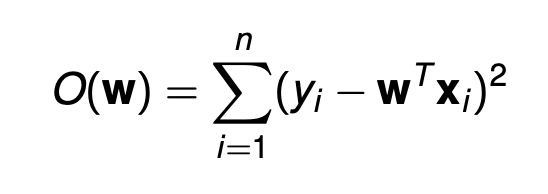

      - In the picture below, it's the jum of squared length of black sticks
        - Each black stick is called a *residual*
          - i.e. each $$y_i-\bf{w}^T\bf{x}_i$$
        
        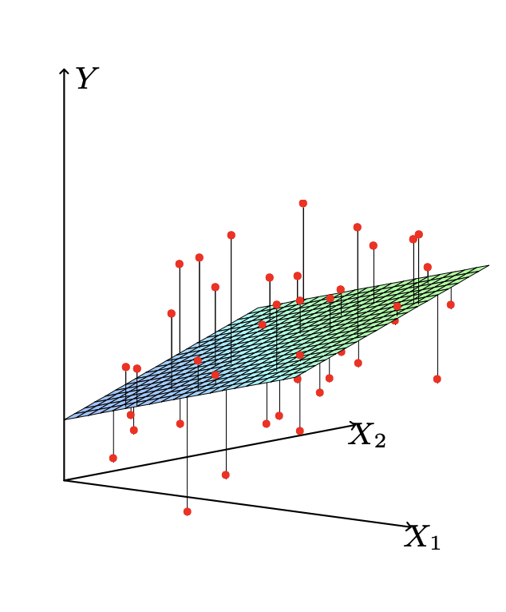

      - We want to minimise this error because if it was zero, all these residuals would have length 0 so the hyperplane would lie perfectly on the points
    - We can rewrite the mean squared error loss function in vector form:

      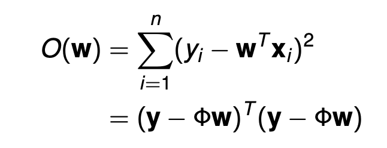
      - (This is achieved by the dot product)
      - Want to minimise this with respect to $\bf{w}$
      - The error surface a parabolic bowl and we are trying to the bottom of this bowl (that's the minimisation)
        
      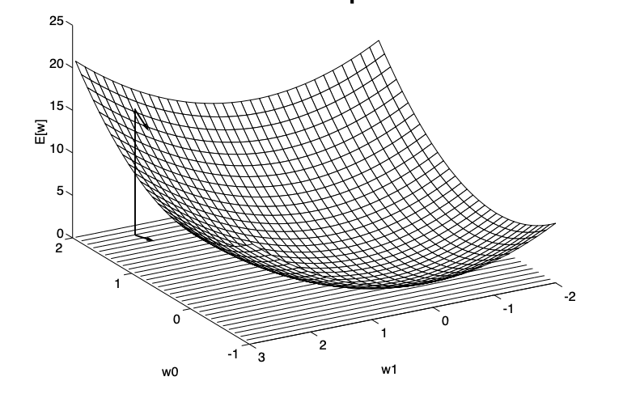
    - Minimising the mean squared error loss function
      - TODO: write this out
        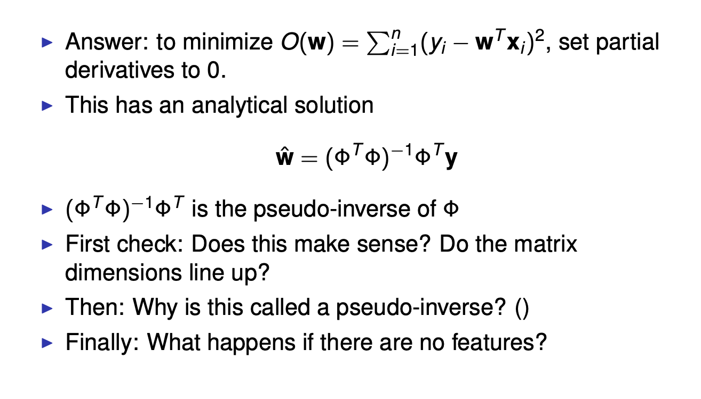
        - It's called the pseudo-inverse because it's not an actual inverse but it acts like one
          - In particular because it works like an inverse
        - If there are no features, $\phi$ is just going to be a column vector of $1$s
  - Probabilistic interpretation of $O(\bf{w})$
    - Assume that $y=\bf{w}^T\bf{x}+\epsilon$
      - Where $\epsilon~N(0,\sigma^2))$
        - That us supposing that $\epsilon$ is more or less Gaussian (with mean 0 and variance $\sigma^2$)
      - That is, an exact linear relationship plus **Gaussian noise**
    - This implies that the output given a particular input ($y|\bf{x}_i$) also varies with Gaussian noise
      - But in this case, the mean of the Gaussian noise is the value that the model predicts
      
        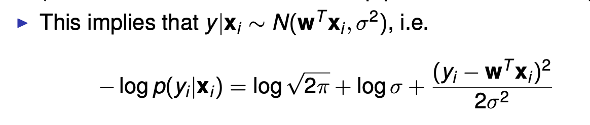
      
        - So we can then take the log probabilities of the Gaussian
          - And then, our resulting epression consists of two constants and the residual expression we know from our loss function in the denominator
        - So minimising $O(\bf{w})$ (that is, the mean squared error loss function) is equivalent to **maximising the likelihood**
      - Can view $\bf{w}^T\bf{x}$ as $E[y|\bf{x}]$
      - Can estimate the variance $\sigma^2$ from the residuals:

        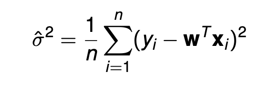

- General structure of regression for learning algorithms:

| Structural aspect                                                 | Regression                      |
| ----------------------------------------------------------------- | ------------------------------- |
| Define task                                                       | Regression                      |
| Decide on the model structure                                     | Linear regression model         |
| Decide on the scoring function                                    | Mean squared error (likelihood) |
| Decide on optimisation search method to optimise scoring function | Calculus (analytic solution)    |

- Problems with linear regression
  - Sensitive to *outliers*
  - What to do about it: diagnostics
  - Graphical diagnostics can be useful for checking:
    - Is the relationship obviously nonlinear?
    - Are there obvious outliers?
    - Or can fit the model and then look at the residuals
      - If the residuals look like a Gaussian, that'd be fairly reasonable
      - If there's a relationship between the data and the residuals then that's a red flag
        - E.g. if the data values go up and the residuals as well then that's a sign that the model isn't capturing
  - The goal is not to find all problems, it's to eliminate the most obvious problems
- Multiple regression
  - We might have different targets $q$ for each input $\bf{x}$
    - This means that for each input, we might not want to predict only one continuous output but multiple
  - We introduce a different $\bf{w}_i$ for each target dimension
  - We do regression separately on each $\bf{w}_i$
  - This is called multiple regression
- Basis Expansion
  - So far, we've talked about linear regression
  - In the real world, there are lots of problems which are non-linear though
  - It's easy to extend our insights so far to non-linear problems
    - Can do so by transforming the data $\bf{x}$ we start with so that it's in a different form
    - By transforming it, the newly transformed data has a linear relationship with the output
    - The transformed data is expressed using $\phi(\bf{x})$
  - Design matrix

    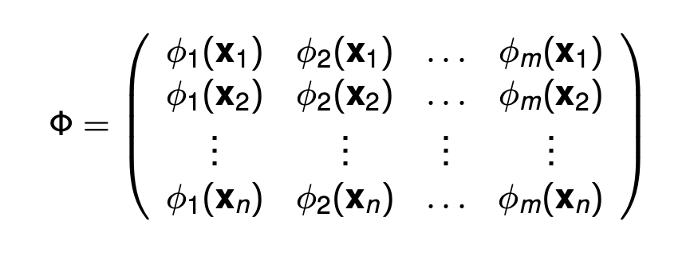
    - $m$ is the number of different transforms we are going to try
    - We run our first training example $\bf{x_1}$ through the first transform $\phi_1$, then through the second transform and so on (that's the first row), for each of the $m$ transforms
      - We do that for each of the $n$ training examples (that's all the rows)
    - Then very similar steps before to get an estimate for the best model $\hat\bf{w}$:
      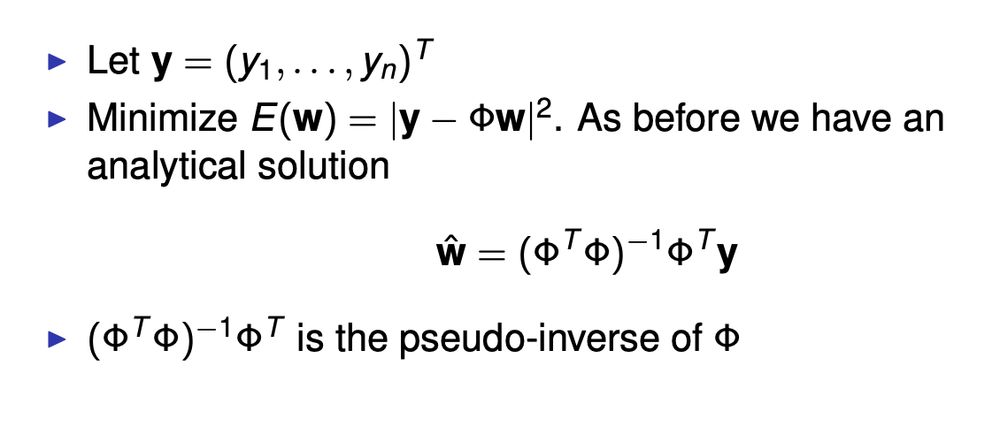
- Feature Transformation
  - Transforming the features can be important
    - By transforming the features by a non-linear transform we are able to cope with problems where there isn't linear relationship between the inputs and the outputs
    - There are lots of different transforms: log, square, square root
      - That's why it's important to *know the problem domain*
- Radial basis function (RBF) models
  - The RBF is a particula kind of transformation
  - The general form of it:
    - Set $\phi_i(\bf{x})=exp(-\frac{1}{2}|\bf{x}-\bf{c}_i|^2/\alpha^2)$
      - Has two parameters
        - $\alpha$: the same for every one of te RBF
        - $\bf{c_i}$: the centre
    - The RBF is taking the distance from the data points $\bf{x}$ to the centre $\bf{c}_i$ and squares it, and then taking the exponential of it.
      - Can think of $\alpha$ as a width
    - Need to pick a certain number of those centre points in prior
      - How to do that is a matter of knowledge about the data, there are no general heuristics
      - Often, choosing a subset of the datapoints as centres turns out to be quite effective $\rarr$ but there are no theoretical results about that, just a practical insight!
  - After transform, can use the pseudo-inverse to find our model $\hat\bf{w}$
  - In general, original data points that are close to the centre will have high values in the RBF
  - RBF disadvantages/ cons (TODO: write this out)

    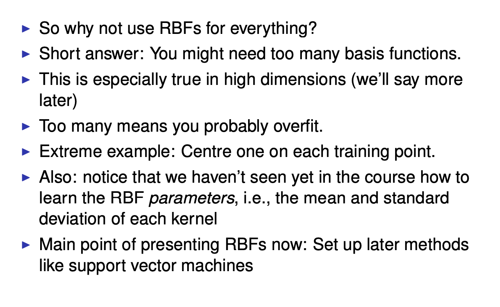
## Week 4: Logistic Regression
- Two-class linear classifier
  - In this class we will discuss *linear classifiers*
    - Just means that in linear classifiers, the decision boundary is a line
  - For each class, there is a *region* of feature space in which the classifier selects one class over the other
  - The decision boundary is the boundary of this region
    - I.e. where that two clsases are "connected"

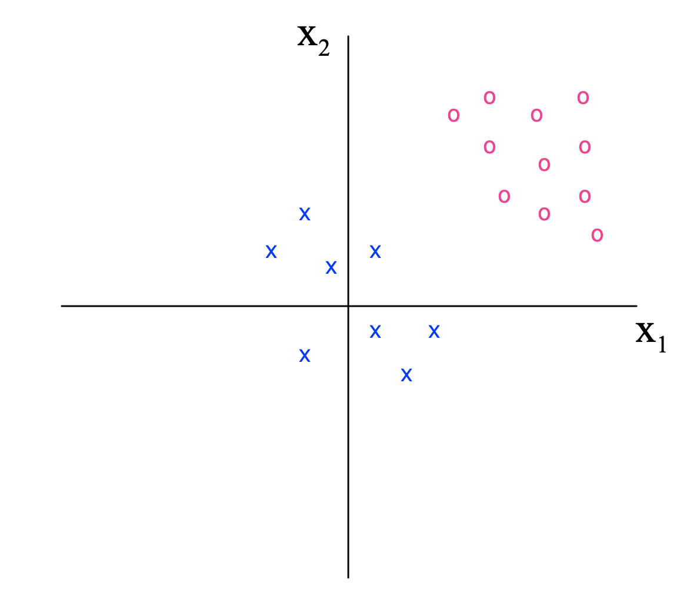
- In a two-class linear classifier, we learn a function to discriminate the two classes:

  $$F(\bf{x},\bf{w})=\bf{w}^T\bf{x}+w_0$$

  - This function represents how aligned the instance is with $y=1$
    - $y=1$ meaning that $\bf{x}$ is in class $y$
  - $\bf{w}$ are parameters of the classifier that we learn from data
    - Also called *weight vector*
  - $w_0$ is called *biased term*
- To do classification of an input $\bf{x}$:

  $$\bf{x}\mapsto(y=1)\ if\ F(\bf{x},\bf{w})>0$$

    - Just check that $F$ returns a value greater than $0$
    - If less than $0$, it's the classified as the other class
- Geometric view (TODO if it seems relevant later-on)
- Logistic Regression
  - For now, consider a two class case: $y\in\{0,1\}$
  - From now on we'll write:
    - $\bf{x}=(1,x_1,x_2,...,x_d)$
      - So we add a dimension with $1$
    - $\bf{w}=(w_0,w_1,...,w_d)$
      - Added $w_0$
  - We will want a linear, probabilisitic model:

    $$P(y=1|\bf{x})=f(\bf{w}^T\bf{x})$$
  - $f$ is a (to-be-defined) function which squashes $\bf{w}^T\bf{x}$ to be between $[0,1]$
  - Probabilities sum up to one so:

    $$P(y=0|\bf{x})=1-f(\bf{w}^T\bf{x})$$
  - A convenient squashing function $f$ is the logistic function:
    
    $$f(Z)=\sigma(Z)\equiv\frac{1}{1+exp(-Z)}$$
  
    - As $Z$ goes from $-\infty$ to $\infty$, so $f$ goes from $0$ to $1$
    - It has a "sigmoid" shape (i.e. S-like shape)
      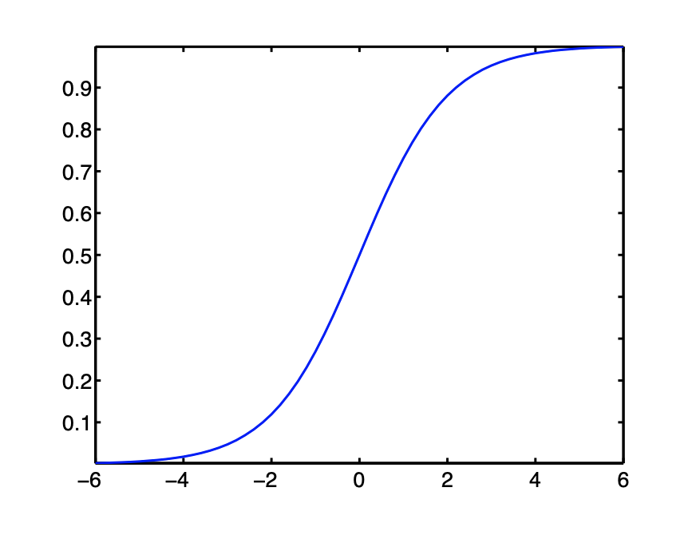
      - If we have a factor $\alpha$ in front of $Z$, it affects the slope of the plot
  - Linear weights
    - Linear weights + logistic squashing function == logistic regression
    - We model the class probabilities as

      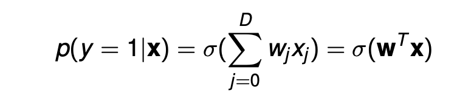
    - $\sigma(z)=0.5$ when $z=0$
      - $z$ is the input of the squashing function $\sigma$
      - Hence, the decision boundary is given by $\bf{w}^T\bf{x}=0$
        - This makes sense! $0.5$ is where we can't decide whether an input belongs to class $A$ or $B$, it's the "middle" of probabilities
    - Decisionn boundary is a $M-1$ hyperplane for a $M$ dimensional problem
  - Let's temporarily define $\tilde{\bf{w}}=(w_1,w_2,...,w_d)$
    - I.e. exclude the bias $w_0$
  - The bias parameter $w_0$ shifts the position of the hyperplane (decision boundary) but does not alter the angle  / orientation in space (since it's not multiplied with any input)
  - The direction of the vector $\tilde{\bf{w}}$ affects the angle of the hyperplane
    - The hyperplane is perpendicular to $\tilde{\bf{w}}$
  - The magnitude of the vector $\tilde{\bf{w}}$ affects how certain the classifications are
    - Magnitude of $\tilde{\bf{w}} = number of elements
  - For small $\tilde{\bf{w}}$ most of the probabilities within the region of the decision boundary will be near to $0.5$
    - Corresponds to steepening the curve of $\sigma$
  - For large $\tilde{\bf{w}}$ probabilities in the same region will be close to $1$ or $0$
- Learning Logistic Regression
  - Want to set the parameters $\bf{w}$ using training data
  - As before:
    - Write out the model in terms of its probabilities
    - We're going to get its likelihood
    - Find the derivatives of the log likelihood w.r.t the parameters
    - Adjust the parameters to maximise the log likelihood
  - Assume the data is IID
    - Independent and identically distributed
  - If we have a data set $D=\{(\bf{x}_1,y_1),(\bf{x}_2,y_2),...,(\bf{x}_n,y_n)\}$
  - The probability of the data set given the weights, $P(D|\bf{w})$, is the product over each of the data points of the probability that we get that $y=y_i$ given the input $\bf{x}_i$ and these weights $\bf{w}$

  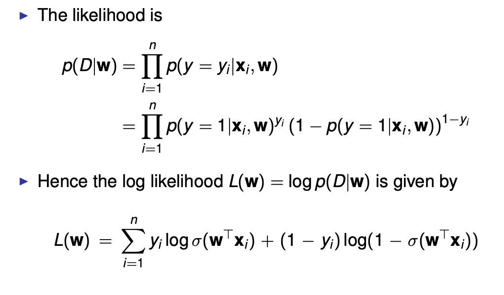

  - As before, we take the log likelihood
    - Makes it easier because it converts a multiple multiplication  $\Phi$ into a summation $\Sigma$
  - Turns out the likelihood has a unique optimum (given sufficient training examples)
    - It's *convex*
    - Q: What does convex mean?
    - A: TODO
  - How do we maximise, then?

    $$\frac{\partial L}{\partial w_j}=\Sigma^n_{i=1}(y_i-\sigma(\bf{w}^T\bf{x}_i))x_{ij}$$

    - TODO: what's L?
  - Unfortunately, we cannot maximise $L(\bf{w})$ explicitly as we did for linear regression
    - Need to use a numerical optimisation method, we'll see it later.
  - General structure of regression for learning algorithms:

| Structural aspect                                                 | Logistic Regression            |
| ----------------------------------------------------------------- | ------------------------------ |
| Define task                                                       | Classification, discriminative |
| Decide on the model structure                                     | Logistic regression model      |
| Decide on the scoring function                                    | Log likelihood                 |
| Decide on optimisation search method to optimise scoring function | Numerical optimisation routine |
  - Note that for the numerical optimisation routine, we have multiple options (stochastic gradient descent, conjugate gradient, BFGS)
- Basis functions
  - Linear Separability
    - A problem is lineraly separable if we can find weights so that
      - $\tilde{\bf{w}}^T\bf{x}+w_0>0$ for all positive cases (where $y=1$), and
      - $\tilde{\bf{w}}^T\bf{x}+w_<=0$ for all negative cases (where $y=0$)
    - So if we can find a weight factor which separates all negative and all positive cases
    - That's if we can draw a straight line which separates positives from negatives
  - XOR
    - Example of a very simple function that is not linearly separable
    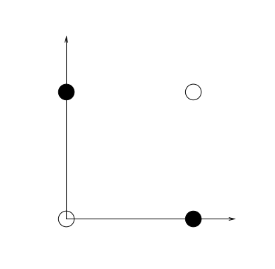
  - XOR becomes linearly separable if we apply a non-linear transformation $\phi(\bf{x})$ of the input – but what is one?
    - TODO: find such non-linear transformation
- Generative and Discriminative Models
  - Recall that with Naive Bayes, we model how a class "generated" the feature vector $p(\bf{w}|y)$
    - Then we could classify using
      
      $$p(y|\bf{x})\propto p(\bf{x}|y)p(y)$$

    - This is called a *generative approach*
  - Logistic regressionn: Model $p(y|\bf{x})$ directly
    - We model the output given the input directly
    - This is a *discriminative approach*
  - Discriminative advantage: Why spend effort modelling $p(\bf{x})$? Seems a waste, we're always  given it as input
  - Generative advantage: Can be good with missing data (remember how Naive Bayes handles missing data (TODO))
    - Also good for detecting outliers
    - Also, sometimes we really do want to generate the input
      - TODO: when?
  - Generative classifiers can be linear too:

    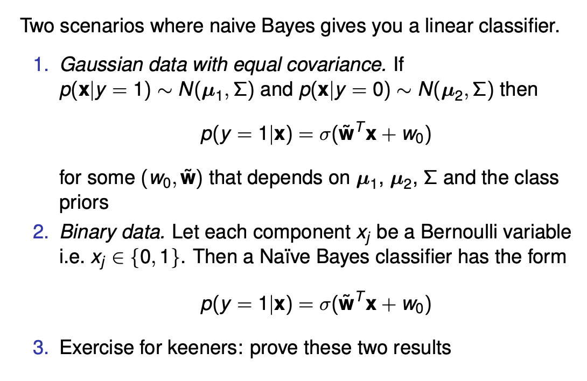
    - TODO: explain this slide
- Multiclass Classification
  - Create a different weight vector $\bf{w}_k$ for each class, to classify into $k$ and not-$k$
  - Then use the "softmax" function

    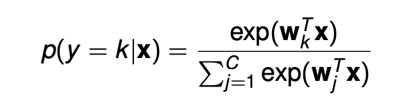

  - Note that $0<=p(y=k|\bf{x})<=1$ and $\Sigma^C_{j=1}p(y=j|\bf{x})=1$
    - Probability is between 0 and 1 and the sum of all probabilities is 1
  - This is the natural generalisation of logistic regression to more than $2$ classes
- Least-squares classification
  - Logistic regression is algorithmically more complicated than linear regression
  - Why don't we just use linear regression with 0/1 targets?
    - Seems like a reasonable idea, linear regression predicts numeric outputs so if we have a data set with 0/1 targets and inputs, can just predict 0 and 1s as numeric outputs
      - -> not good idea though:

    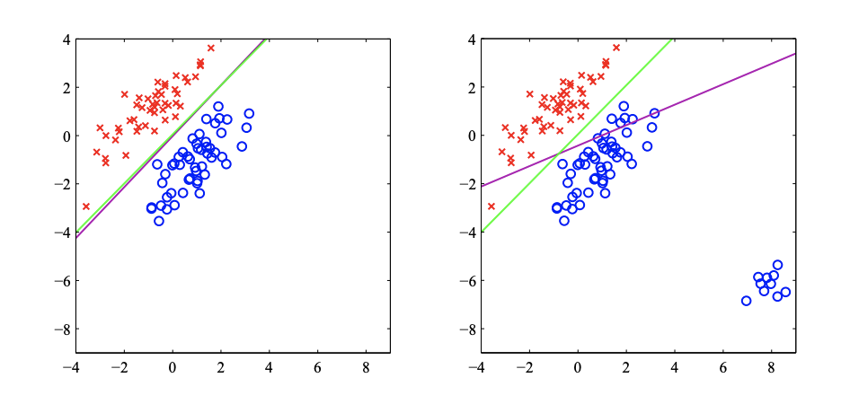

    - If we have data like this, we can see that the group of outliers drags the linear regression noticable, whereas on the green line (logistic regression) it has very little effect
## Week 5: Optimisation and Regularisation
**Optimisation**
- We're talking about optimisation in ML
- A main idea in machine learning is to convert the learning problem into a continuous optimisation problem
  - One of the reasons to do that is because there is a lot of mathematics about optimisation problems
  - Optimisation has been studied from many different angles (not just ML) for many decades $\rarr$ we're pretty good at it!
- Examples:
  - Linear regression: we ended up wanting to optimise the log likelihood
    - Turned out we could optimise via an analytical solution but that's still optimising
  - Logistic regression
    - We haven't figured out yet how to optimise them!
  - SVMs
  - Neural networks
- One way to  do this is the *maximum likelihood*

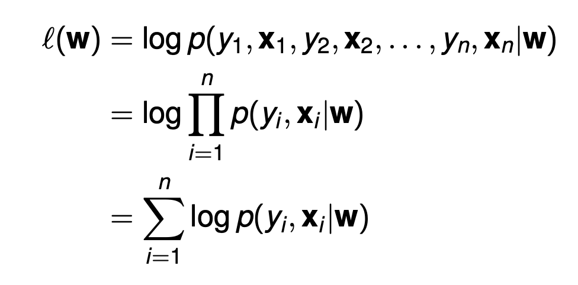

- Error functions
  - End result: an "error function" $E(\bf{w})$ which we want to minimise
  - E.g., $E(\bf{w})$ can be the negative of the log likelihood
  - Concept
    - Consider a fixed training set
    - Think in weight (not input) space
    - At each setting of the weights there is some error (given the fixed training set)
      - Each setting of the weights are the dials we were talking about some time ago
    - This defines an error surface in weight space
  - Learning == descending the error surface, finding the minimumlowest point error
  - If the data is IID, the error function $E$ is a sum of error function $E_i$ for each data point

    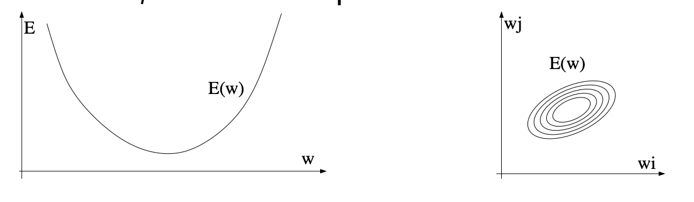
- Role of smoothness
  - If $E$ is completely unconstrained, minimisation is impossible
    - Q: What does unconstrained mean?
    - A: Basically, if the plot of the error is not a nice curve

  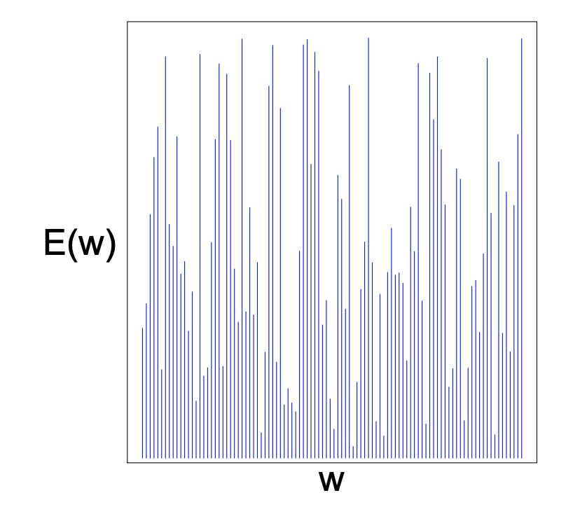

  - There is no NP-complete algorithm that will find the minimum of the error
  - All we could do is search through all possible values $\bf{w}$
  - However, key idea: if $E$ is continuous, then measuring $E(\bf{w}) gives information about $E$ at many nearby values$
- Role of derivatives
  - Idea:
    - Assume we are at some point in the error space
    - If we wiggle $w_k$, we perturbe them a little bit, and keep everything else the same, does the error get better or worse?
      - Similar to walking around in a little patch on the error surface
    - Calculus has an answer to exactly this question:

      $$\frac{\partial E}{\partial w_k}$$

    - So: use a differentiable cost function $E$ and compute partial derivatives of each parameter
    - The vector of partial derivatives is called the gradient of the error
      - It is written

        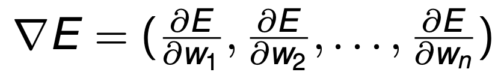      

      - Sometimes we use the alternate notation $\frac{\partial E}{\partial \bf{w}}$

    - It points in the direction of the steepest error descent in the weight space
    - Three crucial questiosn:
      1. How do we compute the gradient $\nabla E$ efficiently?
      2. Once we have the gradient, how do we use it to minimise the error?
      3. Where will we end up in weight space?
 - Numerical optimisation
  - Numerical optimisation algorithms try to solve the general problem

    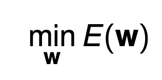
      - Tries to minimise the error function w.r.t $\bf{w}$
  - Most commonly, a numerical optimisation procedure takes two inputs:
    1. A procedure that computes $E(\bf{w})$
    2. A procedure that computes the partial derivative $\frac{\partial E}{\partial w_j}$
 - How numerical optimisation algorithms work
   - They are iterative
   - They generate a sequence of points

      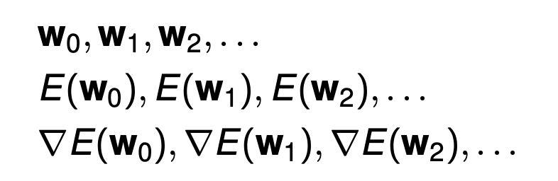
      - The $w$s are set / vectors of weights, each of them try to improve
      - The sequence of errors $E$ is us walking along the error surface
      - And lastly, we get a sequence of gradients

   - Basic optimisation algorithm is:

    ```python
    initialise w # some starting point
    while E(w) is unacceptably high # by some measure
      calculate g = ∇E
      compute direction d from w, E(w), g
        (can use previous gradients as well...)
      w = w - η * d
      # That parameter in front of d tells you by how much you move into the direction
    return w
    ```
  - Gradient descent algorithm
    - The simplest choice for the direction $\bf{d}$ is the  current gradient $\nabla E$
    - It is locally the steepest descent direction
    - Simple gradient descent algorithm:
    ```python
    initialise w
    while E(w) is unacceptably high
      calculate g = ∂E/∂w
      w = w - η * g
    return w
    ```
    - $\eta$ is known as the step size
      - Sometimes called learning rate
      - We must choose $\eta>0$
      - If $\eta$ is too small $\rarr$ too slow, would make many iterations to get to the optimum
      - If $\eta$ is too large $\rarr$ instability
    - Step size $\eta$
      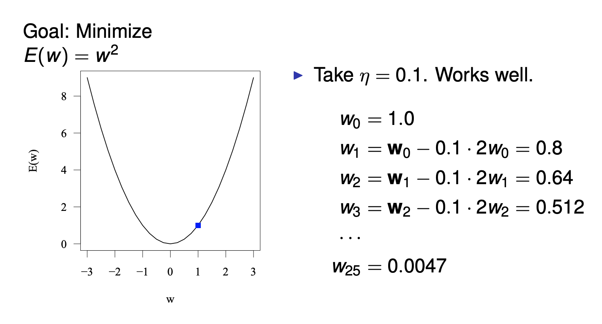
      - We just start out at $w_0$ (it's a random choice for now)
    - If we take $\eta=1.1$ we'd go past the minimum and it would bounce up and down the parabola
    - So picking the right learning rate is a challenge
- "Bold Driver" gradient descent
  - Another example of a gradient descent algorithm
  - Utilisies a simple heuristic for choosing $\eta$ which you can use if you're desparate

  ```python
  initialise w, η
  initialise e = E(w); g = ∇E(w)
  while η > 0
    w1 = w - η * g
    e1 = E(w1)
    g = ∇E
    if e1 ≥ e: # this move would increase the error, so decrease step size and check again
      η = η/2
    else: # it's a good step so cautiously increase the
      η = 1.01 * η; w = w1; g = g1; e = e1
  return w
  ```
  - Finds the *local* minimum of $E$
- Batch vs online learning
  - So far, we have considered functions where we sum up terms which each depend on only one training instance
  - The gradient algorithm we considered go through all the training instances before changing the parameters
    - That's a huge amount of calculations
    - Surely, we can get a gradient that is "good enough" from fewer instances, e.g. a couple of thousand? Or maybe even from just one?
- **Batch learning**
  - Use all patterns in training set, and update weights after calculating

    $$\frac{\partial E}{\partial\bf{w}}=\Sigma_i\frac{\partial E_i}{\partial\bf{w}}$$
    - For each training instance error $E_i$
- **Online learning**
  - Adapt weights after each pattern presentation, using $\frac{\partial E_i}{\partial\bf{w}}$
- Comparison batch vs online

  | Batch                              | Online                                                  |
  | ---------------------------------- | ------------------------------------------------------- |
  | More powerful optimisation methods | More feasible for huge or continually growing data sets |
  | Easier to analyse                  | May have ability to jump over local optima              |
- Batch and online are opposites of the spectrum, all vs one instance but could also go inbetween, e.g. $10%$ of all instances
- Batch gradient descent algorithm
  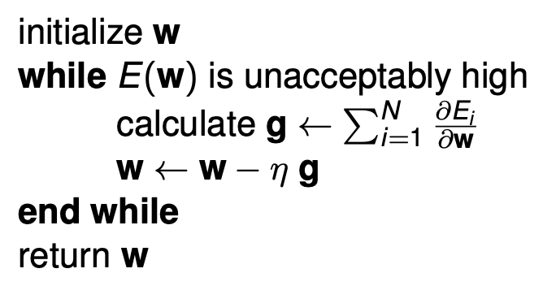
  - Basically what we've seen before
  - But we're emphasising that the overall error is the some of all the different instances ($\Sigma$)
- Online gradient descent algorithm
  ```python
  initialise w
  while E(w) is unnacceptably high
    Pick j as uniform random integer [1..N]
    calculate g = ∂E_j/∂w
    w = w - η * g
  return w
  ```
  - Key point: if we're going to move after each instance, how do we pick the instance?
    - This one uses a uniform random integer in the length of the training set
      - At each step, we pick one isntance at random and then we make a move
      - (Means we could pick the same instance in a row which might not be optimal)
  - This version of the online gradient descent method is called *stochastic gradient ascent*
    - Because we have picked the training instance randomly
  - There are other variants of online gradient descent
- Gradient descent problems
  - Setting the step size $\eta$
    - Have talked about this before, recall too slow / skipping minima dilemma
  - Shallow valleys
    - Typical gradient descent can be fooled in several ways, which is why more sophisticated methods aree used when possible
    - One problem:
      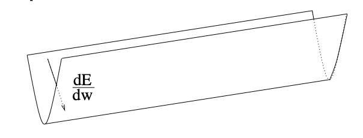
      - Gradient descent will point us to going down into the valley and goes very slowly once it hits the shallow valey
        - Very slowly to the left
    - One solution: *momentum*

      $$\bf{d}_t=\beta*\bf{d}_{t-1} + (1-\beta)\eta\nabla E(\bf{w}_t)$$
      - The direction we're moving is some parameter $\beta$ times the direction we have moved before $\bf{d}_{t-1}$ plus $1-\beta$ times the direction the gradient tells you you should be moving into
      - So if we set $\beta=9$ that'd mean that we pay $9$ times more attention to how we moved previously as you are to the current gradient input
      - This works because the bottom of the valley gets augmented by previous move components
    - Though now you have to set both $\eta$ and $\beta$. Can be difficult and irritating
  - Highly curved error surface
    - Gradient might not point towards the optimum
    - This is because of curvature
      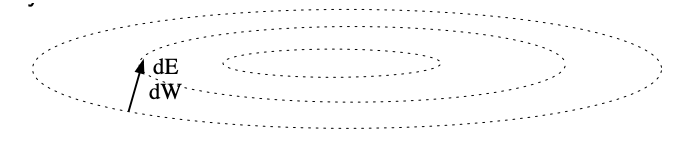
      - Gradient is the *locally* steepest direction
        - So need not necesseraly point toward the global optimum
      - Can be useful to solve this:
        - Local curvature is measued by the Hessian matrix:

        $$H_{ij}=\frac{\partial^2E}{\partial\bf{w}_i\bf{w}_j}$$
  - Local minima
    - If you follow the gradient, where will you end up? Once you hit a local minimum, gradient is $0$, so you stop:

    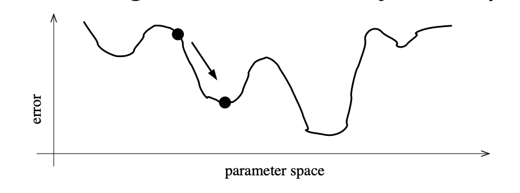
    - Certain nice functions, such as squared error, logistic regression likelihood are *convex*, meaning that the second derivative is always positive
      - This implies that any local minimum is global
    - There is no great solution to this problem
      - It is a fundamental problem
      - Usually the best you can do is rerun the optimiser multiple times from different random starting points
- Take-away: use fancy first-order methods (e.g. quasi-Newton, CG) for moderate amounts of data, stochastic gradient for large amounts of data
**Regularisation**
- Regularisation is a general approach to add a "complexity parameter" to a learning algorithm
  - Minimised complexity is usually better if the error is the same
  - Smoothes out the solution
  - Requires that the **model** parameters are continuous
    - I.e., for regression it works, for decision trees not
      - We have dis-continuous parameters, we are cutting
  - If we penalise polynomials that have large values for their coefficients we will get less wiggly solutions
    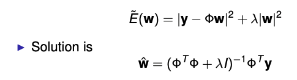
  - Adding this multiple of the size of weights $\lambda|\bf{w}|^2$ is known as *ridge regression*
  - Rather than using a discrete control parameter like $M$ (model order) we can use a continuous parameter $\lambda$
  - Caution: don't shink the bias term!
    - That's the one that corresponds to the all $1$ feature
- Regularised loss function
  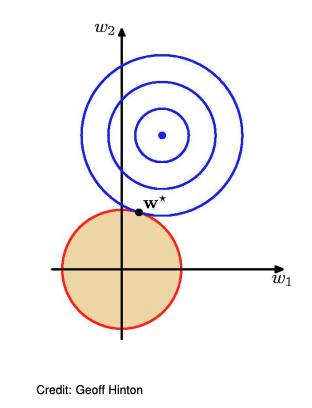
  - The overall cost function is the sum of two parabolic bowls
    - Each bowl is one of the quadratic terms in the formula above
  - The sum is also a parabolic bowl
  - The combined minimum lies on the line between the minimum of the squared error and the origin
  - The regulariser just shrinks the weights
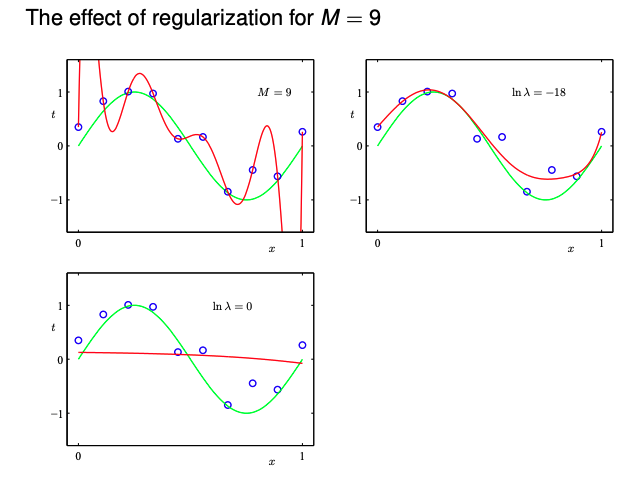
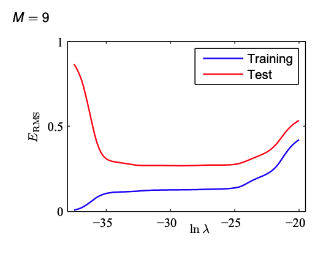
  - When $\lambda$ is really tiny, i.e. we are not penalising weights at all, then we can do really well on the training set
- For standard linear regression, we had:
  | Structural aspect                                                 | Regression                      |
  | ----------------------------------------------------------------- | ------------------------------- |
  | Define task                                                       | Regression                      |
  | Decide on the model structure                                     | Linear regression model         |
  | Decide on the scoring function                                    | Mean squared error (likelihood) |
  | Decide on optimisation search method to optimise scoring function | Calculus (analytic solution)    |
- But with ridge regression we have:
  | Structural aspect                                                 | Regression                                      |
  | ----------------------------------------------------------------- | ----------------------------------------------- |
  | Define task                                                       | Regression                                      |
  | Decide on the model structure                                     | Linear regression model                         |
  | Decide on the scoring function                                    | Squared error **with quadratic regularisation** |
  | Decide on optimisation search method to optimise scoring function | Calculus (analytic solution)                    |
  - Notice how you can train the same model structure with different score functions
    - This is the first time we have seen this
    - This is important
- A control-parameter-setting procedure
  - Regularisation was a way of adding a "capacity control" parameter
  - But how do we set the value?
    - E.g. how do we set the regularisation parameter $\lambda$
  - Won't work to do it on the training set (why not?)
    - If all you care about is the training set (blue line in previous figure), we'd set $\lambda=0$ which would give us a large error for the testing set (red line)
  - Two choices to consider:
    - Validation set
    - Cross-validation
- Using a validation set
  - Split the labelled data into a training set, validation set, and a test set
  - Training set: use for training
  - Validation set: tune the "control parameters" according to performance on the validation set
  - Test set: to check how the final model performs
  - No right answers, but for example, could choose 60% training, 20% validation, 20% test
- Example of using a validation set
  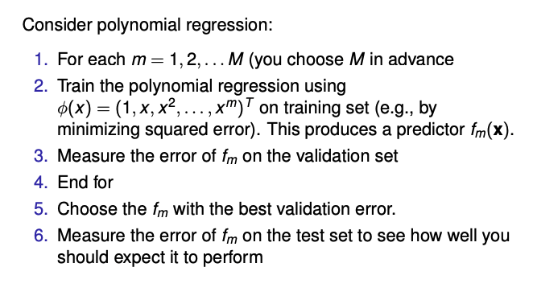
  - We look at the different orders of polynomials (1,2,...) etc.
  - We train polynomial regression on the training set
  - That gives us a predictor
  - Then we measure error on validation set
  - And then choose model which has best validation error
- Continuous control parameters
  - For a discrete control parameter like polynomial order $m$ we could simply search all values
  - What about a quadratic regularisation parameter $\lambda$? What do we do then?
    - Pick a grid of values to search. In practice you want the grid to vary geometrically for this sort of parameter.
      - E.g. try $\lambda \in \{0.01,0.1,0.5,1.0,5.0,10.0\}$
        - Don't bother trying $2.0,3.0,7.0$
          - Q: Why?
          - A: We increase the values geometrically
## Week 5: Support Vector Machines
- SVMs are one of the most effective and widely used classification algorithms
- SVM are the combination of two ideas
  1. Maximum margin classification
  2. The "kernel trick"
- SVMs are a linear classifier
  - This means it's a linear combination of parameters
  - Like logistic regression and preceptron
    - TODO: What's perceptron
- Linear algebra to remember:
  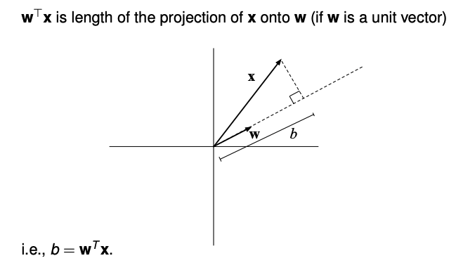
- Recall what a separating hyperplane is
  - For any linear classifier
    - We have training instances $(\bf{x}_i,y_i),i=1,...,n$
      - The class $y$: $y_i\in\{-1,+1\}$
        - Notice that for this topic we use $-1$ rather than $0$ for the negative class as it'll be convenient for the maths
  - Then, we have a hyperplane $\bf{w}^T\bf{x}+w_0=0$
    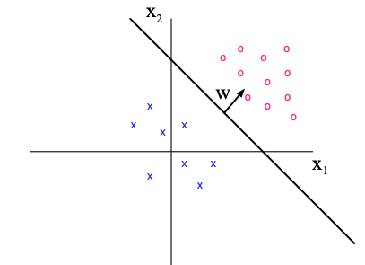
  - = decision boundary
- SVM: Intuition
  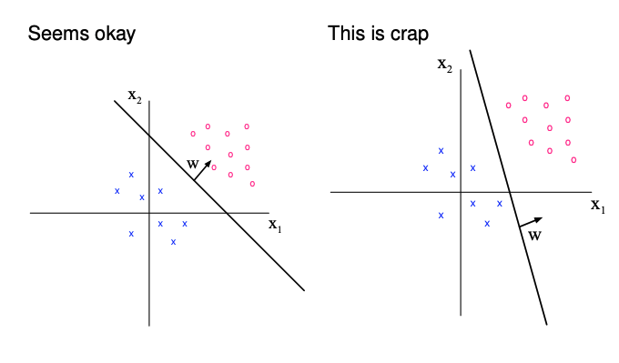
  - Right one is crap because the minimum distance to the closest point is smaller $\rarr$ we want to maximise it
  - Idea: **Maximise the margin**
    - The margin is the distance between the decision boundary (the separating hyperplane) and the closest training point
      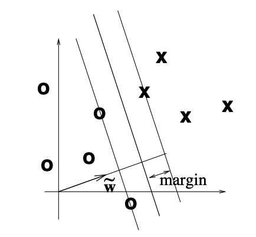
  - Computing the margin
    - The tricky part will be to get an equation for the margin
    - We'll start by getting the distance from the origin to the hyperplane
    - i.e., we want to  compute the scalar $b$ below
      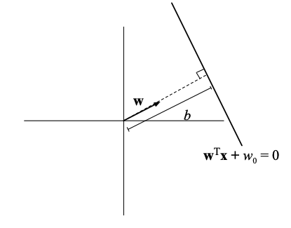
    - Computing the distance to the origin
      - Define $\bf{z}$ as the point on the hyperplane closest to the origin
      - $\bf{z}$ must be proportional to $\bf{w}$ because $\bf{w}$ is *normal* to the hyperplane
        - Normal = perpendicular
      - By definition of $b$, we have the norm oof $\bf{z}$ given by
        $$||\bf{z}||=b$$
      - So
        $$b\frac{\bf{w}}{||\bf{w}||}=\bf{z}$$
    - We know that:
      1. $$\bf{z}$$ is on the hyperplane
      2. $$b\frac{\bf{w}}{||\bf{w}||}=\bf{z}$$
    - (1) means $$\bf{w}^T{z}+w_0=0$$
    - Substituting we get
      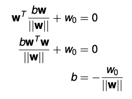
    - Remember $||\bf{w}||=\sqrt{\bf{w}^T\bf{w}}$
    - Now  we have  the distance from the origin to the hyperrplane!
    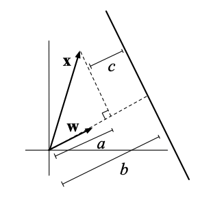
    - Now we want $c$, the distance from $\bf{x}$ to the hyperplane
      - $\bf{x}$ is some random datapoint
    - It's clear that $c=|b-a|$, where $a$ is the length of the projection of $\bf{x}$ onto $\bf{w}$
      $$a=frac{\bf{w}^T\bf{x}}{||\bf{w}||}$$
    - The perpendicular distance from a point $\bf{x}$ to the hyperplane $\bf{w}^T\bf{x}+w_0=0$ is
      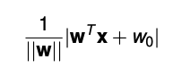
    - The **margin** is the distance from the **closest** training point to the hyperplane:
      
  - Removing the scale
    - Note that $\bf{w},w_0$ and $(c\bf{w},cw_0)$ define the same hyperplane
      - Because the hyperplane is defined by $\bf{w}$ which is a vector that is perpendicular to the hyperplane
      - It doesn't matter, how long that vecotr is, the hyperplane will be the same
      - The scale is arbitrary
    - This is because we predict class $y=1$ if $\bf{w}^T\bf{x}+w_0≥0$
      - That's the same thing as saying $c\bf{w}^T\bf{x}+cw_0≥0$
    - To remove this freedom, we will put a constraint on $(\bf{w},w_0)$
      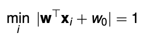
    - With this constraint, the margin is always $\frac{1}{||\bf{w}||}$
  - Optimising the margin
    - (Normal or norm vector = modulus of a vector)
    - Here is a first version of an optimisation problem to maximise the margin
      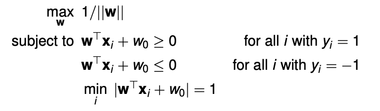
      - **(1)** We're trying to maximise the margin
        - I.e. maximise the minimum distance from the closest point
        - The plane we're trying to achieve gives the greatest degree of separation of positive and negative classes
      - **(2+3)** Subject to the positive class instances (where $y=1$) being on the right side of the hypeplane
        - And the negative class instances (where $y=-1$) being on the left side of the hyperplane
      - **(4)** We have defined this because of the scaling issue discussed earlier
    - The first two constraints are too lose. It's the same thing to say
      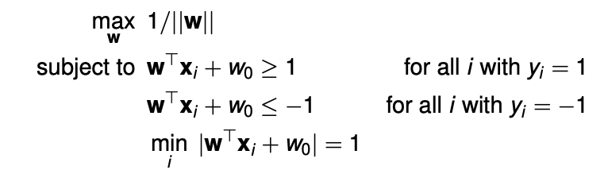
    - Now the third constraaint is redundant
    - The means we can simplify to
      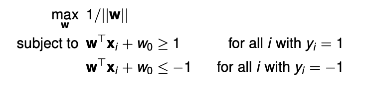
        - We're trying to maximise the margin (1) subject to the two constraints
    - And we can write the above a bit more compactly:
      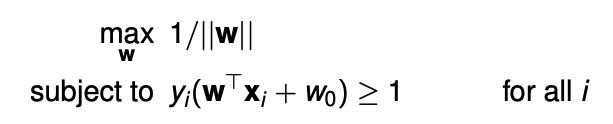
      - This works because if $y_i=-1$ then it turns the inequality sign around
    - Finially, note that maximising $\frac{1}{||\bf{w}||}$ is the same thing as minimising $||\bf{w}||^2$
  - The SVM optiisation problem
    - So the SVM weights are determined by solving the optimisation problem:
      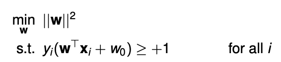
    - Solving this will require maths that we don't have in this course, but will go through solution
- Optimising the margin 2
  - Many algorithms have been proposed to solve the above optimisation problem
    - One or the earliest algorithms is called SMO
  - Finding the optimum
    - If you go through some advanced maths (Lagrange multipliers, etc.), it turns out that you can show something remarkable: Optimal parameters look like
      
      $$\bf{w}=\Sigma_i\alpha_i y_i\bf{x}_i$$

      - This is saying that the solution weight vector is a linear function of the input data (training vector x an class label y)

    - Furthermore, the solution is sparse
      - Means that the optimal hyperplane is determined by just a few examples
      - Call these few examples **support vectors**
        - They provide support for the solution
          - The other vectors don't
  - Why does a solution always have this form?
    - If you move the points that are not on the marginal hyperplanes, the solution doesn't change
      - Therefore, those points don't matter
    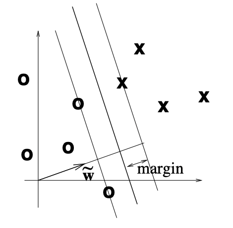
  - Back to finding the optimum 
    - $\alpha_i=0$ for non-support patterns
      - This makes them irrelevant because $\alpha_i$ is a factor so that'll make it function as an absorber
    - It is an optimisation problem to find $\alpha_i$ has no local minima (like logistic regression)
    - Prediction on new data point $\bf{x}$:
      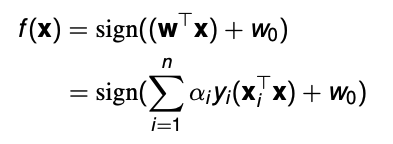
      - The prediction is based on the dot product of the new data point with the support vectors
- Non-separable data
  - Non-separable training sets
    - If data set is not linearly separable, the optimisation problem that we have given has no solution:
      
    - Why?
    - Solution: don't require that we classify all points correctly $\rarr$ give **slack**
      - Allow the algorithm to choose to ignore some of the points
    - This is obviously dangerrous (algorithm could just ignore all of them) so we need to give a penalty for doing so
    - Slack
      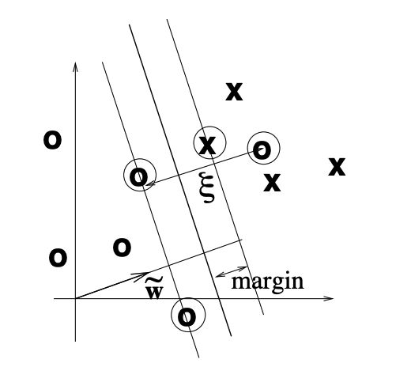
        - There is an O that is on the wrong side of the decision boundary
        - We want to move it to the right side
      - The solution is to add a "slack" variable $\xi ≥ 0$ ($\larr$ that's a xi) for each training example
      - If the slack variable is high, we get to relax the constraint, but we pay a price
      - New optimisation problem is to minimise

        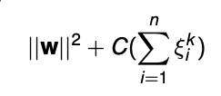
          - Most of the slack variables are going to be $0$, only non-zero for the points we need to move
        - subject to the constraints:
        
        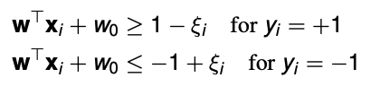
          - We essentially say that we can adjust the constraint be the amoung we move points
      - Usually set $k=1$
      - $C$ is a trade-off parameter
        - It says "how important do we consider these slcak vairables compared to the norm of the weight vector
      - Large $C$ gives a large penalty to errors
      - Solution has some form, but support vectors also include all where $\xi_i\neq 0$
- Regularisation
  - Recall ridge regression
  - Our max margin + slack optimisation problem is to minimise
    
  - This looks even more like rideg regression than the non-slack problem:
    - $C(\Sigma_{i=1}^n\xi_i)^k$ measures how well we fit the data
    - $||\bf{w}||^2$ penalises weight vectors with a lagrge norm
  - So $C$ can be viewed as a regularisation parameter
    - Like $\lambda$ in ridge regression or regularised logistic regression
  - We need to make this tradeoff if data set not linearly separable
  - You're allowedd to make this tradeoff even when the data set is separable!
    - Why you might want slack in a separable data set
      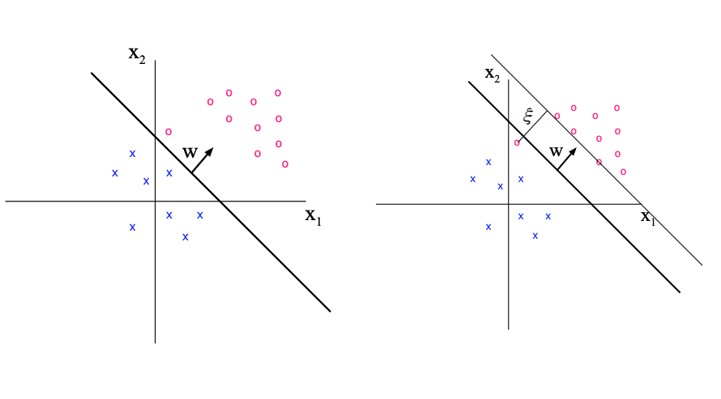
- Optimmisation problems: comparing the SVM and logistic regression
  - TODO: write this out later:
    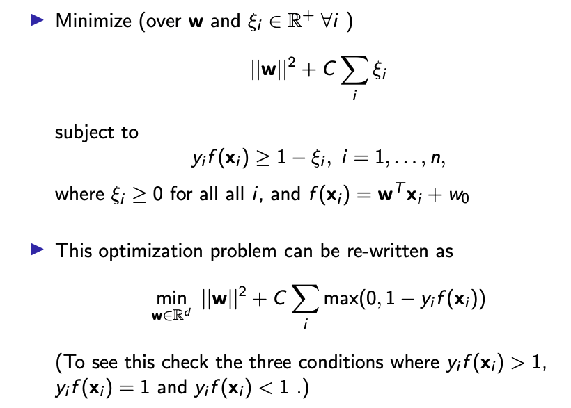
    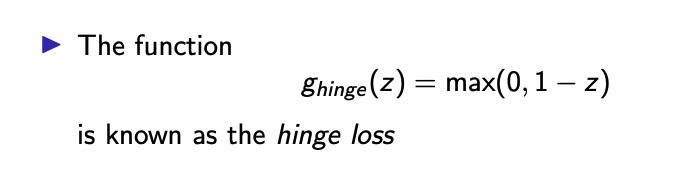
    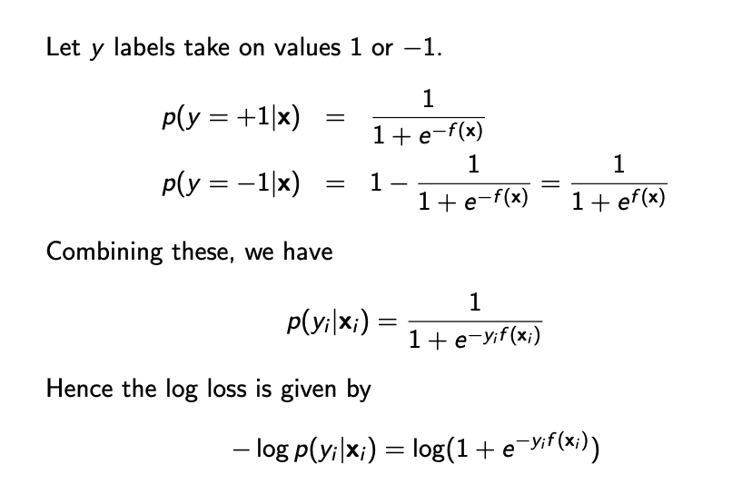
    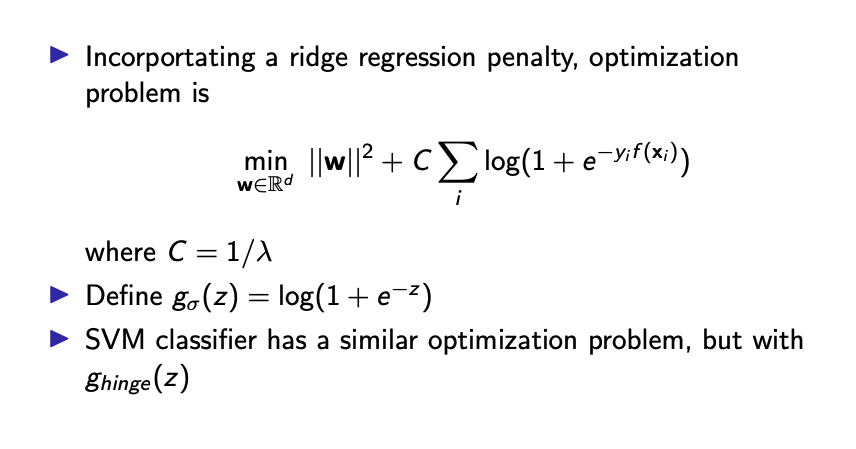
    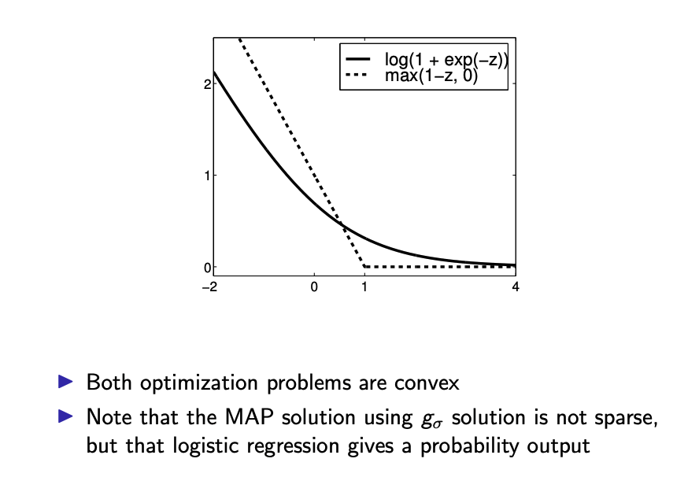
- Non-linear SVMs
  - SVMs can be made nonlinear just like any other linear algorithm we've seen
    - Using basis expansion
    - But in an SVM, the basis expansion is implemented in a very special  way, using something called a *kernel*
    - The reason for this is that kernels can be faster to compute with if the expanded feature space is very  high dimensional (even infinite!)
    - This is aa fairly advanced topic mathematically, so we will just go through a high-level version
  - Kernel
    - A kernel is in some sense an alternate "API" for specifying to the classifier what your expanded feature space is
    - Up to now, we have always given the classifier a new set of training vectors $\phi(\bf{x}_i)$ for all $i$
      - E.g. just as a list of numbers
      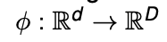
      - We transform from one dimension $d$ to another dimension $D$
      - If $D$ is large, this will be expenive; if $D$ is infinite, this will be impossible
        - D is the dimension
  - Recall what we do when we expand into a new feature-space:
    - Transform $\bf(x)$ to $\phi(\bf{x})$
    - Linear algorithm depends only on the dot product of the input with the support vector: $\bf{x}^T\bf{x}_i$
      - Hence, the transformed algorithm depends only on $\phi(\bf{x})^T\phi(\bf{x}_i)$
    - Use a kernel function $k(\bf{x}_i,\bf{x}_j)$ such that
      $$k(\bf{x}_i,\bf{x}_j) = \phi(\bf{x})^T\phi(\bf{x}_i)$$
      - This is called the "kernel trick" and can be used with a wide variety of learning algorithms, not just max margin
- Kernels for SVMs
  - Here's an example of computing a kernel for a two-dimensional input space:
    - Define a transform first:
    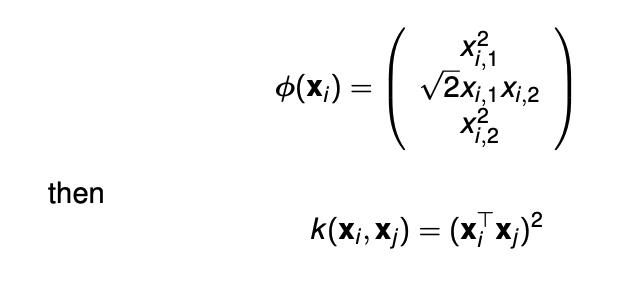
    - Recall the kernel trick
  - The Euclidean distance squared between two vectors can be computed using dot products
    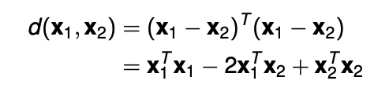
  - Using a linear kernel $$k(\bf{x}_i,\bf{x}_j) = \bf{x}^T\bf{x}_i$$ we can rewrite this as:
    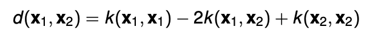
  - Any kernel gives you an associated distance measure this way
    - Think of a kernal as an indirect way of specifyying distances
    - In our new feature space you can think of the kernel as telling the classifier "I've got two points, tell me how far apart they are in the transformed feature space" and the kernel gives a measure of that
    - Works on infinite feature spaces because we never really deal with the infinite number if we're using kernels, they allow us to only focus on a very specialised part of it
- Kernelised max margin
  - A **support vector machine** is a kernelised maximum margin classifier
  - For max margin remember that we had the magic property
    $$\bf{w}=\Sigma_i\alpha_i y_i\bf{x}_i$$
  - This means we would predict the label of a test example $\bf{x}$ as
    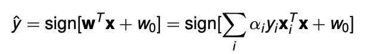
  - Kernelising this we get:
    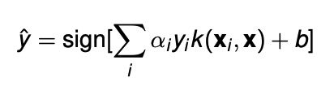
- Prediction on a new example
    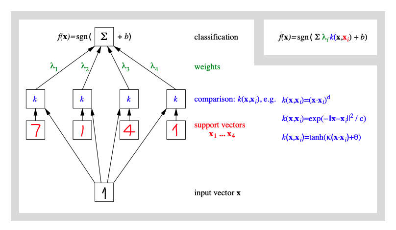
    - This is recognising hand-written digits
    - In the red, these are the instances that have been picked as support vectors
    - Black: new input vector
    - We feed the inpnut vector and each of the support vectors to the kernel k and that produces some result $\lambda$
      - We used $\alpha$ to notate that result
    - We then use these for our classification
    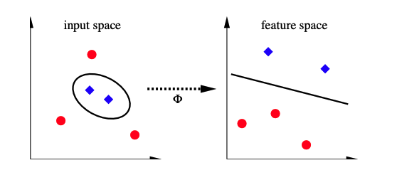
  - Example 2
    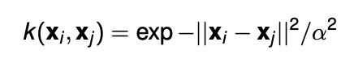
    - In this case the dimension of $\phi$ is infinite
    - I.e. it can be shown that no $\phi$ that maps into a finite-dimensional space will give you this kernel
    - We can *never* calculate $\phi(\bf{x})$ but the algorithm only needs us to calculate $k$ for different pairs of points
- SVMs in practice
  - There are theoretical results but we don't ocver them
  - However, in practice, cross-validation methods are commonly used
  - Example applications
    - Digit recognition
    - Text categorisation
    - Face detection
    - DNA analysis
  - SVM summary and comparisone
    - Comparison with linear and logistic regression
      - Underlying basic idea of linear prediciton is the same, but error functions differ
      - Logistic regression (non-sparse solutions) vs SVM (sparse solution, "hinge loss")
    - Linear regression (squared error) vs $\epsilon$-insensitive error
    - Linear regression and logistic regression can be "kernelised" too
  - SVM summary
    - SVMs are the combination of the max-margin and the kernel trick
    - Leran linear decision boundaries (like logistic regression, perceptrions)
      - Pick hyperplane that maximises margin
      - Use slack variables to deal with non-separable data
      - Optimal hyperplane can be written in terms of support patterns
    - Transform to higher-dimensional space using kernel functions
    - Good empirical results on many  problems
    - Appears to avoid overfitting in high dimensional spaces
## Week 6: Ethics and Machine Learning
- ML and AI are increasinnngly in use for problems that affect people
  - Applications in healthcare, law enforcement, ..., which may have direct effects on people's lives
- Going to talk about:
  1. Ethical benefits and harms linked to data practices
  2. Ethical issues in ML
     1. Fairness
     2. Accountability
     3. Transparency
- Ethical **benefits** linked to data practices
  - Increasing human understanding of nature, society and our personal lives
    - The more we understand about the world and how it works, the more intelligently we can act in it
  - Social, institutional and economic efficiency
    - Reduce waasted effort and resources, and improve alighnemtn between a social system or institution's policies/processes and our goals
    - Predictive accuracy and personalisation
      - More precisely tailor actions to be effective in achieving good outcomes for specific individuals and groups
      - Potential to remove human biases from decision making
- Ethical **harms** linked to data practices
  - Harms to fairness and justice
    - Arbitrariness; avoidable errors and innaccuracies; unjust and often hidden biases
  - Harms to transparency and accountability
      - Can you explain how the system works, and who is responsible for it
        - Often, ML predictor functions are "magic block boxes" which are impossible to understand by humans
  - Harms to privacy and security
    - E.g. youuur personaal data may be part of data proofiles constructed and stored somewhere unknown to you, often without your knowledge or informed consent
- Common ethical challenges for data practitioners and users
  - Appropriate data collection and use
  - Data storage, security and responsible data stewardship
  - Data cleanliness and data relevance
  - Identifying and addressing ethically harmful data bias
  - Validation and testing of data models and analytics
  - Human accountability in data practices and systems
  - Understanding personal, social, and business impacts of data practice
- Is technology netural?
  - Technologies are not ethically neutral, they reflect the values
that we “bake in” to them with our design choices, as well as
the values which guide our use of them
- Questions to ask about your technology
  - **Ethics is not a checklist**. It is an ongoing conversation, and requires you to questionn possible outcomes
    - Who are the stakeholders? This includes anyone who funds, develops, or uses your technology, and anyone it is used upon
    - Who benefits from the technology? How?
    - Who could be harmed by the technology? How?
  - These are questions you must ask yourself and all of the stakeholders
- Ethical Issues in ML: FAT
  - Fairness
    - Data fairness, outcome fairness
  - Accountability
  - Transparency
    - Process transparency, outcome transparency
- Defining fairness
  - In a legal context fairness means that people are not discriminated against based on their membership of a *protected* group or class, such as race, gender, sexual orientation etc
  - Avoiding *disparate impact*:
    - Where a decision dispropoortionately harms people with certain protected attributes
- Data fairness: sampling bias in data collection
  - If a group is more stringently or frequently monitored, more errors will be observed in that group
  - This can lead to a feedback loop whereby the group is subject to further monitoring because of the apparent higher rate of mistakes
  - Danger of this bias in predictive policing, where minority communities are often more highly policed
- Data fairness: bias in labelling
  - Supervised learning requires labels
  - Example: predict who is a "good worker" based on CVs
  - If we train such a system on the existing workforce, and there were biases in their hiring, then these will be perpetuated by the trained system
- Outcome fairness
  - Example: predicting loan repayments
  - This data is used to train a model to predict loan repayment based on the three attributes
    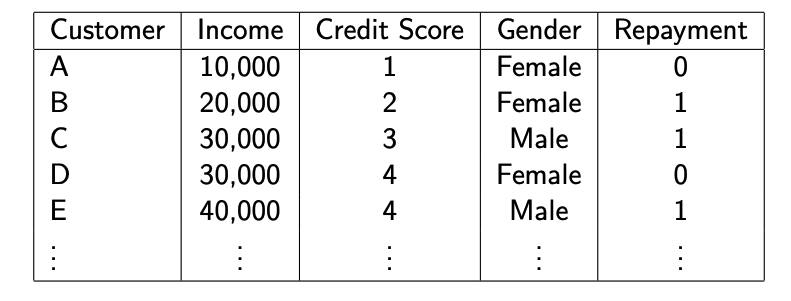
    - Protected attribute = should not count into the outcome
- Fairness through unawareness?
  - Can we simply omit the protected attribute from our predictor to ensure fairness?
  - NO, there may be other attributes (known as *proxies*) correlated with a protected attribute
    - E.g. the credit score may be correlated with gender, so we can predict gender from other (unprotected) features
- Assessing fairness
  - Compare ROC curves for each protected group–do they differ?
    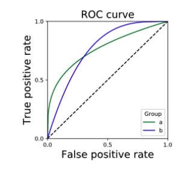
  - There are several definitions of statistical (or group) fairness, with names like demographic parity, equal opportunityy etc
    - These consider different aspects of the TP/FP/TN/FN distribution, conditioned on the protected attribute(s)
  - Different definitions of fairness can be mutually inconsistent, so need to assess which of them is most suitable for a given use case
  - Imposing fairness constraints can lead to a drop in predictive accuracy
- Accountability
  - Human agents can be called upon to account for their judgements and decisions
  - *Accountability gap*: statistical models are not responsible in the same morally relevant sense
  - Requires clear human **answerability**
  - **Auditability**:  *how* are the designers and implementers of AI systems are to be held accountable?
  - *Document* every step of the process of designing and implementing the project
  - *Document* the monitoring of data provenance and analysis from collection pre-processing, and modelling to training, testing, and deployment
- Transparency
  - **Outcome transparency**: The ability to know how and why a model performed the way it did in a specific context and therefore to understand the rationale behind its decision or behaviour (opening the "black box")
  - Note: we may not always know why humans made a decision (and sometimes they make *post hoc* rationalisations)
  - **Process transparency**: the justifiability of the processes that go into its design and implementation of a system's outcomes
## Week 6: Nearest Neighbour Method
- Overview
  - Nearest neighbour method
    - Also called kNN for $k$ Nearest Neighbours
    - Can be used for classification and regression
    - Practical issues: find parameter $k$, distance, ties, missing values
    - Optimality and assumptions
  - Making kNN fast:
    - K-D trees
    - inverted indices
    - fingerprinting
- Intuition for kNN
  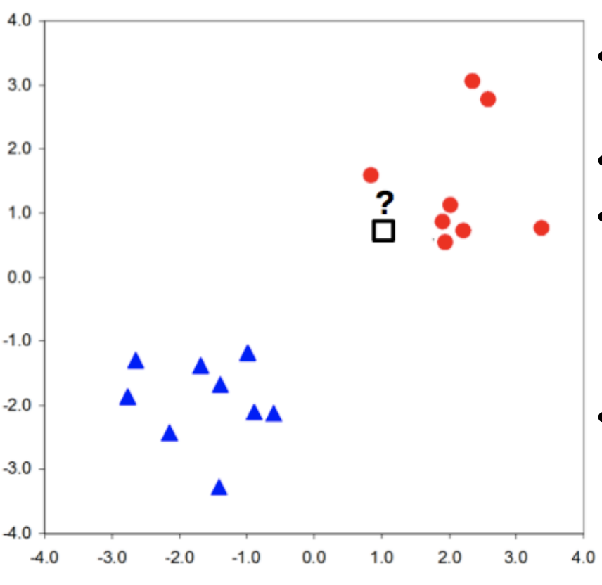
  - We have a set of points defined by $(x,y)$
    - These points are divided into two classes, red and blue
  - We want to determine whether the box is red or blue
    - This is classification
    - Can tell by looking at it that it's red
  - How did we do it?
    - Bayes rule?
    - Decision tree?
    - Hyperplane?
    - Nope, probably looked at proximity
  - Nearby points are red
    - Use this as a basis for a learning algorithm
- Nearest-neighbor classification
  - Use the intuition to classify a new point $x$
    - Find the most similar training example $x'$
    - Predict its calss $y'$
  - Voronoi tessellation
    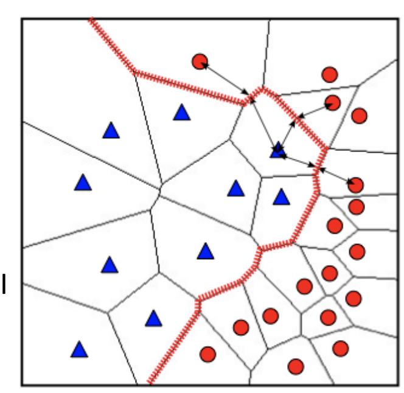
    - We *partition* the entire space into regions
    - For that, we use a *boundary*
      - The tile boundaies consist of points (not datapoints, just points that make up the boundary line) that are at the same distance from two different training examples
    - Decision boundary 
      - Is made up of the above boundaries between training examples
        - Only those that are between cells that are associated with different classes
      - Non-linear, reflects classes well
      - Compare to NB, DT, logistic
      - Impressive given that it's a simple method
- Nearest neighbour: outliers
  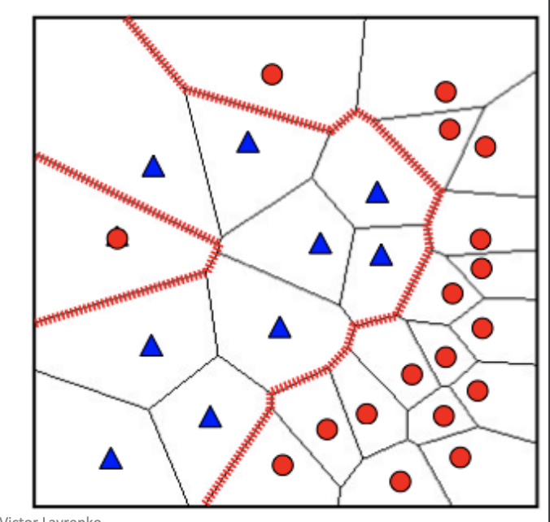
  - The algorithm is sensitive to outliers
    - Single mislabeled example dramatically changes boundary
    - There is no confidence $P(y|x)$
      - Q: What does this mean?
      - A: There is no notion of a prior (one class is much more prominent than another class). kNN does not take that into account.
    - Insensitive to class prior
    - Idea:
      - Use more than one nearest neighbour to make decision
      - Count class labels in $k$ most similar training examples
        - Many "triangles" will outweigh single "circle" outlier
- kNN classification algorithm
  - Given:
    - Training examples $\{x_i,y_i\}$
      - $x_i$ = attribute-value representation of examples
      - $y_i$ = class label: $\{ham,\ spam\}$, digit $\{0,1,...,9\}$ etc.
    - Testing point $x$ we want to classify
      - This is the input
  - Algorithm:
    ```python
    1. Compute the distance D(x,x_i) from input x to every training example x_i
    2. Select k clostest instances x_i1...x_ik and their labels y_i1...y_ik
    3. Output the class y* which is most frequent in y_i1...y_ik
    ```
    - Most frequent label / class is also called *mode*
    - There is no training process, we directly start computing distances to testing instance
- kNN regression algorithm
  - Given:
    - Training examples $\{x_i,y_i\}$
      - $x_i$ = attribute-value representation of examples
      - $y_i$ = real-valued target (profit, rating on YouTube, etc)
    - Testing point $x$ for which we want to predict the target
  - Algorithm:
    ```python
    1. Compute distance D(x,x_i) from input x to every training example x_i
    2. Select k closest instances x_i1...x_ik and their labels y_i1...y_ik
    3. Output the mean of y_i1...y_ik
    ```
    - Mean of $y_{i1}...y_{ik}$:
      $$\hat{y}=f(x)=\frac{1}{k}\Sigma_{j=1}^ky_{i_j}$$
      - TODO: explain this in own words
- Example: kNN regression in a one-dimensional space
  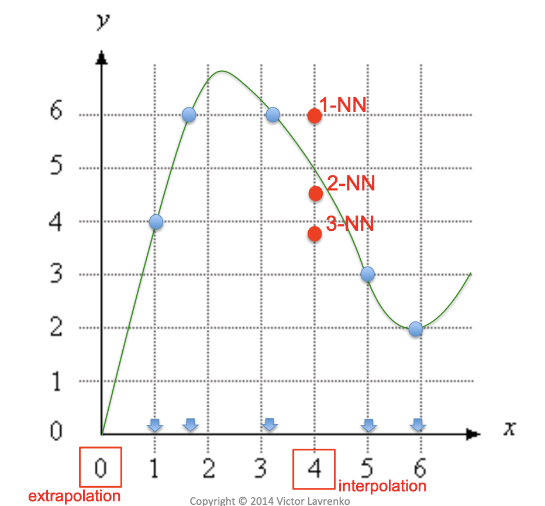
  - Suppose the green line is the function we're trying to predict values for (we don't know this function)
  - We have some observations from this function (blue)
    - That's the training set
    - The algorithm only sees the points, not the function
  - Suppose we want to predict the value/label for $x=4$
    - We look for the nearest neighbour in the x space
    - That's 3.2
    - If we were using a 1-nn algorithm, the prediction for x=4 would just be the y value of x=3.2
    - That's pretty far from the actual function value for x=4
    - So let's look at 2-nn
      - 3.2 and 5, so avg(6,3)=4.5
  - For x=0, there is no good value for $k$, all the predictions are going to be really bad
    - This is happening because there is a fundamental difference between 4 and 0
      - 4 lies in the middle of the training examples
        - Interpolation: we're predicting a value for a point which is in the range of your training examples
      - 0 lies outside of the range of the training examples we have
        - Extrapolation: we're predicting outside of the range of what we have examples for
- Choosing the value of $k$
  - The value of $k$ has a strong effect on the kNN performance
    - Large value $\rarr$ everything will be classified as the most likely class: $P(y)$
    - Small value $\rarr$ highly variable, unstable decision boundaries
      - Small changes to training set $\rarr$ large changes in classification
    - Affects "smoothness" of the boundary
  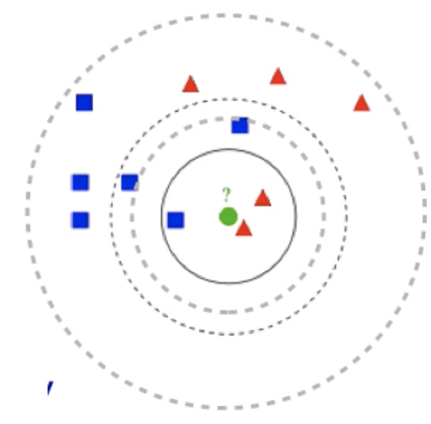
  - Selecting the value of $k$
    - Use cross-validation
    - Set aside a portion of the training data (validation set)
      - It's critical to use a separate set of validation set (and not use training data as validation data) because otherwise we'll just get $k=1$ because for the training data set there is always going to be one example that is going to be near the input which has exactly the correct class label, that is the example itself
        - Higher k will never give better prediction because neighbours could be another class 
    - Vary $k$, observe training $\rar$ validation error
    - Pick $k$ that gives best generalisation performance
- Distance measures
  | Measure   | Data               |
  | --------- | ------------------ |
  | Eucledian | Numeric attributes |
  | Hammer    | Categorical        |
  - Key component of the kNN algorithm
    - Defines which examples are similar and which aren't
    - Can have strong effect on performance
  - Euclidean distance (use for numeric attributes):
    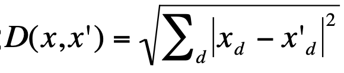
    - Symmetric, spherical, treats all dimensions equally
  - Hamming distance (categorical attributes):
    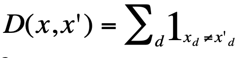
    - Basically just counts the number of attributes where $x,x'$ differ
      - If they are equal, it's 0
  - Minkowski distance (p-norm)
    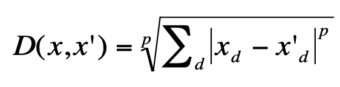
    - Dependent on value of $p$:
      - $p=2$: Euclidean distance
      - $p=1$: Manhattan
        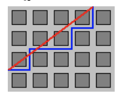
      - $p\rarr\infty$: $\bf{max}_d|x_d-x'_d|$
        - If we raise sth to a very large power, the distance that is the biggest will dominate so if we take the root it's like taking the biggest distance
      - $p\rarr 0$: number of non-zero differences
        - Similar to Hamming distance
    - 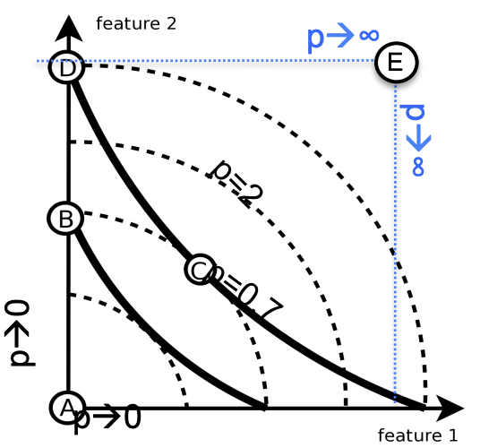
      - We might have an input point A, and test points B, C, D, E
      - The Eucledian distance are the dashed circles, will give same distance for B and C
      - The solid lines are the distance for p=0.7
        - B is closer to A than C
        - C and D have same distance
    - We take away: if we take small p, we suffer more from variables differing on more dimensions than 1
  - And then there are lots of custom distance measures, depending on the domain
    - E.g. for test, or distributions
- kNN: practical issues
  - Resolving ties:
    - A ties occurs when there is a equal number of positive and negative neighbours
    - One solution is to use odd $k$
      - This doesn't solve multi-class
        - Q: Why?
        - T: Because we could have an odd number of classes.
    - Another solution is to break ties
      - Random: flip a coin to decide positive / negative
      - Prior: pick class with greater prior
      - Nearest: use 1-nn classifier to decide
  - Missing values
    - Have to "fill in", otherwise can't compute distance
    - Key concern: should affect distance as little as possible
    - Reasonable choice: average value across entire dataset
- kNN, Parzen windows and kernels
  - kNN algorithms are closely related to a powerful family of algorithms based on kernels
  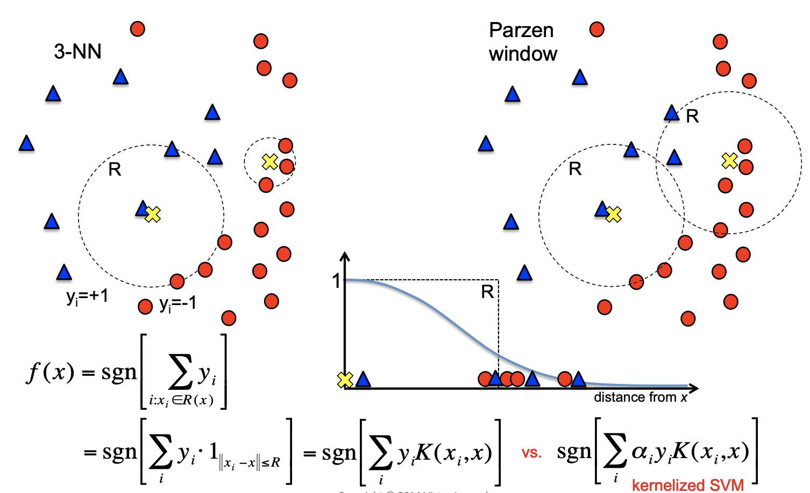
  - Left: We have our training data (blue and red classified training examples) and we are looking at two different testing points (yellow crosses)
    - Suppose we run a 3-NN algorithm
    - For the first testing point, the left one, it finds 2 blue and 1 red point, so classify as blue
    - For the second one, also 3 nearest neighbours but they radius of the circle area we are looking at is much smaller, all the poitns are nearby
      - kNN always looks at fixed number of neighbours regardless of how big/small search area
  - Parzen window algorithm
    - Instead of looking for a fixed numbers of neighbours, we look at **regions of fixed area/volume**
    - We look at a region of a fixed radius $R$
    - Now, the right testing point gets lots of more training examples to base the prediction on
  - Notion of neighbourhood
    - Assume for each positive label, assign +1
    - For each negative label, assign -1
    - It finds the neighbourhood R(x)
    - Within that neighbourhood, it adds up all the labels $y_i$
    - Overall, the prediction is the sign ($sgn$) of the sum of the labels for the points x_i within the neighbourhood $R(x)$
    - Can rewrite it is as a sum that goes over all the training instances
      - But add an indicator function which is 1 if an instance is in the neighbourhood, and 0 if not
    - "distance from x" graph explained: kNN, Parzen windows and kernels video, from min 7.30
- kNN pros and cons
  - Pros
    - Almost no assumptions about the data
      - Smoothness: neraby regions of space $\rarr$ same class
      - Assumptions implied by distance function (only locally!)
        - TODO: what does this mean
      - Non-parametric approach: "let the data speak for itself"
        - Nothing to infer from the data, except $k$ and possible $D()$
        - Easy to update in online setting: just add new item to training set
          - TODO: what's an online setting?
  - Cons
    - Need to handle missing data: fill-in or create a special distance
    - Sensitive to class-outliers (mislabeled training instances)
    - Sensitive to lots of errelevant attributes (they affect the distance)
      - Similar to Naive Bayes, DTs are not as prone to it
    - Computationally expensive
      - Spcace: need to store all training examples
      - Time: need to compute distance to all examples: $O(nd)$
        - $n$ = number of training examples, $d$ cost of computing distance
        - As $n$ grows $\rarr$ system will become slower and slower
        - Expense is at *testing*, not *training* time
          - This is bad
          - For every input, it's expensive rather for that one time we train a model
- Summary: kNN
  - Key idea: nearby points $\rarr$ same class
    - Important to select good distance function
  - Can be used for both classification and regression
  - Simple, non-linear, asymptotically optimal
    - Does not make assumptions about the data
    - "Let the data speak for itself"
  - Select $k$ by optimising error on held-out set
    - Held-out set = validation set
  - Naive implementations are slow for big datasets
    - Use K-D trees (in low dimensions) or inverted lists (high dimensions)
- Why is kNN slow?
  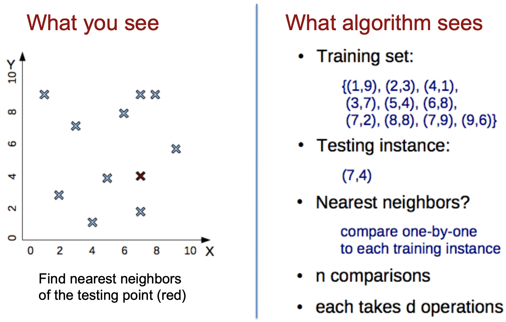
- Making kNN fast
  - Training $O(d)$ but testing: $O(nd)$
    - TODO: Where is this difference coming from?
  - *Reduce d*: dimensionality reduction
    - Simple feature selection, other methods $O(d^3)$
  - *Reduce n*: don't compare to **all** training examples
    - Idea: quickly identify $m<<n$ potential near neighbors
      - Instead of n, only m comparisons which is much smaller
      - Compare only to those, pick $k$ neaerest neighbours $\rarr O(md)$ time
      - Reducing n:
        | Method                     | When to use                                                           | Note                                                                      |
        | -------------------------- | --------------------------------------------------------------------- | ------------------------------------------------------------------------- |
        | K-D trees                  | Low-dimensional, real-valued data                                     | $O(d log_2 n)$, only works when $d<<n$, inexact: can miss neighbors       |
        | Inverted lists:            | High-dimensional, discrete (sparse) data (sparse = most values are 0) | $O(n'd') where $d'<<d,n'<<n$, only for sparse data (e.g. text) exact      |
        | Locality-sensitive hashing | High-dimensional, real-valued or discrete data                        | $O(n'd),\ n'<<n$ = bits in fingerprint, inexact: can miss near neighbours |
- K-D tree example
  - We build a data structure that organises a given data set as a tree
  - And then, if we want to find nearest neighbours of an input point, we navigate down the tree to the region that will hopefully contain most of the near neighbours
  - How to build a K-D tree from training data:
    ```python
    1. Take all of the training instances
    2. Pick a random attribute. (In example either x_1 or x_2)
    3. Find the median for that attribute (in example: 6)
    4. Use that median to split the dataset, half the points on side, the other half on the other side (vertical cut in example image)
    5. Repeat process with subsets, picking another attribute.
    6. Keep doing it until we end up with a predetermined number of points in each branch of the tree. 
    ```
    - Depth of tree cannot be larger than $log_2(n)$ where $n$ is the total number of instances
      - Because there is no point in splitting further than singletons / it's impossible
  - Find nearest neigbours for new point $(7,4)$
    - Find region containing $(7,4)$
    - Compare to all points in region
  - 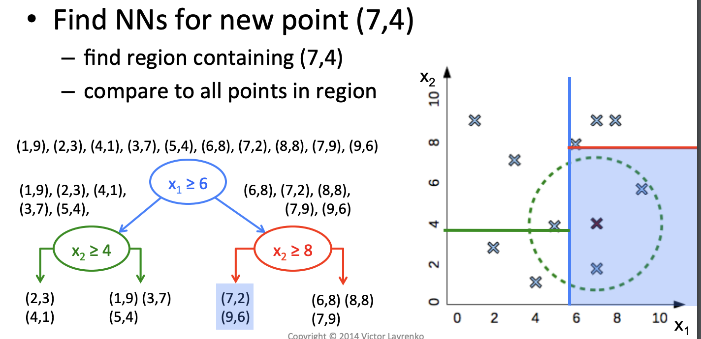
    - Note that we can easily miss nearest neighbours (like the point to the left of the input $\bf{x}$, it's in the nearest neighbour circle but not in the same tree branch)
- Locality-sensitive hashing (LSH)
  - At a high-level, it operates similarily to K-D trees, we divide the space into region
  - Construct random hypeplanes $\bf{h}_1,...,\bf{h}_k$
    - Space is sliced into $2^k$ regions (polytopes)
    - Compare $x$ only to training points in the same region $R$
  - Complexity:
     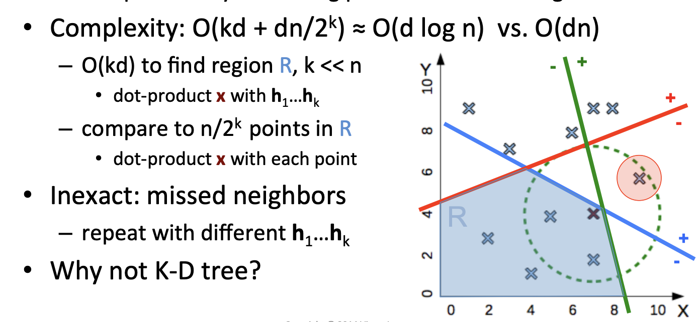
    - O(dn) is the kNN brute-force approach $\rarr$ much worse
- Inverted list example
  - Inverted list is a data structure used by search engines (Google, etc)
    - List all training examples that contain a particular attribute
    - Asusmption: most attribute values are zero (sparseness)
  - Given a new testing example:
    - Merge inverted lists for attributes present in new example
    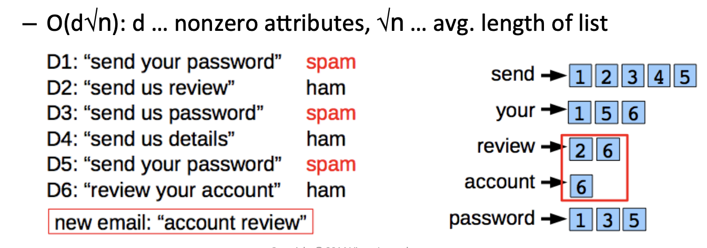
      - If data is not sparse, the inverted lists are just going to be as long as the number of elements in examples so would not be any benefit using inverted lists
## Week 7: K-Means
- Clustering
  - About discorver the underlying structure of the data
    - Unsupervised task, not predicting anything specific
    - We're trying to understand the data
  - What sub-populations exist in the data? Can answer one family of questions which have to do with subpopulations of the data
    - How many sub-populations are there?
    - What are their sizes?
    - Do elements in a sub-population have any common properties?
    - Are sub-populations cohesive? Can they be further split up?
    - Are there outliers?
- Types of clustering methods
  - Difference in goal:
    - **Monothetic**: cluster members have some common property
      - E.g. all are males aged 20-35
    - **Polythetic**: cluster members are similar to each other
      - There is no single common property, they are just similar, or at least we cannot guarantee it / put a finger down on an attribute that unifies all individuals
        - How you define similarity may vary, sometimes you don't know why the individuals are similar
  - Overlap:
    - Hard clustering: clusters do not overlap
      - Element either belongs to a cluster or not
    - Soft clustering: clusters may overlap
      - "strength of association" between element and cluster
  - Flat or hierarchical
    - Set of groups vs. taxonomy
    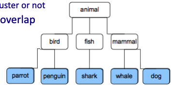
      - Taxonomy: can define higher-level /broader groups
- Methods we will talk about
  - K-D trees (see k-NN material)
    - Takes data set and partitions it into number of groups
    - Monothetic, hard boundaries, hierarchical
      - Monothetic because K-D trees cut the dataset at every step so going to cut in half until we get to final level
      - When we try to describe one instance in a cluster in a K-D tree we have a very short description of why every point landed in its region, so it's probably closer to being monothetic than polythetic
      - Hard because a point falls only into one and only one
      - Hierarchical because we can cut the tree at different levels which leads to different clusterings which are all nested in each other
  - K-means clustering
    - Splits data into a specified number of populations
    - Polythetic, hard boundaries, flat
  - Gaussian mixtures (EM algorithm)
    - Fits a mixture of K Gaussians to the data
    - Points will be associated to all clusters to certain degrees
    - Polythetic, soft boundaries, flat
  - Agglomerative clustering
    - Creates an "ontology" of nested sub-populations
      > Ontology: a particular theory about the nature of being or the kinds of things that have existence.
    - Polythetic, hard boundaries, hierarchical
- K-means clustering
  - K-means takes your dataset and partitions it into K subpopulations
  - K is something we need to specify in advance
  - Produces hard, flat, polythetic clusters
    - Data partitioned into $K$ sub-populations (need to know/specify $K$)
    - Partitions data by associating the points in each subpopulation with something called a "centroid"
      - So for each subpopulation it creates this notion of a centroid
      - Centroid is sort of a prop
      - Centroid = attribute-value "representation" of a cluster
      - Centroid is sort of a "propotypical" individual in a sub-population, some representation of a prototypical child of a cluster
  - Uses:
    - Discover classes in an unsupervised manner
      - E.g. cluster images of handwritten digits (with $K=10$ for 10 digits)
    - Smoothness over space
      - In the same cluster $\rarr$ similar representations / class labels / ...
    - Used for dimensionality reduction: clusters = "latent factors"
      - Often we need to deal with data that is not well-behaved
      - We take data and try to run SVM on it or sth else and it comes up with dodgy and bad results
      - We can use K-means to regularise the data
      - Replace representation of each data point with its cluster number, take these instead of their original attribute values
      - Assumes all pertinent qualities reflected in cluster membership
      - Related to basis / kernels in linear classifiers
- K-means clustering algorithm
  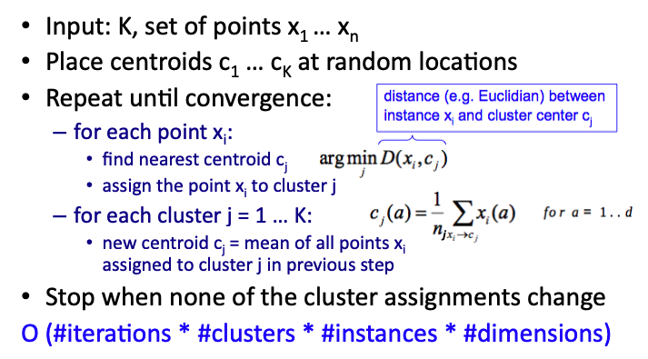  
  - Input:
    - n instances $x_1,...,x_n$, each instance is a vector in d dimensinal space
    - K, number of clusters
  - Place centroids $c_1,...,c_k$ at random locations
    - One for each cluster
  - Repeat the following two steps until convergence
    - TODO: what does convergence mean?
      - Probably if the steps don't have any affect anymore / centroids don't change anymore
    - For each point $x_i$ that we have in the dataset:
      1. Find nearest centroid $c_j$
        - This involves taking data point $x_i$, comparing it to every centroid $c_j$ and take the one with the minimum distance, the nearest one
        - Assign the point $x_i$ to cluster j
        - After this step we will have assigned every point to a cluster
      2. For every cluster $j=1...K$, update each centroid
   - New centroid $c_j=$ mean of all points $x_i$ that were assigned to cluster $j$ in previous step
   - Stop when none of the cluster assignments change
   - Performance / efficiency: O(#iterations * #clusters * #instances * #dimensions)
   - For large datasets we don't do it until convergence, just for however many iterations you have time for
  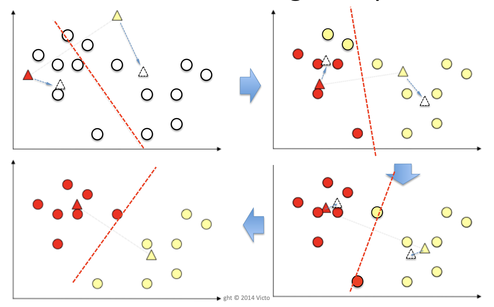
  - Only look at top left visualisation first
    - Let's say we have two attributes
    - White circles are data points
    - We assign to centroids to two randomly chosen points (not necessarily individuals, just any random point in the space)
    - For every datapoint, we're going to figure out which centroid to assign to
    - If using Euclidean distance, it's easy:
      1. Draw a line that perpendicularly bisects the line between the centroids
      2. Every point on that line is equal distance
      3. All the points above and to the right are closer to yellow, all others to the left to red.
    - Then, look at mean of new clusters and re-evaluate where centroids should be for each cluster, move them to new individuals
      - Centre of mass
    - Once new assignment of centroids doesn't change the cluster of a single datapoint $\rarr$ we know we can stop the algorithm
- K-means properties
  - Minimises aggregate intra-cluster distance $\underset{j}{\Sigma}\underset{x_i\rarr c_i}{\Sigma}D(c_j x_i)^2\$
    - Total squared distance from a point to the centre of its cluster
      - Summed up over all the data points assigned to cluster j and then summed up over all the centroids j
      - Only care about distance within cluster, not to other clusters in this method
    - Same as variance if Euclidian distance is used
  - Converges to a local minimum
    - Different starting points $\rarr$ very different results
      - Pick clustering that yields smalles aggregate distance
  - Nearby points may not end up in the same cluster
    - The following clustering is a stable local minimum
      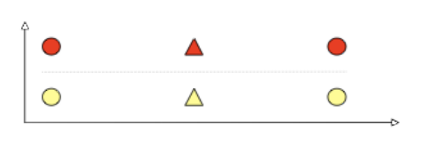
- Optimal number of clusters
  - How many clusters are there in your data?
    - K-means cannot answer this for you, expects you to say it
    - Class labels may suggest the value of $K$ (e.g. digits 0..9)
  - Optimise distance $V$ for $K=2,3,...$
    - That is, the "variance", the interclusteral distance for all clusters
      - Want each point to be as close to its centroid as possible
    - Run K-means, record distance
    - Problem: V minimised when $K=n$
      - Because if every instance has it's own centroid, that's when the overall variance is the smallest (0) (╯°□°）╯︵ ┻━┻
     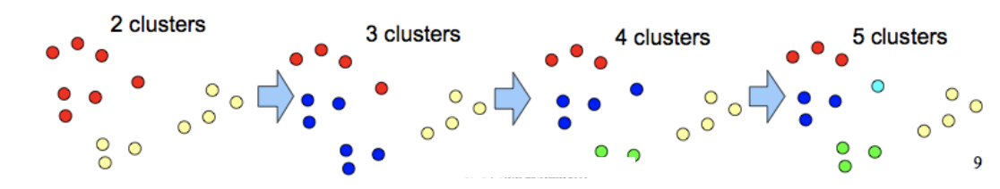
      - What if we use a validation set? $\rarr$ still doesn't help
        - Revision TODO: why? video "optimal number of clusters" 2.37min
    - One solution: Minimum Description Length
      - After clustering we compress the data, the k different cluster centroids and going to look at the deltas, the distance between the centroids and the datapoints assigned to it
      - Then look for some value of K that leads to the smalles possible description length
      - Total bits to encode K centroids + V
      - But dependent on encoding of values, so not good option in practice
    - In practice do it visually from scree plot:
      - Look at scree plot below, it will always decrease and have similar shape
        - Decrease quickly at first
      - Point where "mountain" ends, "rubble" begins
        - That's where it stops decreasing steeply and flat decrease begins
      - Elbow method: maximise 2nd derivative of V: point where rate of decline changes the most
    
    - As we increase the number of clusters, the interclusteral distance (aggregat distance) of the datapoints to their respective centroid decreases
- Evaluating clustering algorithms
  - K-means itself cannot tell us whether different Ks lead to better or worse clusters
  - Want to answer question if clusters are any good
  - There are two large families of attempts at answering that question
  - **Extrinsic**: (helps us solve another problem)
    - Take some algorithm and try to see if it's useful to solve some other task that you typically solve with another algorithm
      - Example
        - Represent images with cluster features
          - Instead of using pixels or some other features
        - Train different classifier for each sub-population
        - See if we get better accuracy
  - **Intrinsic**: (useful in and of itself)
    - Trying to see if clustering is useful by themselves
    - Can either have quantitative of qualitative methods to determine this
    - Helps understand the makeup of our data (qualitative)
    - For example, if we really had a classification task, e.g. bitmaps -> digits, could choose to solve this task by using k-means with k = 10
      - Then could see how well these 10 clusters correspond to the 10 classes (digits $\rarr$ 10 clusters)
      - Align, evaluate as you would a normal classifier
    - Compare to human judgement
      - Can't ask humans to "cluster" a dataset manually
      - Sample pairs $x_i,x_j$ ask humans if they "match"
- Intrinsic Evaluation 1
  - System produces K clusters $C_1,C_2,...,C_K$
  - Let's say we have reference clusters (e.g. digit classes) $R_1,R_2,...,R_N$
    - Number of clusters K and number of reference clusters N doesn't need to be the same
  - Align up / pair up $R_i\iff C_j$
    - Once we have our pairs, we can measure accuracy, F1, any other kind of evaluation metric we have seen before
  - Many differet ways to align:
    - Can't just connect c1 to r1 because c1 has no idea what elements it contains, it's completely arbitrary
    - E.g. $C_j\rarr R_i$ with max overlap
      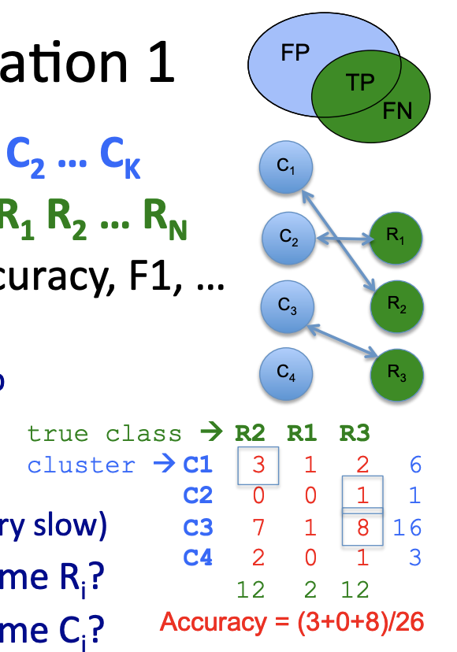
      - Matrix: count elements that are in both classes (overlap)
        - Then choose alignment based on maximum overlap
          - Go over each cluster and pick the class which has the highest overlap with that cluster
          - Since in exapmle, C2 and C3 have been both assigned to R3, and C1 and C4 $\rarr$ R2, we reassign to avoid multiple assignments
        - To get around that, we reassign so that we loose the least amount of overlap points
          - C2 -> from R3 to R1 would be only 1 point loss
          - C4 can't be moved anymore, can either not assign C1 or C4 at all, dropping C4 will only lose 2 points
          - To compute accuracy, just add up TP (numbers within matrix) over entire set of clusters and divide by total number of elements in dataset
    - If many $C_j\rarr$ same $R_i$:
      - Re-assign in a greedy manner
      - Non-greedy not really possible in practice: $\frac{K!}{(N-K)!}$ ways (very slow, too many possibilities to iterate over)
    - Can we have multiple $C_j\rarr$ same $R_i$?
      - In matrix: two assignments in one column
      - No. But why can't we allow multiples clusters to be assigned to the same reference class?
        - We can come up with a very simple clustering strategy that will come up with 100%
          - If we have a cluster for every single instance
          - Singleton clusters are not useful
    - Can we have multiple $R_i\rarr$ same $C_j$?
      - In matrix: two assignments in one row
      - No. We can put all the instances in one huge group
        - Matrix will have one row only
        - We allow multiple selections of Rs within row so we select all of them
        - $\rarr$ 100% accuracy
        - Not good, cheatable system, only looks good on paper
    - Can we have overlapping clusters?
      - Suppose our clustering system outputs the *powerset* of our dataset
        - That's the set of all possible subsets
        - For every element in that set there is a class that corresponds to exactly that set
        - So we'd get 100% accuracy
  - Intrinsic Evaluation 2
    - Other intrinsic evaluation: ask humans to help
    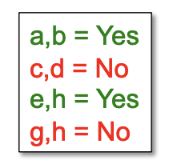
    - Sample pairs $x_i,x_j$
      - Ask human if $x_i,x_j$ should be in the same cluster
      - Easy task (cognitively)
      - Can't ask them to "cluster" dataset manually
    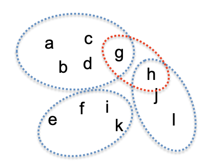
    - System produces clusters
    - Count howm any errors we made with respect to human guideline, compute accuracy, $F1$, or other error metrics
      - False negatives FN: matching pairs $x_i,x_j$ that are in different cluster (e,h)
      - False positives: non-matching pairs $x_i,x_j$ that are in same cluster (c,d)
    - Doesn't require a pairing strategy
    - Can handle overlapping clusters (a bit tricky though)
      - Same pair can count as both TN and FP (g,h = No)
    - Can generate pairs from classes, so don't need humans
- Summary
  - Clustering: want to discover underlying sub-populations / -structures in data
  - K-means
    - Fast, iterative method: $O(i*K*n*d)$
    - Converges to a local minimum
      - So need to run several times with different starting poitns
    - Need to pick $K$: use scree plot
    - Need to pick distance function (Euclidean)
    - Nearby points may end up in different clusters
  - Application: image representation
    - Cluster image patches based on visual similarity
    - Cluster numbers (vis-terms) becomes attributes
      - TODO: what?
  - Evaluation: intrinsic vs. extrinsic
## Week 7: Gaussian Mixture Models
- Mixture models
  - Recall the different types of clustering methods
    - Hard clustering: clusters do not overlap
      - Element either belongs to cluster or it does not
      - K-means
    - Soft clustering: clusters may overlap
      - Strength of association between clusters and instances
- Probabilisically-grounded way of doing soft clustering
  - Means we're using probabilistic models
  - Each cluster corresponds to a probability distribution in our d-dimensional space
  - And the points are viewed as samples from that probabilitiy distribution
  - What kind of probability distribution it is depends on the data
    - If it's real-valued observations then typically use Gaussian
    - If discrete, use something multinomial
  - Let's assume data is real-valued and use Gaussian
- Each cluster: a generative model (Gaussian or multinomial)
- Parameters (e.g. mean/covariance are unknown)
- Expectation Maximisation (EM) algorithm
  - Automatically discover all parameters for the K "sources"
    - Source = individual Gaussian in mixture
      - Or other probabilistic model if Gaussian not used
- Mixsture models in 1-d
  - We have observations $x_1...x_n$
    - Let's way we want to fit a two Gaussian mixture to this input data set:
      - This means we are assuming this data came from this mixture of Gaussians, every point came from one of the two Gaussians, randomly samples from them
      - K=2 Gaussians with unknown $\mu, \sigma^2$
    - Estimation trivial if we know the source of each observation, if we knew which point came from which Gaussian
      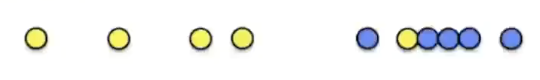
      - If we know that the yellow points come from the "yellow" Gaussian, and the blue from the blue one, then we can simply compute mean and variance:
        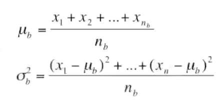
        - Above how to compute mean and variance for the blue (b) Gaussian source, that's our best estimate for it
        - If we do that for each class, we get a pretty good image of what the mixture looks like:
          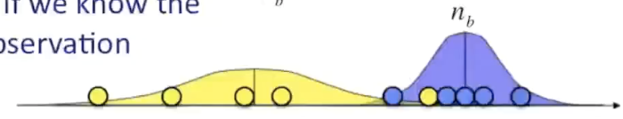
  - What if we don't know the source?
    - Problem: nobody tells us which points are blue and which ones are yellow:
      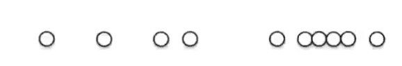
    - If we want to estimate means, not really possible
    - If we knew parameters of the Gaussians ($\mu,\sigma^2$)
      - Can guess whether point is more likely to be blue or yellow
      - For each point we would compute the posterior probability that it is blue
      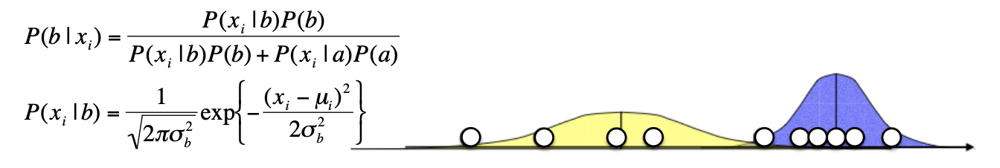
- Expectation Maximisation (EM)
  - Chicken and egg problem
    - We have neither colours nor means / variances
    - Need $(\mu_a,\sigma_a^2)$ and $(\mu_b,\sigma_b^2)$ to guess source of points
    - Need to know source to estimate $(\mu_a,\sigma_a^2)$ and $(\mu_b,\sigma_b^2)$
  - EM algorithm
    - Guesses both classes and model parameters iteratively
    - Start with two randomly places Gaussians $(\mu_a,\sigma_a^2)$, $(\mu_b,\sigma_b^2)$
      - Random points in space
      - A and b are just the two classes, yellow and blue
    - **E-step**: for each point: $P(b|x_i)=$ does it look like it came from $b$?
      - Use the models to colour the points, predict the most probable cluster
    - **M-step**: adjust $(\mu_a,\sigma_a^2)$ and $(\mu_b,\sigma_b^2)$ to fit points assigned to them
    - Iterate until convergence
- EM: 1-d example
  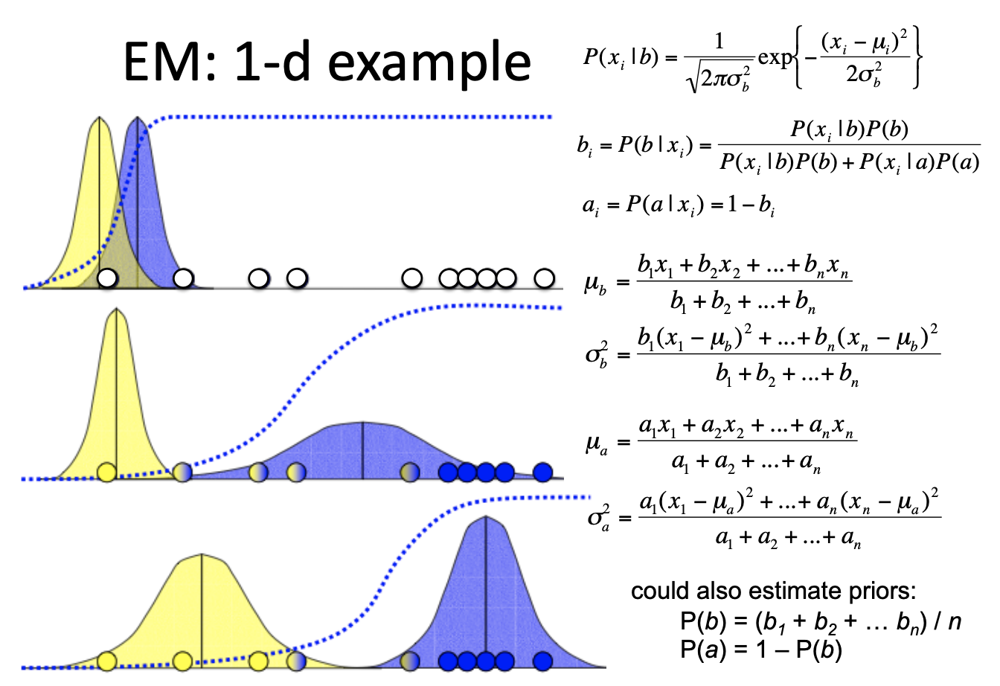
  - Dotted line: posterior probability $P(b|x_i)$
- Gaussian Mixture Model
  - Can do it in high-dimensional data as well
  - Formulas
  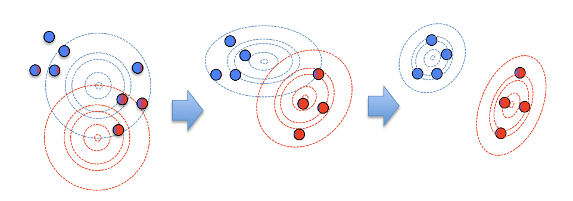
  - Data with $D$ attributes, from Gaussian sources $c_1...c_k$
    - EM for high-dimensional data:
    1. How typical is $\bf{x}_i$ under source $\bf{c}$?
      - Is this an input point?
      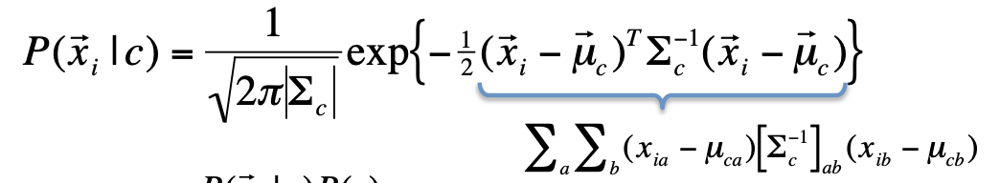
      - $\Sigma_c^{-1}$ is the inverse of the covariance matrix for Gaussian source $c$
    2. How likely that $\bf{x}_i$ came from $\bf{c}$ (Bayes' rule)
      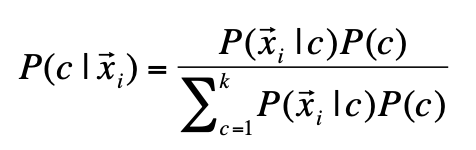
      - Like colouring data points with the more probable colour, can be mixture of colours
    3. How important is $\bf{x}_i$ for source $\bf{c}$:
      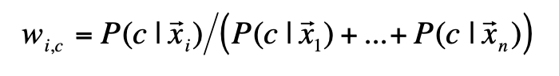
      - Convert posteriors to weights
      - They reflect how important particular instances are to particular Gaussians
    4. Compute the mean of attribute $\bf{a}$ in items assigned to $\bf{c}$:
      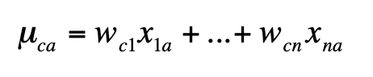
    5. Covariance of $\bf{a}$ and $\bf{b}$ in items from $\bf{c}$:
      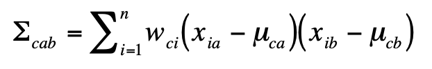
    6. Prior: how many items assigned to $\bf{c}$:
      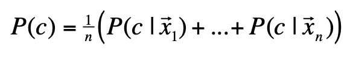
      - $\Sigma_{cab}$ is the covariance for attribute a and attribute b for Gaussian number c
- How to pick $K$, number of Gaussians
  - Probabilistic model
    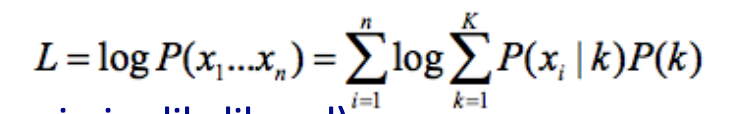
    - Tries to "fit" the data (maximise likelihood)
  - Pick $K$  that makes $L$ as large as possible?
    - Ill-posed approach
    - $K=n$ where each data point has its own "source"
    - Like K-means where we place a centroid on each individual datapoint
    - May not work well for new data poitns
  - Split points into training set $T$ and validation set $V$
    - For each $K$: fit parameters of $T$, measure likelihood of $V$
    - See which number of components (K) works the best on validation set
    - Sometimes still best when $K=n$
      - The more Gaussians you throw, the more densely you're going to cover the space
  - Occam's razor: pick "simplest" of all models that fit
    
    - Two possible instantiations of Occam's razor
    - In both cases, we're trying to balance the likelihood against the complexity of the model
- Summary
  - Walked through 1-d version
    - Works for higher dimensions as well
      - d-dimensional Gaussians, can be non-spherical
        - Q: what does spherical mean?
        - A: They have a circular form because the covariance matrix is a multiple of the identity matrix
    - Works for discrete data (test)
      - d-dimensional multinomial distributions (e.g. pLSI is a popular choice for text data)
  - Maximises likelihood of the data:
    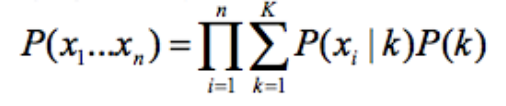
  - Similar to K-means
    - Sensitive to starting point, converges to a local maximum
    - Convergence: Gaussians will always shift around a little bit so stop when change in $P(x_1,...,x_n)$ is sufficiently small
    - Cannot discover $K$ (likelihood keeps growing with $K$)
  - Different from K-means
    - Soft clustering: instance can com from multiple "clusters" (sources)
    - Co-variance: notion of "distance" changes over time
      - K-means sticks to same specified distance definition
  - How can you make GMM = K-means?
    - GMM basically like K-means if only considering means
  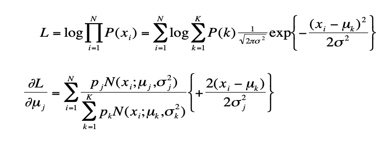
    - TODO: what do these mean?